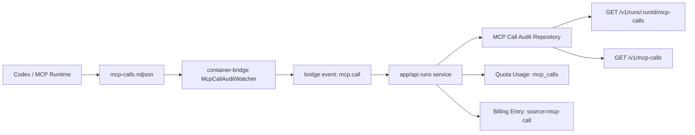

# 2026-07-09 MCP 调用审计链增量说明

## 1. 文档信息

| 字段 | 内容 |
|---|---|
| 文档名称 | 2026-07-09 MCP 调用审计链增量说明 |
| 日期 | 2026-07-09 |
| 影响范围 | `app/api`、`app/container-bridge`、`app/run-worker`、`packages/contracts`、`packages/mcp`、`packages/domain-models`、`packages/api-sdk` |
| 目标 | 建立 MCP 调用从运行期落盘到 API 审计、计费、配额归集的完整闭环 |

## 2. 本次补齐的能力

| 能力 | 结果 |
|---|---|
| runtime audit log | 已建立 `mcp-calls.ndjson` 作为容器内 MCP 调用观测落盘格式 |
| bridge 采集 | 已新增 watcher 监听 audit log，并转发 `mcp.call` 结构化事件 |
| API 持久化 | 已支持 file-backed 与 PostgreSQL 双存储 |
| 查询接口 | 已提供 `GET /v1/runs/:runId/mcp-calls` 与 `GET /v1/mcp-calls` |
| 配额归集 | 已对首次落库且非 rejected 的调用计入 `mcp_calls` |
| 计费归集 | 已写入 `source = "mcp-call"`、`costBasis = "actual"` 的 billing entry |
| 迁移基线 | 已新增 `0018_mcp_call_audits.sql` |
| 验证 | `pnpm -C app/api test:smoke` 当前 `38/38` 全通过 |

## 3. 端到端链路

## 4. 关键代码变更

### 4.1 契约与共享包

| 文件 | 变更 |
|---|---|
| `packages/contracts/src/runtime.ts` | 扩展 `mcpBindingSchema` 与 `bridgeSessionContextSchema`，补齐 `mcpId`、`displayName`、`riskLevel`、`requestedByUserId` 等上下文字段 |
| `packages/contracts/src/mcp.ts` | 新增 `mcpCallStatusSchema`、`mcpCallObservationSchema`、`mcpCallRecordSchema` 与查询 schema |
| `packages/contracts/src/bridge.ts` | 新增 `mcp.call` bridge event |
| `packages/contracts/src/billing.ts` | 新增 billing source `mcp-call` |
| `packages/mcp/src/index.ts` | 运行期 binding 组装补齐 `mcpId`、`displayName`、`riskLevel` |
| `packages/domain-models/src/runs.ts` | 允许 `mcp.call` 进入 bridge event 投影链 |
| `packages/api-sdk/src/index.ts` | 新增 `listRunMcpCalls()` 与 `listCalls()` |

### 4.2 Bridge

| 文件 | 变更 |
|---|---|
| `app/container-bridge/src/bridge/mcp-call-audit-watcher.ts` | 新增 watcher，消费 `mcp-calls.ndjson` 并转为 `mcp.call` 事件 |
| `app/container-bridge/src/bridge/mcp-materializer.ts` | 物化 `mcp-calls.ndjson` 与相关路径 |
| `app/container-bridge/src/observability.ts` | 新增 `lingban_bridge_mcp_call_events_total`、`lingban_bridge_mcp_call_ingest_failures_total` |
| `app/container-bridge/src/index.ts` | 注入 `LINGBAN_MCP_AUDIT_LOG_PATH`、`LINGBAN_MCP_AUDIT_FORMAT` 等环境变量并接入 watcher 生命周期 |
| `app/container-bridge/src/bridge/run-control-server.ts` | diagnostics 暴露 `mcpCallAuditWatcher` 状态 |

### 4.3 API

| 文件 | 变更 |
|---|---|
| `app/api/src/modules/mcp/call-audit-repository.ts` | 新增 MCP 调用审计 repository，支持 file-backed 与 PostgreSQL |
| `app/api/src/modules/mcp/call-audit-service.ts` | 新增归一化、权限校验、按 run 查询等服务逻辑 |
| `app/api/src/modules/mcp/routes.ts` | 新增 `GET /v1/mcp-calls` |
| `app/api/src/modules/runs/routes.ts` | 新增 `GET /v1/runs/:runId/mcp-calls` |
| `app/api/src/modules/runs/service.ts` | 接入 `mcp.call` 持久化、quota usage 与 billing entry |
| `app/api/src/modules/realtime/event-bus.ts` | 支持从 `mcp.call` 提取 `runId` 与 `occurredAt` |
| `app/api/src/modules/mcp/service.ts` | 初始化 MCP 调用审计基础设施 |

### 4.4 Worker

| 文件 | 变更 |
|---|---|
| `app/run-worker/src/services/run-lifecycle.ts` | 把 `requestedByUserId`、`taskVersionId`、`sessionVersionId`、`workspaceContextKey`、`serviceId` 注入 bridge session context |
| `app/api/src/modules/runs/launch-plan.ts` | launch plan 中的 MCP binding 补齐 `displayName`、`riskLevel` |

## 5. 数据模型与接口

### 5.1 审计记录核心字段

| 字段 | 说明 |
|---|---|
| `callId` | 调用唯一标识 |
| `runId` | 归属 run |
| `workspaceId` | 归属工作区 |
| `mcpId` | MCP 标识 |
| `toolName` | MCP tool 名称 |
| `status` | `success / error / cancelled / rejected / started` |
| `occurredAt` | 发生时间 |
| `durationMs` | 调用耗时 |
| `requestedByUserId` | 发起用户 |
| `workspaceContextKey` | 当前上下文边界 |

### 5.2 新增接口

| 接口 | 作用 |
|---|---|
| `GET /v1/runs/:runId/mcp-calls` | 查询单个 run 的 MCP 调用记录 |
| `GET /v1/mcp-calls` | 跨 run 查询 MCP 调用记录 |

### 5.3 数据库存储

| 项 | 内容 |
|---|---|
| 迁移文件 | `app/api/migrations/0018_mcp_call_audits.sql` |
| 表名 | `lingban_mcp_call_audits` |
| 主键冲突策略 | `call_id` upsert |
| 索引 | `run_id`、`workspace_id`、`mcp_id` |

## 6. 计费与配额归集

| 项目 | 规则 |
|---|---|
| 归集条件 | 仅对首次落库且非 `rejected` 的调用归集 |
| quota metric | `mcp_calls` |
| billing metric | `mcp_calls` |
| billing source | `mcp-call` |
| cost basis | `actual` |
| 幂等键 | 由 `callId` 派生，确保重复 bridge event 不重复入账 |

## 7. 测试与验证

| 类型 | 证据 |
|---|---|
| Bridge 集成测试 | `app/container-bridge/tests/cli-api-forwarding.test.mjs` 已断言 `mcp.call` 被成功上报 |
| API smoke | `app/api/tests/mcp-credentials.smoke.test.mjs` 已断言 run 级查询、全局查询与 billing entry |
| PostgreSQL smoke | `app/api/tests/mcp-call-audit-postgres.smoke.test.mjs` 已验证重启后审计与 billing 持久化 |
| 迁移 smoke | `app/api/tests/database-migrations.smoke.test.mjs` 已纳入 `0018_mcp_call_audits` |
| 全量 smoke | `pnpm -C app/api test:smoke` = `38/38` |

## 8. 当前剩余缺口

| 缺口 | 说明 |
|---|---|
| MCP rejected 审批视图 | 当前已有事件与账本阻断，Creator/治理前端视图仍待深化 |
| 多节点桥接聚合 | 目前以单 API 实例聚合为主，多节点观测看板仍待补齐 |
| 更细粒度成本模型 | 现阶段按调用次数归集，尚未接入每个 MCP 工具的差异化成本函数 |
