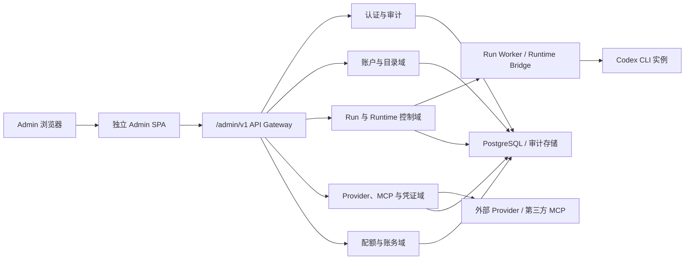

# 灵办词元 Admin Console 重构细则

## 1. 文档控制

| 字段 | 内容 |
|---|---|
| 文档名称 | `20260715admin重构细则.md` |
| 文档类型 | 产品需求、交互规范、视觉规范、前端架构与交付验收细则 |
| 产品 | 灵办词元 |
| 版本 | v1.0 |
| 编写日期 | 2026-07-15 |
| 适用端 | 独立 Web Admin Console |
| 唯一管理角色 | `platform_admin` |
| 目标工程路径 | `app/admin` |
| 目标仓库名称 | `agent-workshop-admin` |
| 后端接口命名空间 | `/admin/v1/*` |
| 计划服务端口 | `38140` |
| 指定品牌 Logo | `docs/assets/logo.png` |
| 视觉参照 | `http://192.168.31.26:3308/` |
| 视觉取样时间 | 2026-07-15 |
| 状态 | 重构实施基线 |

本文档冻结 Admin Console 的产品边界、信息架构、页面能力、视觉系统、接口契约、安全规则、迁移路径和验收条件。所有模块均属于最终交付范围，开发优先级仅用于安排实施顺序。

## 2. 核心结论

| 决策项 | 冻结结论 |
|---|---|
| 权限模型 | Admin Console 仅保留 `platform_admin` 一个角色，所有 Admin 账户拥有相同功能权限 |
| 前端边界 | Admin Console 从 `app/dashboard` 完整拆离，建立独立工程、独立仓库、独立构建和独立部署链路 |
| 产品边界 | Admin 仅处理平台级治理、全局运行控制和系统配置；工作区日常协作继续由用户 Dashboard 承载 |
| 模块数量 | 固定为 8 个一级模块：平台总览、用户与工作区、工坊与 Session、运行与运行时、Provider 与模型、MCP 与凭证、配额与账务、审计与系统 |
| 主技术栈 | React 18.3、Vite 5、TypeScript 5、React Router 6、TanStack Query 5、Zustand 5 |
| 视觉方向 | 深色运维控制台为默认主题，系统性继承指定参考站点的色调、表面层级、栅格、圆角、边框、数据密度和状态色语义 |
| 多语言 | `zh-CN` 与 `en-US` 首发完整交付 |
| 主题 | 深色主题为默认主题，同时提供语义等价的浅色主题 |
| 高风险操作 | 操作影响预检、原因填写、二次确认、幂等键、版本校验和完整审计全部强制执行 |
| 敏感信息 | 凭证明文永不回显，列表和详情仅展示元数据、掩码、引用、状态与使用范围 |
| 环境限制 | 禁止使用本地 Docker、WSL 或其他本地虚拟化环境；开发、构建和测试使用本地 Node.js 进程、浏览器进程、远程开发服务或 CI |

## 3. 重构目标

### 3.1 产品目标

1. 建立与用户 Dashboard 完全独立的平台管理产品。
2. 让平台管理员在统一入口完成全局对象查询、故障定位、运行干预、配置治理、成本治理和审计追溯。
3. 降低单页信息密度，通过列表、详情、操作抽屉和专项工作面拆分复杂任务。
4. 统一第三方 OpenAI Provider、模型、外部 MCP、私有凭证和 Codex 运行实例的管理入口。
5. 保证每项写操作具备可追踪、可重放判断、可审计和可回滚能力。
6. 建立可独立发布、回滚和扩展的管理端工程边界。

### 3.2 管理体验目标

| 场景 | 目标 |
|---|---|
| 日常巡检 | 进入总览后 30 秒内确认平台健康、异常数量和待处理对象 |
| 全局查询 | 通过全局搜索直接定位用户、工作区、工坊、Session、Run、Provider、MCP 或审计事件 |
| 故障处置 | 从异常指标进入目标 Run，完成诊断、取消、恢复或终止，并自动形成审计链 |
| Provider 管理 | 完成 Provider 配置、模型同步、健康检查、默认路由和影响范围确认 |
| 外部 MCP 管理 | 查看来源、传输方式、工具清单、网络策略、健康状态、绑定范围和调用记录 |
| 凭证治理 | 查看凭证元数据、过期状态、引用关系和使用记录，执行轮换或吊销 |
| 成本治理 | 从平台账务下钻到工作区、Run、Provider、模型和账本条目 |
| 事故复盘 | 通过统一时间线关联 Admin 操作、Run 事件、Provider 调用、MCP 调用和系统告警 |

## 4. 产品边界与权限模型

### 4.1 唯一 Admin 角色

Admin Console 权限模型固定为：

```text
platform_admin
```

约束如下：

| 规则 | 要求 |
|---|---|
| 入口校验 | 登录成功后必须读取 `platformAccess.isPlatformAdmin`，值为 `true` 才可进入应用 Shell |
| 接口校验 | `/admin/v1/*` 的每个接口必须执行 `requirePlatformAdmin` |
| Admin 账户能力 | 所有 Admin 账户拥有相同页面、查询和操作能力 |
| 角色扩展 | 禁止引入 reviewer、operator、auditor、billing-admin、security-admin 等 Admin 子角色 |
| 权限矩阵 | Admin Console 内不建设角色组、权限点分配、页面授权或字段授权矩阵 |
| 工作区角色 | owner、admin、creator、operator、viewer 继续作为工作区域数据存在，仅用于查看和治理工作区成员关系 |
| 敏感操作控制 | 通过强认证、影响预检、原因、确认词、审计和并发版本控制实现 |

### 4.2 Admin 管理对象

| 管理对象 | 管理范围 |
|---|---|
| 用户与身份 | 全平台用户状态、登录会话、平台 Admin 账户 |
| 工作区 | 个人空间、企业空间、成员、计划、配额、使用量 |
| 工坊资产 | Workshop、Service、Creator Package、Release、Session Pack、脱敏与签名状态 |
| 运行对象 | Run、Conversation、Approval、File、Artifact、事件、费用、诊断 |
| 运行基础设施 | Worker、Queue、Bridge、运行节点、资源、心跳、恢复与清理任务 |
| AI 接入 | OpenAI 兼容 Provider、模型、路由、价格、限额、健康状态 |
| MCP 接入 | 第一方 MCP、第三方 MCP、传输协议、工具清单、网络策略、绑定和调用记录 |
| 凭证 | Secret 引用、状态、有效期、轮换、吊销和使用关系 |
| 财务治理 | 套餐、配额、超额、用量账本、Provider 成本、导出作业 |
| 系统治理 | 审计、系统健康、配置、功能开关、通知、保留策略 |

### 4.3 明确排除项

以下内容不建立独立一级模块：

| 排除项 | 归属 |
|---|---|
| Creator 独立管理中心 | 归入“工坊与 Session” |
| 文件或对象存储独立中心 | 归入“运行与运行时”的 Run 文件页和存储诊断页 |
| Worker、Bridge、Queue、Node 独立一级导航 | 归入“运行与运行时” |
| 安全中心、审计中心、Admin 账户中心分别导航 | 合并到“审计与系统” |
| 客服工单、内容投诉、财务审批流 | 当前 Admin Console 不承载 |
| 多 Admin 角色和权限分配 | 禁止建设 |
| 面向终端用户的任务对话 | 继续由 H5、小程序和用户 Dashboard 承载 |

## 5. 当前实现判断与目标状态

### 5.1 当前状态

现有 `app/dashboard` 已包含以下 Admin 代码：

- `src/app/AdminShell.tsx`
- `src/components/AdminAuthScreen.tsx`
- `src/components/AdminAccessDeniedScreen.tsx`
- `src/pages/admin/AdminOverviewPage.tsx`
- `src/pages/admin/AdminProvidersPage.tsx`
- `src/app/router/AppRouter.tsx` 内的 `/admin/*` 路由
- `src/lib/routes.ts` 内的 Admin 路由常量
- 与 Admin Shell 共用的样式、语言、状态和 API 接线

当前结构导致用户 Dashboard 与平台 Admin 在路由、认证、导航、样式、构建产物和发布周期上发生耦合。重构完成后，用户 Dashboard 仅保留指向独立 Admin 域名的入口链接，且该链接仅对 `platform_admin` 可见。

### 5.2 目标状态

| 维度 | `app/dashboard` | `app/admin` |
|---|---|---|
| 面向对象 | 重度用户、Creator、工作区管理员 | 平台总 Admin |
| 路由根 | `/dashboard/*` | 独立站点根路由，页面路径见第 7 章 |
| 认证会话 | 用户 Dashboard 会话 | 独立 Admin 会话 |
| API 命名空间 | `/v1/*` 业务接口 | `/admin/v1/*` 平台治理接口 |
| App Shell | 工坊、实例、Creator | 8 个平台管理模块 |
| 状态缓存 | Dashboard Query Client | Admin Query Client |
| 样式入口 | Dashboard 主题 | Admin 专用主题和组件规格 |
| 构建产物 | Dashboard `dist/` | Admin `dist/` |
| 部署 | 用户 Dashboard 服务 | 独立 Admin 服务，计划端口 `38140` |
| 发布周期 | 用户功能发布 | 平台治理功能发布 |

## 6. 系统架构与工程边界



### 6.1 工程目录

```text
app/admin/
  public/
  src/
    app/
      providers/
      router/
      guards/
      shell/
    pages/
      overview/
      accounts/
      catalog/
      runs/
      runtime/
      providers/
      integrations/
      billing/
      audit/
      settings/
    features/
      auth/
      global-search/
      impact-preview/
      operation-confirmation/
      audit-context/
      realtime-health/
    components/
      layout/
      data-table/
      forms/
      feedback/
      status/
      detail/
    lib/
      api/
      i18n/
      query/
      routing/
      telemetry/
      validation/
    stores/
    styles/
      tokens.css
      themes.css
      reset.css
      globals.css
    test/
  index.html
  package.json
  tsconfig.json
  vite.config.ts
```

### 6.2 共享边界

`app/admin` 仅允许共享以下正式包：

| 共享包 | 用途 |
|---|---|
| `@lingban/contracts` | Zod 契约、请求响应类型、错误码、事件类型 |
| `@lingban/api-sdk` | Admin API Client、请求头、分页和错误归一化 |
| `@lingban/ui-tokens` | 品牌色、语义色、基础间距和字体变量 |

禁止从 `app/dashboard/src/*` 导入组件、Store、页面、样式、路由或工具函数。确需复用的稳定能力必须先提升为共享包，并完成独立版本和契约测试。

### 6.3 技术栈冻结

| 层级 | 选型 | 具体作用 |
|---|---|---|
| UI 运行时 | React 18.3.x | 页面、组件、表单和交互状态 |
| 构建器 | Vite 5.x | 开发服务器、生产构建、代码分块和静态资源处理 |
| 语言 | TypeScript 5.x，`strict: true` | 契约约束、空值检查、可辨识联合和 API 类型安全 |
| 路由 | React Router 6+ | 深链、模块路由、详情页、错误边界和路由懒加载 |
| 服务端状态 | TanStack Query 5 | 查询缓存、失效、轮询、重试、乐观更新和预取 |
| UI 状态 | Zustand 5 | 侧栏折叠、主题、语言、密度和临时选择态 |
| 表单 | React Hook Form + Zod | 配置表单、字段校验、脏状态和提交映射 |
| 数据表 | TanStack Table | 服务端排序、筛选、列显隐、列固定和批量选择 |
| 长列表 | TanStack Virtual | 大规模 Run、审计和账本列表虚拟化 |
| 国际化 | i18next + react-i18next | `zh-CN`、`en-US` 资源、复数和格式化 |
| 图标 | lucide-react | 统一现代扁平图标，替代字符图标和自绘 SVG |
| 单元测试 | Vitest + React Testing Library | 组件、Hook、状态和契约适配测试 |
| 端到端测试 | Playwright | 登录、导航、危险操作、Provider、MCP、Run 和审计闭环 |
| 代码检查 | oxlint + TypeScript | 语法、类型、未使用代码和危险模式检查 |

### 6.4 环境变量

| 变量 | 必填 | 说明 |
|---|---|---|
| `VITE_ADMIN_API_BASE_URL` | 是 | Admin API 基址；生产推荐同源相对路径 `/admin/v1` |
| `VITE_ADMIN_PUBLIC_BASE_PATH` | 是 | 静态资源和 Router 基路径，独立域名部署时为 `/` |
| `VITE_ADMIN_REALTIME_URL` | 是 | Admin 运行状态 WebSocket 或 SSE 地址 |
| `VITE_ADMIN_RELEASE` | 是 | 发布版本和错误追踪版本号 |
| `VITE_ADMIN_TELEMETRY_DSN` | 否 | 前端异常追踪地址 |
| `VITE_ADMIN_DEFAULT_LOCALE` | 否 | 默认 `zh-CN` |

发布构建必须拒绝 `localhost`、`127.0.0.1` 和未授权内网回环地址作为生产 API 基址。生产推荐由反向代理提供同源 `/admin/v1`，减少跨域、Cookie 和 CSRF 配置复杂度。

## 7. 信息架构与路由

### 7.1 一级导航

| 顺序 | 一级模块 | 图标建议 | 核心职责 |
|---|---|---|---|
| 1 | 平台总览 | `Gauge` | 指标、健康、异常和待处置对象 |
| 2 | 用户与工作区 | `UsersRound` | 用户、个人空间、企业、成员、计划和配额 |
| 3 | 工坊与 Session | `PackageOpen` | 工坊目录、服务、版本、Session 资产和发布治理 |
| 4 | 运行与运行时 | `Activity` | Run、对话、文件、Worker、Queue、Bridge 和资源 |
| 5 | Provider 与模型 | `Network` | 多 Provider、模型、路由、价格、限额和健康 |
| 6 | MCP 与凭证 | `PlugZap` | 第一方及第三方 MCP、网络策略、凭证和调用记录 |
| 7 | 配额与账务 | `ReceiptText` | 套餐、配额、用量、超额、成本和账本 |
| 8 | 审计与系统 | `ShieldCheck` | 审计、系统健康、配置、功能开关和 Admin 账户 |

### 7.2 路由表

| 路由 | 页面 | 说明 |
|---|---|---|
| `/login` | Admin 登录 | 独立身份认证、MFA 和会话建立 |
| `/access-denied` | 访问拒绝 | 非 `platform_admin` 账户的终止页面 |
| `/overview` | 平台总览 | 默认首页 |
| `/accounts/users` | 用户列表 | 全平台用户检索和治理 |
| `/accounts/users/:userId` | 用户详情 | 身份、空间、使用、会话和审计 |
| `/accounts/workspaces` | 工作区列表 | 个人与企业工作区 |
| `/accounts/workspaces/:workspaceId` | 工作区详情 | 成员、资源、配额、运行和费用 |
| `/catalog/workshops` | 工坊列表 | Workshop、Service 和发布状态 |
| `/catalog/workshops/:workshopId` | 工坊详情 | 版本、来源、质量和运营数据 |
| `/catalog/sessions` | Session 资产列表 | Session Pack、脱敏、签名和血缘 |
| `/catalog/sessions/:sessionId` | Session 资产详情 | 来源 Run、版本、依赖、风险和回滚 |
| `/runs` | Run 列表 | 全平台 Run 查询 |
| `/runs/:runId` | Run 详情 | 对话、事件、审批、文件、成本和诊断 |
| `/runtime` | 运行时控制 | Worker、Queue、Bridge、节点、容量和清理 |
| `/providers` | Provider 列表 | Provider Profile 和健康状态 |
| `/providers/:providerId` | Provider 详情 | 模型、凭证引用、绑定、费用和调用 |
| `/providers/:providerId/models/:modelId` | 模型详情 | 上下文、能力、价格、限额和路由 |
| `/integrations/mcps` | MCP 列表 | 第一方及第三方 MCP 注册表 |
| `/integrations/mcps/:mcpId` | MCP 详情 | Transport、工具、网络、绑定和调用 |
| `/integrations/credentials` | 凭证列表 | Secret 元数据和生命周期 |
| `/integrations/credentials/:credentialId` | 凭证详情 | 引用、轮换、吊销和使用审计 |
| `/billing/quotas` | 套餐与配额 | 规则、计数器、超额和调整 |
| `/billing/ledger` | 用量与账本 | Provider 成本、Run 成本和导出 |
| `/audit` | 审计事件 | 全平台操作和安全事件 |
| `/settings` | 系统设置 | 健康、配置、功能开关、通知、保留和 Admin 账户 |

所有筛选、排序、分页、选中页签和时间范围必须进入 URL Search Params。页面刷新、分享链接和浏览器前进后退必须恢复同一查询状态。

## 8. 全局 App Shell

### 8.1 页面骨架

```text
┌──────────────────────────────────────────────────────────────────────┐
│ 260px 可折叠侧栏 │ 顶栏：搜索 / 系统状态 / 语言 / 主题 / Admin 菜单 │
│                  ├───────────────────────────────────────────────────┤
│ 品牌             │ 页面标题、说明、主操作                           │
│ 8 个一级模块     │ 筛选与摘要                                       │
│                  │ 主列表或工作面                                   │
│                  │ 详情页 / 抽屉 / 危险操作确认                     │
│ 连接与版本状态   │                                                   │
└──────────────────────────────────────────────────────────────────────┘
```

### 8.2 左侧栏

| 项目 | 要求 |
|---|---|
| 展开宽度 | `260px` |
| 收起宽度 | `82px` |
| 定位 | 桌面端 `position: sticky; top: 0; height: 100vh` |
| 内边距 | 展开 `24px 16px`，收起 `18px 12px` |
| 品牌区 | `42px` Logo、产品名“灵办词元”、副标题“平台管理” |
| 导航行 | 高度 `44px`，圆角 `8px`，图标槽 `24px`，图文间距 `10px` |
| 当前项 | `rgba(255,255,255,0.10)` 背景、白色文字、青色图标 |
| Hover | 与当前项使用相同表面层级，保留可辨识焦点环 |
| 分组 | 8 个模块可按“治理、运行、接入、系统”设置低强调分组标题 |
| 底部状态 | API、Realtime、Worker 总体状态、当前版本；异常时可点击进入系统健康页 |
| 折叠控制 | 使用 `PanelLeftClose` / `PanelLeftOpen` 图标按钮，状态持久化到本地偏好 |
| 收起态 | 仅展示图标，Hover 与键盘焦点显示 Tooltip |

### 8.3 顶栏

| 区域 | 内容 | 行为 |
|---|---|---|
| 左侧 | 当前模块 Eyebrow、H2 页面标题 | 标题随路由变化 |
| 中部 | 全局搜索 | 搜索用户、工作区、工坊、Session、Run、Provider、MCP 和审计 ID |
| 右侧 | 系统健康、语言、主题、通知、Admin 菜单 | 固定图标按钮，统一 `42px` |
| 系统健康 | 正常、降级、故障 | 点击进入 `/settings?tab=health` |
| Admin 菜单 | 当前账户、会话到期时间、重新认证、退出 | 不出现角色切换 |

全局搜索使用命令面板形态，结果按对象类型分组。每条结果显示名称、稳定 ID、状态、所属工作区和更新时间，选择后直接进入详情路由。

### 8.4 页面级通用结构

| 页面类型 | 结构 |
|---|---|
| 列表页 | 标题区、指标摘要、筛选工具栏、数据表、分页、批量操作栏 |
| 详情页 | 返回与面包屑、对象摘要、关系页签、内容工作面、操作区、审计时间线、危险区 |
| 编辑页 | 对象摘要、分组表单、脏状态提示、影响预检、保存操作 |
| 运行控制页 | 状态总览、控制工具栏、实时事件、资源与诊断、危险操作区 |
| 设置页 | 二级侧栏或页签、配置表单、来源说明、版本信息、变更历史 |

### 8.5 认证页面

| 页面 | 布局与内容 |
|---|---|
| 登录 | 近黑背景，居中单列登录表单，顶部展示 `42px` 灵办词元 Logo、产品名和“平台管理”；表单最大宽度 `420px` |
| MFA | 沿用登录表面，展示验证码、恢复方式和会话上下文，不展示平台业务信息 |
| 重新认证 | 以模态页或独立路由承载，完成后恢复原高风险操作上下文 |
| 访问拒绝 | 显示当前账户、拒绝原因、用户 Dashboard 入口和退出操作 |
| 会话过期 | 清理 Query Cache 和 Realtime 连接，返回登录页并保留安全的目标路由 |
| 系统不可用 | 展示 API 状态、最近成功时间、Request ID 和重试入口 |

登录页与 Admin Shell 使用同一色彩、字体、圆角和焦点系统。登录表单保持单一视觉层级，不叠加营销内容或功能介绍。

## 9. 模块一：平台总览

### 9.1 页面目标

总览用于快速判断平台是否健康、异常集中在哪个管理域、哪些对象需要立即处理。页面保持监控面板语义，减少装饰图表。

### 9.2 内容结构

| 区块 | 指标或内容 | 下钻目标 |
|---|---|---|
| 账户摘要 | 总用户、24h 活跃用户、工作区、受限账户 | 用户或工作区列表 |
| 目录摘要 | 已发布工坊、待审核版本、隔离 Session、签名失败 | 工坊或 Session 列表 |
| 运行摘要 | 运行中、等待中、失败、需确认、超时 | Run 列表 |
| 接入摘要 | Provider 健康率、异常模型、MCP 健康率、即将过期凭证 | 对应接入列表 |
| 运行时摘要 | Worker、Queue 深度、Bridge 心跳、容量、失败清理任务 | Runtime 页 |
| 成本摘要 | 当日成本、月累计、超额工作区、成本增长异常 | 账本或配额页 |
| 异常队列 | 严重级别、对象、首次发生、持续时间、最近事件 | 对象详情或审计页 |
| 最近 Admin 操作 | 操作人、动作、对象、结果、时间 | 审计详情 |

### 9.3 交互规则

- 默认时间范围为最近 24 小时，可切换 1 小时、24 小时、7 天和 30 天。
- 指标卡仅承载一个主数值、一个趋势和一个状态，不堆叠说明文本。
- 严重故障置于首屏，按 `critical > high > medium > low` 排序。
- 刷新由 TanStack Query 管理；总体指标 30 秒，运行时健康 10 秒，静态目录 60 秒。
- 用户主动刷新时保留筛选条件并展示最近成功更新时间。
- 数据过期必须显示 Stale 状态，禁止以旧数据呈现实时健康结论。

## 10. 模块二：用户与工作区

### 10.1 用户列表

| 类别 | 字段或能力 |
|---|---|
| 核心列 | 用户、邮箱、状态、工作区数、最近登录、最近 Run、当月用量、创建时间 |
| 筛选 | 关键词、状态、注册来源、是否平台 Admin、计划、创建时间、最近活跃时间 |
| 排序 | 创建时间、最近登录、当月用量、工作区数、Run 数 |
| 批量能力 | 导出、强制退出、暂停、恢复；执行前展示影响用户数 |
| 行操作 | 查看详情、暂停、恢复、强制退出、调整计划、调整配额 |

### 10.2 用户详情

| 页签 | 内容 |
|---|---|
| 概览 | 基本身份、状态、注册来源、验证状态、最近登录、风险事件 |
| 工作区 | 所属工作区、角色、成员状态、加入时间 |
| 使用量 | Token、模型调用、MCP 调用、存储、运行时长和费用 |
| Runs | 最近 Run、状态、来源工坊、Provider、成本 |
| 会话 | 登录会话、设备、IP、创建时间、过期时间和吊销状态 |
| 审计 | 与该用户相关的 Admin 操作和系统事件 |

### 10.3 工作区列表与详情

| 页面 | 主要字段 | 主要操作 |
|---|---|---|
| 工作区列表 | 名称、类型、Owner、成员数、计划、配额、当月用量、活跃 Run、状态 | 查看、暂停、恢复、调整计划、调整配额 |
| 概览页签 | 类型、状态、计费主体、创建来源、区域、数据保留策略 | 编辑可治理元数据 |
| 成员页签 | 用户、工作区角色、状态、加入时间、邀请来源 | 移除异常成员、恢复成员、强制退出 |
| 资源页签 | 工坊、Session、Run、凭证、MCP、Provider 绑定 | 跳转关联对象 |
| 用量页签 | 配额计数器、成本、超额、趋势 | 调整配额、批准超额 |
| 审计页签 | 工作区级事件时间线 | 导出 |

### 10.4 操作约束

- 暂停用户或工作区前必须展示活动 Run、定时任务、共享资产和账务影响。
- 强制退出必须吊销目标登录会话，保留 API 审计记录。
- 调整计划与配额必须填写原因、生效时间和有效期。
- 成员治理只修改工作区成员数据，不改变 Admin Console 的单角色权限模型。
- 用户邮箱、手机号、IP 等个人数据默认掩码；临时查看完整值需要填写原因并形成审计事件。

## 11. 模块三：工坊与 Session

### 11.1 工坊列表

| 类别 | 字段或能力 |
|---|---|
| 核心列 | 工坊名称、Service 数、Creator、可见性、发布版本、质量状态、近 30 天启动数、成功率、更新时间 |
| 筛选 | 状态、可见性、Creator、分类、标签、质量门、更新时间 |
| 行操作 | 查看、下架、恢复上架、隔离、回滚版本、查看来源 |
| 批量操作 | 下架、隔离、导出；影响预检必须显示关联 Service 和活跃 Run |

### 11.2 工坊详情

| 页签 | 内容 |
|---|---|
| 概览 | 描述、封面、分类、标签、可见范围、Creator、运营指标 |
| Services | 服务版本、入口说明、默认 Session、MCP 与 Credential 需求 |
| Releases | 版本、签名、发布门、审核结果、发布时间、回滚点 |
| Runs | 启动数、成功率、失败分布、成本和用户反馈摘要 |
| 血缘 | Creator Package、源 Session、源 Run、派生版本 |
| 审计 | 发布、下架、隔离、回滚和配置变更 |

### 11.3 Session 资产列表与详情

| 范围 | 要求 |
|---|---|
| 列表字段 | Session 名称、版本、来源 Run、脱敏状态、签名状态、依赖摘要、发布状态、更新时间 |
| 依赖 | Codex 版本、基础镜像版本、MCP、Skill、环境能力、Credential Slot |
| 内容 | 会话消息索引、文件清单、运行参数、恢复点、工具调用摘要 |
| 血缘 | 源 Session、派生 Session、来源 Run、关联 Workshop Release |
| 安全 | 脱敏扫描、敏感项命中、人工确认、签名校验、隔离原因 |
| 操作 | 隔离、解除隔离、撤销发布、回滚版本、重新扫描、查看源 Run |

### 11.4 发布与隔离规则

- 下架仅影响后续实例化，活动 Run 继续按既定策略运行。
- 隔离必须阻止新实例化，并标记所有引用入口。
- 回滚前展示当前版本、目标版本、活跃绑定、计划任务和依赖差异。
- Session 内容只提供经过权限和脱敏策略处理的查看面，禁止直接展示私有凭证明文。
- 每次发布状态变化必须产生目录事件和审计事件。

## 12. 模块四：运行与运行时

### 12.1 Run 列表

| 类别 | 字段或能力 |
|---|---|
| 核心列 | Run ID、用户、工作区、来源工坊、状态、阶段、Provider/模型、Worker、开始时间、持续时间、成本 |
| 筛选 | 状态、阶段、工作区、用户、工坊、Provider、模型、Worker、错误码、时间范围 |
| 排序 | 创建时间、持续时间、成本、最近事件、重试次数 |
| 批量能力 | 取消、重试符合条件的 Run、导出、添加治理标签 |
| 实时更新 | 状态、阶段、最近事件、Token、成本和 Worker 心跳 |

### 12.2 Run 详情

| 页签 | 内容 |
|---|---|
| 摘要 | 状态、阶段、用户、工作区、来源、Provider、模型、容器/进程标识、开始与结束时间、费用 |
| 对话 | 用户消息、Codex 消息、系统注入消息、工具调用摘要、附件引用 |
| 事件 | 完整 Run Event 时间线、阶段、Trace ID、错误码和耗时 |
| 审批 | 待确认动作、确认人、确认内容、过期时间和结果 |
| 文件 | target path 文件树、大小、类型、修改时间、扫描状态、预览和下载 |
| MCP | MCP 调用、工具、参数摘要、耗时、结果状态、网络目标 |
| 资源 | CPU、内存、磁盘、进程、日志片段、Worker 与 Bridge 心跳 |
| 成本 | Token、Provider 请求、模型、MCP、存储、运行时和账本条目 |
| 诊断 | 启动检查、恢复点、错误归因、重试条件、清理状态 |
| 审计 | Admin 对该 Run 的所有干预 |

### 12.3 Run 操作

| 操作 | 前置条件 | 影响预检 | 结果 |
|---|---|---|---|
| 取消 | queued、starting、running、waiting | 当前阶段、未完成工具调用、文件写入状态 | 进入 cancelling，等待 Worker 确认 |
| 重试 | failed、cancelled 且资产完整 | 重试起点、输入、Credential、Provider、费用上限 | 创建新 Run 并保留 parentRunId |
| 恢复 | 存在有效恢复点 | 恢复点版本、文件快照、Codex Session 状态 | 创建恢复尝试和新事件链 |
| 强制终止 | 常规取消超时或失联 | 进程、临时文件、未提交产物、资源泄漏风险 | 终止进程并进入清理流程 |
| 重新清理 | cleanup_failed | 残留目录、对象存储、租约、进程 | 生成独立 Cleanup Job |
| 导出诊断 | 任意状态 | 数据范围、敏感项、有效期 | 生成脱敏诊断包和短期下载地址 |

### 12.4 Runtime 页面

| 子区域 | 内容 | 操作 |
|---|---|---|
| Worker | 状态、版本、心跳、并发、当前 Job、失败率 | Drain、恢复接单、查看日志 |
| Queue | 等待、活动、延迟、失败、死信、最老 Job | 重试死信、暂停、恢复 |
| Bridge | Bridge ID、版本、连接状态、活跃 Run、Codex 状态 | 诊断、断开失联连接 |
| 节点与容量 | 节点、CPU、内存、磁盘、租约、可用槽位 | 设置 Drain、查看实例 |
| 启动与清理 | 启动失败、孤儿实例、残留目录、清理任务 | 扫描、清理、重新执行 |
| 实时事件 | Worker、Queue、Bridge、Run 关联事件 | 按 Trace ID 下钻 |

强制终止、Queue 暂停、节点 Drain 和批量清理均属于高风险操作，必须执行两阶段确认。

## 13. 模块五：Provider 与模型

### 13.1 Provider Profile

Provider 管理必须支持官方 OpenAI API 与第三方 OpenAI 兼容 API，并允许多个 Provider 同时启用。

| 字段 | 说明 |
|---|---|
| `providerId` | 平台稳定标识 |
| 名称与描述 | Admin 可识别名称和用途 |
| 协议类型 | `openai-responses`、`openai-chat-completions`、项目明确支持的其他适配器 |
| Base URL | API 基址，保存前执行 URL、TLS、DNS 和网络策略校验 |
| Credential Ref | 私有 API Key 的 Secret 引用 |
| 请求头模板 | 仅允许配置经过白名单控制的非敏感请求头 |
| 模型发现 | 手动、Provider 模型列表同步或固定白名单 |
| 超时与重试 | 连接、首字节、总超时、最大重试和退避策略 |
| 并发与限流 | 平台、工作区和模型级并发或 RPM/TPM 限制 |
| 健康状态 | 最近检查、延迟、错误率、可用模型和失败原因 |
| 默认路由 | 平台默认、工作区覆盖和工坊绑定 |
| 状态 | draft、enabled、degraded、disabled |

### 13.2 Provider 页面能力

| 页面 | 内容 | 操作 |
|---|---|---|
| Provider 列表 | 名称、协议、Base URL 主机、模型数、健康、近 24h 请求、错误率、费用、状态 | 新建、启用、停用、健康检查 |
| Provider 详情 | 配置、模型、绑定、健康历史、调用、费用、审计 | 编辑、同步模型、切换默认、停用 |
| 模型列表 | 模型 ID、显示名、能力、上下文、输入输出类型、价格、限额、状态 | 启用、停用、编辑能力映射 |
| 模型详情 | 参数、能力、价格版本、使用范围、成功率、延迟、错误分布 | 更新、测试、查看关联 Run |

### 13.3 Provider 操作约束

- 浏览器不得直接向 Provider Base URL 发送健康检查或模型请求，全部通过后端受控探测接口执行。
- Base URL 变更前必须显示受影响的工作区、工坊、Session、活动 Run 和默认路由。
- Credential Ref 仅展示标识、掩码、状态和更新时间。
- 停用 Provider 时必须提供替代路由或确认受影响对象进入阻断状态。
- 模型价格采用版本化记录，历史账本保持原价格快照。
- 模型同步结果必须先进入差异预览，Admin 确认后再写入正式目录。

### 13.4 Provider 到 Codex 实例的生效链

| 步骤 | 执行方 | 处理内容 | Admin 可见结果 |
|---|---|---|---|
| 1. 配置 | Admin API | 保存 Provider Profile、协议、Base URL、模型和 Credential Ref | 配置版本、健康状态、审计 ID |
| 2. 绑定 | Control Plane | 建立平台默认、工作区、工坊或 Session 级绑定 | 绑定范围、优先级和受影响对象 |
| 3. 解析 | Run Worker | 新 Run 启动时计算最终 Provider、模型、超时和限额 | Run 详情中的 Effective Provider 摘要 |
| 4. 物化 | Credential Broker | 按 Run 身份读取 API Key，在受控边界内生成短期材料 | Credential Ref、版本、物化事件，明文不可见 |
| 5. 注入 | Runtime Bridge | 将 Base URL、模型、协议适配和临时 Secret 注入该 Run 的独立运行实例 | 注入状态、配置哈希、Bridge 事件 |
| 6. 启动 | Codex CLI | 使用实例级有效配置建立会话 | Codex 版本、Provider、模型、启动结果 |
| 7. 运行 | Runtime / API | 记录请求用量、错误、延迟和费用 | Run、Provider 和账本关联记录 |
| 8. 销毁 | Runtime Bridge | Run 结束后清理临时 Secret、配置文件和进程环境 | 销毁事件、清理状态、异常告警 |

绑定优先级固定为“平台默认 < 工作区覆盖 < 工坊或 Session 约束 < Run 明确选择”。Run 明确选择仍需满足上层允许范围。Admin 详情页必须展示最终生效值、每一层来源和配置哈希，禁止展示 API Key 明文。

## 14. 模块六：MCP 与凭证

### 14.1 MCP 注册表

平台必须支持受控第一方 MCP 和用户接入的第三方 MCP。第三方 MCP 视为外部不受控服务，运行时执行网络隔离、超时、调用审计和输出限制。

| 字段 | 说明 |
|---|---|
| MCP ID | 稳定标识 |
| 名称与来源 | 第一方、平台托管、工作区自带、第三方 |
| Transport | `stdio`、`streamable-http`、兼容期内的 `sse` |
| Endpoint / Command 摘要 | URL 主机或经过批准的命令摘要 |
| 工具清单 | 工具名、描述、Schema 摘要、最近同步时间 |
| 网络策略 | 出站目标、端口、DNS、重定向、私网访问策略 |
| Credential Binding | 所需 Credential Ref 和注入键名 |
| 绑定范围 | 平台、工作区、工坊、Session 或 Run 模板 |
| 健康 | 探测状态、延迟、失败原因、最近成功时间 |
| 风险状态 | normal、degraded、quarantined、disabled |

### 14.2 MCP 页面能力

| 页面 | 内容 | 操作 |
|---|---|---|
| MCP 列表 | 来源、Transport、工具数、绑定数、健康、调用量、错误率、风险状态 | 注册、探测、停用、隔离 |
| MCP 详情 | 配置、工具、网络、凭证引用、绑定、调用、错误、审计 | 编辑、同步工具、探测、停用、解除隔离 |
| 调用记录 | Run、工具、耗时、状态、目标、参数摘要、结果摘要、错误码 | 关联 Run、导出脱敏记录 |
| 网络策略 | 域名、IP 分类、端口、协议、重定向和解析结果 | 预检、更新、查看命中记录 |

### 14.3 凭证列表与详情

| 范围 | 要求 |
|---|---|
| 列表字段 | 名称、类型、Secret Provider、状态、到期时间、最近轮换、引用数、最近使用 |
| 详情字段 | Secret Ref、掩码、创建人、创建时间、版本、到期时间、绑定对象、使用记录 |
| 创建 | 明文仅在创建请求中存在，后端写入 Secret Broker 后立即清理请求上下文 |
| 轮换 | 新旧版本并存窗口、影响对象、验证结果和切换时间 |
| 吊销 | 影响预检、确认原因、立即阻断后续物化 |
| 查看 | API 永不返回明文，前端不提供明文展示按钮 |

### 14.4 MCP 与凭证操作约束

- 外部 MCP 的探测、工具同步和调用测试全部由后端或专用运行环境执行。
- `stdio` MCP 的命令、参数、包摘要和完整性哈希必须进入审核记录。
- MCP 输出在 Admin UI 中按结构化摘要和受限文本显示，禁止直接渲染外部 HTML。
- Credential 轮换必须显示 Provider、MCP、工作区、工坊、Session 和活动 Run 影响。
- 每次凭证物化、使用、轮换、冻结、吊销和销毁都必须记录审计事件。

### 14.5 Credential 物化链

```text
Admin 创建或轮换 Secret
  -> Admin API 仅接收一次明文
  -> Credential Broker 写入 Vault / KMS / Secret Provider
  -> 数据库仅保存 credentialId、secretRef、版本、状态和元数据
  -> Run Worker 按 Run、工作区、MCP / Provider 绑定申请短期物化
  -> Runtime Bridge 将值注入该 Run 的独立运行实例
  -> Codex CLI 或 MCP 子进程在进程边界内读取
  -> Run 结束、吊销或超时后执行清理
  -> Audit 记录申请、使用、轮换、吊销和清理结果
```

| 安全边界 | 强制要求 |
|---|---|
| 浏览器 | 明文只存在于创建或轮换提交前的受控字段，提交后立即清理 |
| Admin API | 禁止记录请求正文中的 Secret，异常日志使用字段级删除策略 |
| 数据库 | 仅保存 Secret 引用和生命周期元数据 |
| Worker | 只传递物化授权和目标注入描述，避免在队列负载中携带明文 |
| Runtime Bridge | 在目标 Run 的独立实例内注入，禁止写入共享宿主配置 |
| 文件系统 | 临时 Secret 文件使用最小权限、短期生命周期和确定性清理 |
| 日志与审计 | 记录引用、版本和结果，永不记录明文 |
| 下载与导出 | Credential 明文不进入任何导出、诊断包或文件下载 |

## 15. 模块七：配额与账务

### 15.1 套餐与配额

| 范围 | 内容 |
|---|---|
| 套餐 | 名称、版本、状态、生效时间、默认限制 |
| 配额维度 | Run 并发、月 Run 数、Token、Provider 费用、MCP 调用、存储、运行时长 |
| 计数器 | 限额、已用、保留、剩余、重置时间、数据更新时间 |
| 超额 | 工作区、维度、申请值、原因、有效期、状态 |
| 调整 | 临时调整、永久调整、生效时间、到期时间、原因 |

### 15.2 账本

| 类别 | 字段或能力 |
|---|---|
| 核心列 | Ledger ID、时间、工作区、用户、Run、Provider、模型、用量、单价版本、金额、币种、状态 |
| 筛选 | 时间、工作区、用户、Run、Provider、模型、费用类型、状态 |
| 聚合 | 按工作区、Provider、模型、工坊、日期和费用类型 |
| 导出 | CSV、JSON；异步作业、进度、文件哈希和短期签名地址 |
| 对账 | Provider 账单与内部账本差异、缺失条目、重复条目和修正记录 |

### 15.3 操作约束

- 配额调整必须记录原值、新值、生效范围、有效期和原因。
- 账本修正使用追加式调整条目，历史条目保持不可变。
- 成本摘要必须标明币种、时区、价格版本和数据完整时间。
- 大范围导出进入异步作业，完成后通过 Admin 通知中心返回。

## 16. 模块八：审计与系统

### 16.1 审计事件

| 字段 | 说明 |
|---|---|
| Event ID | 全局稳定标识 |
| 时间 | 服务端 UTC 时间和当前显示时区 |
| Admin | Admin ID、邮箱、会话 ID |
| 动作 | 标准动作码和本地化名称 |
| 对象 | 类型、ID、名称、工作区 |
| 原因 | Admin 提交的操作原因 |
| 变更 | 脱敏后的 Before / After |
| 结果 | success、failed、partial、rejected |
| 关联 | Request ID、Trace ID、Run ID、Job ID、Operation ID |
| 来源 | IP、User Agent、发布版本 |
| 错误 | 错误码和脱敏错误摘要 |

审计事件不可由 Admin UI 删除或修改。导出任务自身也必须生成审计事件。

### 16.2 系统设置页签

| 页签 | 内容 | 操作 |
|---|---|---|
| 系统健康 | API、数据库、队列、Worker、Bridge、存储、Realtime、Provider、MCP | 刷新、下钻诊断 |
| 全局配置 | 运行限制、超时、重试、保留期、默认路由、上传限制 | 版本化编辑、影响预检 |
| 功能开关 | Key、环境、状态、范围、更新时间 | 启用、停用、计划生效 |
| 通知 | 告警通道、阈值、静默窗口、最近投递 | 测试、启停、编辑 |
| 数据保留 | Run、消息、文件、审计、账本保留策略 | 编辑、预估影响 |
| Admin 账户 | 账户、状态、MFA、最近登录、会话、创建时间 | 新增、暂停、恢复、强制退出、重置认证 |
| 版本 | 前端、API、Worker、Bridge、Schema、配置版本 | 查看差异和发布记录 |

Admin 账户全部固定为 `platform_admin`。新增账户时不显示角色选择器。

## 17. 跨模块治理流程

### 17.1 Provider 故障处置

| 步骤 | 操作 |
|---|---|
| 1 | 总览发现 Provider 健康率下降 |
| 2 | 进入 Provider 详情查看错误率、延迟、模型和受影响 Run |
| 3 | 执行后端健康检查，确认网络、认证、协议或模型错误 |
| 4 | 预览停用或切换默认路由的影响范围 |
| 5 | 提交原因和确认，切换路由或停用 Provider |
| 6 | 在 Run 列表筛选受影响任务，按条件重试或恢复 |
| 7 | 在审计页确认操作、路由变化和恢复结果形成完整时间线 |

### 17.2 外部 MCP 风险处置

| 步骤 | 操作 |
|---|---|
| 1 | 总览或 MCP 列表发现异常调用、健康失败或网络策略命中 |
| 2 | 查看 MCP 配置、工具、目标主机、绑定和最近调用 |
| 3 | 隔离 MCP，阻止新 Run 物化该能力 |
| 4 | 筛选活动 Run，确认继续、取消或终止策略 |
| 5 | 检查关联 Credential 使用记录并按需轮换或吊销 |
| 6 | 导出脱敏调用记录和关联 Run 诊断包 |
| 7 | 完成修复后执行探测、工具同步和解除隔离 |

### 17.3 Run 失联恢复

| 步骤 | 操作 |
|---|---|
| 1 | 总览发现失联 Run 或 Bridge 心跳异常 |
| 2 | 进入 Run 详情检查最近事件、文件、资源和恢复点 |
| 3 | 进入 Runtime 核对 Worker、Bridge、Queue 和节点状态 |
| 4 | 优先执行常规取消或恢复 |
| 5 | 常规路径超时后执行强制终止，进入清理任务 |
| 6 | 验证文件与 Artifact 完整性，决定重试或结束 |
| 7 | 审计时间线关联 Run、Job、Bridge 和 Admin 操作 |

### 17.4 Session 风险回滚

| 步骤 | 操作 |
|---|---|
| 1 | 发现脱敏、签名、依赖或运行质量异常 |
| 2 | 隔离 Session，阻止新实例化 |
| 3 | 查看关联 Workshop Release 和活动 Run |
| 4 | 选择可信版本并预览依赖与绑定差异 |
| 5 | 回滚 Release，更新目录状态 |
| 6 | 检查受影响 Run 和后续启动结果 |
| 7 | 记录隔离、回滚和解除隔离审计链 |

## 18. 写操作与高风险操作协议

### 18.1 标准写操作

每个写请求必须包含：

| 字段或请求头 | 要求 |
|---|---|
| `X-Request-Id` | 每次请求唯一，贯穿前端、API、Job 和审计 |
| `Idempotency-Key` | 对可重试写请求强制提供 |
| `expectedVersion` | 对配置和对象状态变更执行乐观并发控制 |
| `reason` | 治理操作原因，最少 8 个字符，禁止纯空白 |
| `clientRelease` | Admin 前端发布版本 |
| `operationContext` | 当前路由、筛选和来源对象摘要 |

### 18.2 高风险两阶段确认

```text
1. POST /admin/v1/.../impact
2. API 返回 operationId、impactHash、影响对象、阻断项和过期时间
3. Admin 阅读影响，填写原因和指定确认词
4. POST /admin/v1/.../execute，提交 operationId、impactHash、expectedVersion
5. API 重新校验权限、版本、影响哈希和操作状态
6. 执行操作并写入审计事件
7. 前端展示结果、部分失败项和关联 Job / Audit ID
```

### 18.3 高风险操作清单

- 暂停用户或工作区
- 批量强制退出
- 下架或隔离 Workshop / Session
- Provider 停用、Base URL 变更、默认路由切换
- MCP 隔离、网络策略放宽、Credential 吊销
- Run 强制终止、Queue 暂停、节点 Drain、批量清理
- 大额配额调整、账本修正
- 全局配置、功能开关、数据保留策略变更
- Admin 账户新增、暂停、恢复和认证重置

确认对话框必须展示真实对象名称、数量、当前状态、目标状态、直接影响、间接影响、不可恢复部分和恢复路径。禁止仅显示“确认执行”一行通用提示。

## 19. Admin API 契约

### 19.1 通用响应

```json
{
  "data": {},
  "meta": {
    "requestId": "req_...",
    "generatedAt": "2026-07-15T00:00:00.000Z"
  }
}
```

列表响应：

```json
{
  "data": {
    "items": [],
    "pageInfo": {
      "nextCursor": null,
      "previousCursor": null,
      "total": 0
    },
    "facets": {}
  },
  "meta": {
    "requestId": "req_...",
    "generatedAt": "2026-07-15T00:00:00.000Z"
  }
}
```

### 19.2 接口分组

| 分组 | 核心接口 |
|---|---|
| Bootstrap | `GET /admin/v1/bootstrap`、`GET /admin/v1/me` |
| 总览 | `GET /admin/v1/overview`、`GET /admin/v1/anomalies` |
| 全局搜索 | `GET /admin/v1/search` |
| 用户 | `GET /admin/v1/users`、`GET /admin/v1/users/:id`、`POST /admin/v1/users/:id/actions/*` |
| 工作区 | `GET /admin/v1/workspaces`、`GET /admin/v1/workspaces/:id`、`POST /admin/v1/workspaces/:id/actions/*` |
| 工坊 | `GET /admin/v1/workshops`、`GET /admin/v1/workshops/:id`、`POST /admin/v1/workshops/:id/actions/*` |
| Session | `GET /admin/v1/sessions`、`GET /admin/v1/sessions/:id`、`POST /admin/v1/sessions/:id/actions/*` |
| Runs | `GET /admin/v1/runs`、`GET /admin/v1/runs/:id`、`POST /admin/v1/runs/:id/actions/*` |
| Runtime | `GET /admin/v1/runtime/*`、`POST /admin/v1/runtime/actions/*` |
| Provider | `GET/POST /admin/v1/providers`、`GET/PATCH /admin/v1/providers/:id`、`POST /health-check`、`POST /model-sync` |
| MCP | `GET/POST /admin/v1/mcps`、`GET/PATCH /admin/v1/mcps/:id`、`POST /probe`、`POST /tool-sync` |
| Credential | `GET/POST /admin/v1/credentials`、`GET /admin/v1/credentials/:id`、`POST /rotate`、`POST /revoke` |
| Billing | `GET /admin/v1/quotas`、`POST /admin/v1/quotas/actions/*`、`GET /admin/v1/ledger`、`POST /exports` |
| Audit | `GET /admin/v1/audit/events`、`GET /admin/v1/audit/events/:id`、`POST /admin/v1/audit/exports` |
| System | `GET /admin/v1/system/health`、`GET/PATCH /admin/v1/system/config`、`GET/PATCH /admin/v1/system/flags` |

### 19.3 错误契约

| 错误码 | 前端行为 |
|---|---|
| `ADMIN_AUTH_REQUIRED` | 进入独立登录页 |
| `PLATFORM_ADMIN_REQUIRED` | 展示访问拒绝页并清理 Admin 会话 |
| `ADMIN_STEP_UP_REQUIRED` | 打开重新认证流程，成功后恢复原操作 |
| `VERSION_CONFLICT` | 展示最新值与本地值差异，禁止直接覆盖 |
| `IMPACT_CHANGED` | 重新执行影响预检 |
| `IDEMPOTENCY_CONFLICT` | 展示原操作结果和 Audit ID |
| `RESOURCE_LOCKED` | 展示锁持有者、过期时间和关联 Operation ID |
| `SECRET_VALUE_FORBIDDEN` | 清理前端字段并记录安全事件 |
| `RATE_LIMITED` | 展示重试时间，禁止高频自动重试 |
| `DEPENDENCY_UNAVAILABLE` | 显示依赖状态、最近成功时间和降级路径 |

## 20. 认证、安全与审计

### 20.1 会话

| 项目 | 要求 |
|---|---|
| Cookie | 独立 `lingban_admin_session`，`HttpOnly`、`Secure`、`SameSite=Strict` |
| Token 存储 | 禁止将 Admin Access Token 写入 `localStorage` 或页面可读 Cookie |
| 空闲超时 | 默认 30 分钟，可配置 |
| 绝对时长 | 默认 8 小时，可配置 |
| MFA | Admin 账户强制启用 |
| Step-up | 高风险操作前要求最近 10 分钟内完成强认证 |
| CSRF | 同源 Cookie 配合 CSRF Token 或严格 Origin 校验 |
| 登出 | 立即吊销服务端会话并清理前端缓存 |

### 20.2 前端安全

- 启用严格 CSP，限制脚本、连接、图片和 Frame 来源。
- 禁止 `dangerouslySetInnerHTML` 渲染外部 MCP、Provider 或日志内容。
- 日志、错误、对话和工具结果统一按纯文本或受控结构化组件呈现。
- 下载地址由后端生成短期签名 URL，绑定 Admin、对象和有效期。
- CSV 导出防止公式注入，所有以 `= + - @` 开头的单元格执行转义。
- URL、Base URL、MCP Endpoint 和重定向目标由后端执行 SSRF 防护。
- 前端遥测不得采集 Token、Credential、消息正文、文件正文或完整请求参数。

### 20.3 审计写入要求

所有写操作必须记录：操作人、会话、时间、请求、对象、原因、脱敏前后值、结果、错误、来源 IP、User Agent、前端版本和关联 Trace。审计写入失败时，高风险操作必须中止；普通写操作按后端策略进入可靠补偿队列，并在 UI 明确标记审计延迟。

## 21. 参考站点视觉取样

### 21.1 取样范围

2026-07-15 对 `http://192.168.31.26:3308/` 完成以下页面与状态检查：

| 取样项 | 已检查内容 |
|---|---|
| 总览 | 固定侧栏、顶栏、指标卡、机会列表、系统状态 |
| 市场矩阵 | 筛选工具栏、宽表格、排序表头、状态 Badge、横向滚动 |
| 交易所管理 | 指标摘要、超宽配置表单、多选、输入框、按钮和长页面结构 |
| 执行中心 | 高风险表单、确认词、状态提示、规则摘要和运行信息 |
| 参数与状态 | 双列设置页、键值列表、告警和历史统计 |
| 默认视口 | `2560 x 1305` |
| 收窄视口 | `960 x 900`，触发 `82px` 图标侧栏 |
| 移动断点 | `640 x 900`，触发单列与 `16px` 主内容边距 |

### 21.2 参考站点核心视觉参数

| 类别 | 取样值 |
|---|---|
| 页面背景 | `#090D12` |
| 默认文字 | `#E7EDF3` |
| 弱化文字 | `#8FA0B3` |
| 主表面 | `#111922` |
| 次级表面 | `#172331` |
| 深层表面 | `#0C141D` |
| 分隔线 | `#263544` |
| 主强调色 | `#23C7B7` |
| 辅助强调色 | `#D99A3E` |
| 成功色 | `#4BD384` |
| 警告色 | `#F0B45B` |
| 危险色 | `#FF6B6B` |
| 信息色 | `#2B7FF0` |
| 主阴影 | `0 18px 48px rgba(0,0,0,0.38)` |
| 默认圆角 | `8px` |
| 侧栏展开宽度 | `260px` |
| 侧栏收起宽度 | `82px` |
| 主内容边距 | `26px` |
| 窄屏内容边距 | `16px` |
| 导航项高度 | `44px` |
| 图标按钮 | `42px x 42px` |
| 输入框高度 | `38px` 至 `40px` |
| 表头高度 | 约 `51px` |
| 表格行高 | 约 `53px` |
| 表格单元格内边距 | `13px 14px` |
| 内容面板内边距 | `18px` |
| 卡片间距 | `12px` 至 `18px` |

### 21.3 继承范围

Admin Console 必须继承以下视觉语言：

- 深色、低反光、低装饰密度的运维控制台基调。
- 固定深色侧栏与宽内容工作面的整体骨架。
- 青绿色作为主操作、焦点和在线状态的品牌强调。
- 绿色、黄色、红色、蓝色作为稳定状态语义。
- `8px` 圆角、`1px` 边框、轻阴影和清晰表面层级。
- 12px 至 14px 数据标签、14px 表格正文、18px 分区标题、28px 页面标题。
- 宽表格、横向滚动、状态 Badge、指标摘要和详情分组。
- 通过边框和背景层级组织信息，限制大面积高饱和色。

### 21.4 工程修正项

参考实现中的以下表现不得进入正式 Admin：

| 参考表现 | 正式要求 |
|---|---|
| 使用 `◎`、`↕`、`▦` 等字符充当图标 | 统一使用 `lucide-react`，图标尺寸 `18px` 或 `20px` |
| 原生 Select 高度约 `19px`，与 `38px` 输入框不一致 | 所有 Input、Select、Date Picker 和 Combobox 统一最小高度 `40px` |
| 超长配置内容连续堆叠 | 拆分为列表、详情页签、编辑抽屉和专项工作面 |
| 2560 宽屏内容无上限延展 | 表格使用全宽，详情与表单内容设置合理最大宽度和列宽 |
| 640px 断点的侧栏表现不稳定 | Admin 完整能力以 `1024px` 为最小支持宽度，低于该宽度展示明确宽度提示 |
| 状态仅依赖颜色 | 同时使用图标、状态文字和 ARIA Label |
| 部分复杂面板存在多层嵌套 | 正式页面限制为页面、面板、行项目三层结构，禁止卡片嵌套卡片 |

## 22. Admin 设计系统

### 22.1 深色主题令牌

```css
:root[data-theme="dark"] {
  --admin-bg: #090d12;
  --admin-sidebar: #0b121a;
  --admin-surface: #111922;
  --admin-surface-raised: #172331;
  --admin-surface-deep: #0c141d;
  --admin-text: #e7edf3;
  --admin-text-muted: #8fa0b3;
  --admin-line: #263544;
  --admin-accent: #23c7b7;
  --admin-accent-secondary: #d99a3e;
  --admin-success: #4bd384;
  --admin-warning: #f0b45b;
  --admin-danger: #ff6b6b;
  --admin-info: #2b7ff0;
  --admin-shadow: 0 18px 48px rgba(0, 0, 0, 0.38);
}
```

### 22.2 状态表面令牌

| 状态 | 前景 | 背景 | 边框 |
|---|---|---|---|
| Success | `#4BD384` | `rgba(75,211,132,0.12)` | `rgba(75,211,132,0.34)` |
| Warning | `#F0B45B` | `rgba(240,180,91,0.13)` | `rgba(240,180,91,0.34)` |
| Danger | `#FF6B6B` | `rgba(255,107,107,0.13)` | `rgba(255,107,107,0.36)` |
| Info | `#8DB8FF` | `rgba(43,127,240,0.13)` | `rgba(43,127,240,0.34)` |
| Neutral | `#8FA0B3` | `#0C141D` | `#263544` |

### 22.3 浅色主题语义映射

浅色主题保持相同布局、间距、圆角、组件结构和状态语义：

| Token | 浅色值 |
|---|---|
| 页面背景 | `#F4F7F9` |
| 主表面 | `#FFFFFF` |
| 次级表面 | `#F7FAFC` |
| 深层表面 | `#EEF3F6` |
| 主文字 | `#17212B` |
| 弱化文字 | `#64748B` |
| 分隔线 | `#D7E0E8` |
| 主强调色 | `#0C9488` |
| 成功色 | `#168A50` |
| 警告色 | `#A6630A` |
| 危险色 | `#C33C45` |
| 信息色 | `#2563EB` |
| 阴影 | `0 12px 32px rgba(17,24,39,0.10)` |

浅色主题继续保留深色侧栏，以维持 Admin 产品识别和稳定导航锚点。

### 22.4 字体与数字

| 用途 | 字体规格 |
|---|---|
| 默认字体 | `Inter, "Segoe UI", Arial, "Microsoft YaHei", sans-serif` |
| 页面标题 H2 | `28px / 700` |
| 分区标题 H3 | `18px / 700` |
| 品牌标题 | `18px / 700` |
| 正文 | `14px` 或 `16px / 400` |
| 表格正文 | `14px / 400` |
| 表头和字段标签 | `12px / 700` |
| Eyebrow | `13px / 700`，主强调色 |
| 指标数值 | `24px` 至 `28px / 700` |
| 状态 Badge | `12px / 700` |
| ID、哈希、路径 | `ui-monospace, SFMono-Regular, Consolas, monospace` |

数值列使用 `font-variant-numeric: tabular-nums`。ID、金额、Token、耗时和时间戳禁止因数字宽度变化产生列抖动。全局字距固定为 `0`。

### 22.5 间距、圆角与阴影

| Token | 值 | 用途 |
|---|---|---|
| `space-1` | `4px` | 标签内部微间距 |
| `space-2` | `8px` | 图标与文字、紧凑行 |
| `space-3` | `12px` | 卡片内容和按钮组 |
| `space-4` | `16px` | 常规分组 |
| `space-5` | `18px` | 内容面板内边距 |
| `space-6` | `24px` | 页面区块间距 |
| `space-7` | `26px` | 桌面主内容边距 |
| 默认圆角 | `8px` | 面板、输入、按钮、导航项 |
| 小圆角 | `6px` | 小型 Badge、紧凑控件 |
| 胶囊圆角 | `999px` | 状态 Badge，禁止用于普通按钮 |
| 面板阴影 | `var(--admin-shadow)` | 浮层、抽屉和少量重要面板 |

## 23. 布局与响应式规则

### 23.1 桌面布局

| 视口 | 侧栏 | 主内容 | 布局规则 |
|---|---|---|---|
| `>= 1440px` | 默认展开 `260px` | `minmax(0,1fr)`，边距 `26px` | 总览 4 列指标；详情可双列；宽表全宽 |
| `1280px - 1439px` | 记忆用户展开状态 | 边距 `24px` | 总览 3 至 4 列；详情按内容切换双列或单列 |
| `1024px - 1279px` | 默认收起 `82px`，展开时使用覆盖抽屉 | 边距 `20px` | 指标 2 列；详情单列；表格横向滚动 |
| `< 1024px` | 不进入完整管理工作面 | 显示宽度提示、退出和安全帮助 | 防止高风险操作在不可读布局中执行 |

### 23.2 内容宽度

| 页面 | 宽度策略 |
|---|---|
| 总览 | 使用全部可用宽度，指标和异常列表按栅格排列 |
| 列表与账本 | 使用全部可用宽度，表格容器内部横向滚动 |
| 详情 | 内容主体最大 `1600px`，关系和审计区可全宽 |
| 编辑表单 | 最大 `1280px`，单列字段最大 `720px` |
| 抽屉 | 常规 `520px`，复杂编辑 `720px`，不得超过视口 `80vw` |
| 对话与事件 | 主列最大 `960px`，上下文信息置于右侧栏或页签 |

### 23.3 稳定布局规则

- 指标卡使用固定最小高度，加载、错误和数值变化不得改变栅格行高。
- 图标按钮固定 `42px x 42px`，表格行操作固定列宽。
- 长 ID、路径、URL 和错误信息使用省略、换行或展开控制，禁止撑破容器。
- 表格列设置最小宽度、推荐宽度和最大宽度；关键 ID、状态和操作列可固定。
- 页面加载骨架必须与最终结构尺寸一致。
- 抽屉和对话框打开后保持背景页面滚动位置。

## 24. 组件规范

### 24.1 按钮

| 类型 | 规格 | 使用场景 |
|---|---|---|
| Primary | 高度 `40px`，主强调背景，深色文字或符合对比度的白字 | 每个表单唯一主提交 |
| Secondary | 高度 `40px`，深层表面，`1px` 边框 | 刷新、测试、导出、次级命令 |
| Danger | 高度 `40px`，危险色半透明背景和边框 | 暂停、吊销、强制终止、删除性操作 |
| Icon | `42px x 42px` | 刷新、折叠、主题、语言、通知 |
| Link | 无背景，主强调色 | 跳转对象详情 |

熟悉的操作使用图标按钮并提供 Tooltip。含业务语义的提交操作使用“图标 + 文本”。禁止使用字符图标。

### 24.2 表单控件

- Input、Select、Combobox、Date Picker 最小高度统一为 `40px`。
- 默认背景使用深层表面，边框 `#263544`，Focus 使用 `3px` 青绿色半透明外环。
- Label 位于控件上方，`12px` 至 `13px`，必填标识进入可访问名称。
- 帮助文本只描述格式、来源或风险，不重复字段名称。
- Secret 输入提交后立即从 React 状态、表单缓存和 DOM 中清理。
- 配置页显示“当前值来源”：默认值、环境配置、数据库覆盖或工作区覆盖。
- 保存按钮在无变更时禁用，存在未保存变更时阻止误离开。

### 24.3 数据表

| 项目 | 要求 |
|---|---|
| 表头 | 高度约 `51px`，`12px/700`，深层表面，支持排序状态 |
| 数据行 | 默认高度约 `52px`，`14px`，底部分隔线 |
| Hover | 使用次级表面，不引起布局变化 |
| 选中 | 左侧选择框和低饱和强调背景 |
| 状态 | Badge 同时包含文字和图标 |
| 排序 | 服务端排序，URL 保存 `sort` 与 `direction` |
| 筛选 | 服务端筛选，URL 保存筛选值，支持一键清除 |
| 分页 | Cursor 分页为主；显示已加载数量和可用总数 |
| 虚拟化 | 超过 200 行或连续流式列表必须启用 |
| 空态 | 描述当前筛选下无结果，提供清除筛选或创建入口 |
| 错误态 | 保留筛选，展示 Request ID、错误摘要和重试 |

### 24.4 状态 Badge

- 高度 `24px` 至 `26px`，横向内边距 `9px`，字号 `12px`。
- 仅状态、风险、层级和短标签使用胶囊形态。
- Success、Warning、Danger、Info 和 Neutral 统一使用第 22.2 节令牌。
- 在线状态使用圆点、文字和 Tooltip，圆点单独出现时必须有可访问名称。

### 24.5 详情、抽屉与对话框

| 组件 | 要求 |
|---|---|
| Detail Header | 名称、稳定 ID、状态、所属关系、主要操作 |
| Summary Grid | 2 至 4 列键值对，标签 12px，值 14px 至 16px |
| Tabs | 用于概览、关系、运行、费用、审计等平级信息 |
| Drawer | 用于轻量编辑、影响预检和关联对象选择，路由可恢复 |
| Full Page | 用于 Run 诊断、Provider 配置和复杂 Session 详情 |
| Confirm Dialog | 对象、影响、原因、确认词、版本和提交状态完整展示 |
| Danger Zone | 详情页末尾独立区域，红色语义边框，禁止与常规编辑混排 |

## 25. 信息密度与页面拆分规则

1. 列表页只承担检索、比较、批量选择和进入详情。
2. 详情页只展示单一对象及其关联关系。
3. 编辑表单使用独立抽屉或编辑路由，查看态与编辑态分离。
4. 高风险操作使用独立影响预检和确认流程。
5. 运行诊断使用专项工作面，日志、事件、资源和操作分区展示。
6. 顶部指标限制在 4 至 8 个关键指标，扩展统计进入详情或二级页签。
7. 页面首屏优先展示状态、异常、关键指标和主操作。
8. 低频元数据进入折叠分组，折叠状态可在当前对象内记忆。
9. 禁止在一个页面连续渲染多个完整对象编辑表单。
10. 禁止卡片内部继续嵌套同等视觉权重的卡片。

## 26. 多语言与格式化

| 项目 | 要求 |
|---|---|
| 语言 | `zh-CN`、`en-US` |
| 路由 | 使用稳定英文路径，不随语言变化 |
| 翻译资源 | 按 `common`、`navigation`、`accounts`、`catalog`、`runs`、`providers`、`integrations`、`billing`、`audit` 分 Namespace |
| 日期 | 服务端使用 UTC，前端按 Admin 偏好时区展示，同时支持查看原始 UTC |
| 数字 | 使用 `Intl.NumberFormat`，金额必须包含币种 |
| 时长 | 使用本地化时长，Tooltip 展示毫秒或原始值 |
| 错误码 | API 返回稳定错误码，前端映射本地化文案 |
| 动态文案 | 使用插值和复数规则，禁止字符串拼接 |
| 搜索 | 中文名称、英文名称、ID 和别名同时可搜索 |

语言切换后不得刷新登录会话、清空筛选或中断正在进行的影响预检。

## 27. 可访问性

- 达到 WCAG 2.2 AA 对比度要求。
- 所有交互元素支持键盘操作，焦点顺序与视觉顺序一致。
- Focus Ring 始终可见，不依赖浏览器默认细线。
- 图标按钮必须提供可访问名称和 Tooltip。
- 表格排序、选择、展开和实时更新使用正确 ARIA 属性。
- 错误摘要使用 `aria-live="polite"`，危险结果使用明确状态通知。
- 颜色只承担辅助语义，状态必须同时展示文字或图标。
- 动画遵循 `prefers-reduced-motion`，抽屉和状态变化动画控制在 120ms 至 180ms。
- 键盘焦点进入对话框后执行焦点锁定，关闭后返回触发元素。

## 28. 前端状态与数据流

### 28.1 TanStack Query

| 数据类型 | Query 策略 |
|---|---|
| Bootstrap / Me | 应用启动加载，认证变化后清理全部缓存 |
| 总览指标 | 30 秒轮询；窗口不可见时降低频率 |
| Runtime 健康 | 10 秒轮询并融合 Realtime 事件 |
| 列表 | URL 生成 Query Key，保留上一页数据 |
| 详情 | 进入列表时预取摘要，详情页按页签懒加载 |
| 审计 | 默认手动刷新或 30 秒轮询，支持实时追加 |
| 写操作 | 成功后按对象精确失效，避免全局缓存清空 |

### 28.2 Zustand

Zustand 仅保存：

- 侧栏展开状态
- 主题与语言偏好
- 表格列显示偏好
- 当前通知抽屉状态
- 短期批量选择状态

用户、工作区、Run、Provider、MCP、账本等服务端对象不得复制到 Zustand。

### 28.3 Realtime

- 首选 WebSocket，受限网络下允许 SSE 降级。
- 事件包含 `eventId`、`type`、`resourceType`、`resourceId`、`occurredAt`、`version`。
- 客户端按 `eventId` 去重，按对象版本拒绝旧事件覆盖新状态。
- 断线后使用游标补拉，补拉失败时对相关 Query 执行失效刷新。
- Realtime 状态固定显示在侧栏底部和系统健康页。

## 29. 加载、空态、错误与降级

| 状态 | 要求 |
|---|---|
| 首次加载 | 使用结构化骨架，保持页面尺寸稳定 |
| 后台刷新 | 保留现有数据，显示轻量更新时间和刷新状态 |
| 空数据 | 区分平台无数据、筛选无结果、权限或依赖受限 |
| 单接口错误 | 当前区块局部错误，页面其他区块继续可用 |
| 全局依赖错误 | 系统状态栏标记降级，提供依赖详情和 Request ID |
| 写操作失败 | 保留表单内容，显示字段错误、全局错误和可重试条件 |
| 部分成功 | 列出成功、失败和未执行对象，提供导出结果 |
| 数据过期 | 明确显示最后成功时间，危险操作自动禁用 |
| Realtime 断开 | 降级到轮询，并显示连接状态 |

## 30. 性能与容量要求

| 指标 | 目标 |
|---|---|
| 首次可交互 | 生产环境 p75 小于 `2.5s` |
| 路由切换 | 已缓存详情 p75 小于 `300ms` |
| 列表接口 | 常用筛选 p95 小于 `800ms` |
| 写操作响应 | 同步操作 p95 小于 `2s`；长操作返回 Job ID |
| 初始 JS | gzip 后建议小于 `350KB`，模块页面必须懒加载 |
| 大列表 | 支持十万级服务端结果集，浏览器仅渲染可视窗口 |
| 全局搜索 | 输入防抖 `250ms`，结果 p95 小于 `500ms` |
| 实时事件 | 正常网络下 UI 延迟小于 `2s` |
| 内存 | 连续使用 2 小时无持续增长，离开页面释放订阅和大型数据 |

## 31. 测试要求

### 31.1 测试分层

| 层级 | 范围 |
|---|---|
| 契约测试 | `/admin/v1` 请求响应、错误码、分页、审计字段 |
| 单元测试 | 格式化、权限守卫、影响预检状态机、Query Key、错误映射 |
| 组件测试 | 表格、筛选、表单、Badge、抽屉、确认对话框、空态和错误态 |
| 集成测试 | 路由、Query、表单提交、缓存失效、Realtime 融合 |
| E2E | 登录、跨模块检索、危险操作、Provider、MCP、Credential、Run、Audit |
| 视觉回归 | 1440、1280、1024，深色与浅色，中英文 |
| 可访问性 | 键盘、焦点、名称、对比度、ARIA 状态 |
| 安全测试 | 会话、CSRF、XSS、SSRF、敏感值回显、CSV 注入、越权 |

### 31.2 必须通过的 E2E 场景

1. `platform_admin` 登录并恢复独立 Admin 会话。
2. 普通用户访问 Admin 域名后收到访问拒绝。
3. 全局搜索定位用户、工作区、Run、Provider 和 MCP。
4. 暂停用户执行影响预检、原因填写、确认和审计查询。
5. Provider 新建、Credential Ref 绑定、健康检查、模型同步和停用预检。
6. 第三方 MCP 注册、网络策略预检、工具同步、隔离和审计。
7. Credential 创建后明文不回显，轮换和吊销均形成审计链。
8. Run 取消、重试、恢复、强制终止和清理流程。
9. 配额调整、账本查询和异步导出。
10. 中英文切换、深浅主题切换、侧栏折叠和 URL 状态恢复。
11. Realtime 断开后降级轮询，恢复后补拉事件。
12. 并发修改产生 `VERSION_CONFLICT`，前端展示差异并阻止覆盖。

测试流程禁止依赖本地 Docker 或 WSL。后端集成测试使用远程测试环境、CI 服务依赖或进程级测试替身。

## 32. 部署与网络

### 32.1 独立部署

| 项目 | 要求 |
|---|---|
| 构建 | `pnpm build` 生成独立 `dist/` |
| 服务 | 独立静态站点，计划大端口 `38140` |
| 推荐访问形态 | 独立 Admin 域名或独立主机端口 |
| API | 同源反向代理 `/admin/v1/*` 到 Backend |
| Realtime | 同源 `/admin/realtime`，支持 WebSocket 与 SSE |
| 缓存 | HTML 禁止长期缓存；带哈希静态资源可长期缓存 |
| 健康检查 | `/healthz` 返回静态站点版本与构建时间 |
| 回滚 | 保留上一版本静态产物和配置，支持原子切换 |

### 32.2 Dashboard 迁移

- `app/dashboard` 删除 `AdminShell`、Admin 页面、Admin 认证屏、Admin Store、Admin CSS 和 `/admin/*` 内部路由。
- Dashboard 可保留“平台管理”外链，链接地址由环境变量注入。
- 原 Dashboard `/admin/*` 由网关返回 302/308 到独立 Admin 站点对应路由。
- Admin Cookie、CSRF、CSP、缓存和错误追踪配置与 Dashboard 分离。
- 发布流水线分别构建、测试、部署和回滚两个前端。

### 32.3 环境约束

- 本地禁止启动 Docker、Docker Desktop、WSL、Podman 或其他虚拟化运行时。
- 本地前端开发仅使用 Node.js、pnpm、Vite 和浏览器。
- 需要真实数据库、队列、对象存储、Worker 或 Bridge 时连接指定远程开发环境。
- CI 或远程服务器可按基础设施规范运行服务，相关行为不由本地开发脚本隐式触发。
- 任何 `dev`、`test`、`build` 脚本不得自动调用 Docker 或 WSL。

## 33. 迁移实施顺序

| 阶段 | 交付内容 | 完成条件 |
|---|---|---|
| 1. 契约冻结 | Admin 对象、错误码、审计、影响预检、分页和 Realtime 契约 | Contracts 与 API 契约测试通过 |
| 2. 独立工程 | `app/admin`、仓库、Vite、Router、Query、i18n、主题、测试和 CI | 独立构建与预览通过 |
| 3. Shell 与认证 | 登录、守卫、侧栏、顶栏、搜索、主题、语言和系统状态 | 登录与访问拒绝 E2E 通过 |
| 4. 查询模块 | 总览、用户、工作区、工坊、Session、Run、Provider、MCP、凭证、账本、审计列表与详情 | 所有只读页面接真实 API |
| 5. 治理操作 | 状态变更、影响预检、确认、并发控制、Job 和审计闭环 | 所有写操作具备审计证据 |
| 6. Runtime 工作面 | Worker、Queue、Bridge、节点、恢复、终止、清理和诊断 | 故障处置 E2E 通过 |
| 7. 视觉与质量 | 参考站点风格、主题、响应式、国际化、可访问性、性能 | 视觉回归与质量门通过 |
| 8. 拆离切换 | Dashboard 删除 Admin 代码、旧路由重定向、独立部署和回滚 | 两端独立发布且无代码依赖 |

所有 8 个模块、双语、双主题、安全协议、审计和独立部署全部完成后，Admin 重构方可判定交付。

## 34. 详细开发项

| 编号 | 开发项 | 主要产物 |
|---|---|---|
| ADM-001 | 创建 `app/admin` 独立 React + Vite 工程 | 工程、脚本、TypeScript、Vite 配置 |
| ADM-002 | 建立独立 Git 仓库与 CI | README、`.gitignore`、Actions、发布流程 |
| ADM-003 | 建立 Admin 主题令牌 | 深色、浅色、状态色、排版和间距 |
| ADM-004 | 实现独立认证与会话恢复 | Login、Bootstrap、Guard、Logout |
| ADM-005 | 实现折叠侧栏和顶栏 | 8 模块导航、搜索、状态、语言、主题 |
| ADM-006 | 实现全局搜索 | 多对象分组、键盘导航、详情跳转 |
| ADM-007 | 实现统一数据表 | 服务端分页、筛选、排序、列偏好、虚拟化 |
| ADM-008 | 实现详情页基础组件 | Header、Summary、Tabs、Relations、Audit、Danger Zone |
| ADM-009 | 实现影响预检和确认状态机 | Impact Drawer、Confirm Dialog、Step-up |
| ADM-010 | 实现平台总览 | 指标、健康、异常、待处置和最近操作 |
| ADM-011 | 实现用户列表与详情 | 状态、会话、工作区、用量、Runs、审计 |
| ADM-012 | 实现工作区列表与详情 | 成员、资源、计划、配额、账务和审计 |
| ADM-013 | 实现工坊列表与详情 | Service、Release、指标、血缘、发布治理 |
| ADM-014 | 实现 Session 列表与详情 | 依赖、脱敏、签名、血缘、隔离和回滚 |
| ADM-015 | 实现 Run 列表与详情 | 对话、事件、审批、文件、MCP、资源、成本和诊断 |
| ADM-016 | 实现 Run 控制操作 | 取消、重试、恢复、终止、清理和诊断导出 |
| ADM-017 | 实现 Runtime 页面 | Worker、Queue、Bridge、节点、容量和事件 |
| ADM-018 | 实现 Provider 列表与详情 | Profile、健康、绑定、调用、费用和审计 |
| ADM-019 | 实现模型目录 | 同步、差异、能力、价格、限额和状态 |
| ADM-020 | 实现 MCP 注册表 | Transport、工具、网络、绑定、健康和调用 |
| ADM-021 | 实现凭证治理 | 创建、元数据、轮换、吊销、引用和审计 |
| ADM-022 | 实现配额页 | 套餐、策略、计数器、超额和调整 |
| ADM-023 | 实现账本页 | 聚合、筛选、对账和异步导出 |
| ADM-024 | 实现审计页 | 查询、详情、关联时间线和导出 |
| ADM-025 | 实现系统设置 | 健康、配置、功能开关、通知、保留、Admin 账户和版本 |
| ADM-026 | 接入 Realtime | 去重、补拉、降级轮询和状态指示 |
| ADM-027 | 完成双语资源 | `zh-CN`、`en-US` 全页面、错误和操作文案 |
| ADM-028 | 完成可访问性 | 键盘、焦点、ARIA、对比度和降低动态效果 |
| ADM-029 | 完成视觉回归 | 1440、1280、1024，双主题、双语言 |
| ADM-030 | 完成安全测试 | 会话、CSRF、XSS、SSRF、Secret、CSV 和越权 |
| ADM-031 | 完成性能治理 | 路由分块、预取、虚拟化、缓存和内存检查 |
| ADM-032 | 删除 Dashboard Admin 代码 | 路由、Shell、页面、样式、Store、测试清理 |
| ADM-033 | 配置旧路由重定向 | 网关规则和深链映射 |
| ADM-034 | 独立部署与回滚演练 | 端口 `38140`、健康检查、版本切换和回滚证据 |

## 35. 验收标准

### 35.1 产品验收

- 8 个一级模块均具备完整列表、详情、筛选、操作和审计入口。
- Admin 权限仅存在 `platform_admin` 一个角色。
- 用户 Dashboard 与 Admin Console 在界面、路由、构建和部署上完全分离。
- Provider、模型、第三方 OpenAI API、第三方 MCP 和私有凭证均可管理。
- Run 可进行完整查询、对话查看、文件访问、诊断和受控运行干预。
- 配额、用量、成本和账本可从平台下钻到工作区与 Run。
- 审计可关联 Admin、对象、请求、Trace、Run、Job 和结果。

### 35.2 视觉验收

- 深色主题的背景、表面、边框、强调色和状态色符合第 21 至 24 章。
- 布局保持参考站点的固定侧栏、宽工作面、低装饰密度和清晰层级。
- 全面使用现代扁平图标，页面中不存在字符图标占位。
- 所有表单控件高度统一，文字、图标和状态无重叠、截断或错位。
- 1440、1280 和 1024 三档视口通过截图回归。
- 中英文与深浅主题组合均通过视觉回归。

### 35.3 安全验收

- 普通用户无法进入 Admin Shell 或调用 `/admin/v1/*`。
- Admin Token 不进入浏览器持久化可读存储。
- 凭证明文在创建后无法由任何读接口或 UI 回显。
- 高风险操作全部执行影响预检、原因、确认、版本校验和审计。
- 审计记录不可编辑、删除或绕过。
- Provider 与 MCP 探测全部由后端受控执行。

### 35.4 工程验收

- `app/admin` 可独立安装、类型检查、Lint、测试、构建、预览、部署和回滚。
- `app/dashboard` 不包含 Admin Shell、Admin 页面和 Admin 内部路由。
- 生产构建不包含 `localhost` 或 `127.0.0.1` API 地址。
- 所有 Admin 路由支持直接访问、刷新和浏览器历史恢复。
- CI 不调用本地 Docker、WSL 或其他虚拟化环境。
- E2E、视觉回归、可访问性、安全和性能门全部通过。

## 36. 最终交付物

| 交付物 | 内容 |
|---|---|
| 独立 Admin 前端仓库 | React + Vite + TypeScript 正式工程 |
| Admin API 契约 | `/admin/v1/*` Contracts、SDK 和错误码 |
| 8 个管理模块 | 页面、交互、操作和审计闭环 |
| 设计系统 | 深浅主题、令牌、组件和响应式规范 |
| 测试资产 | 单元、组件、集成、E2E、视觉、安全和性能测试 |
| 部署资产 | 静态产物、反向代理配置、健康检查、版本与回滚流程 |
| 迁移资产 | Dashboard 清理清单、旧路由映射和切换验证 |
| 运维资料 | 监控、告警、故障处置、审计导出和回滚说明 |

本细则作为 Admin Console 后续产品设计、接口设计、前端实现、后端补齐、联调、部署和验收的统一依据。

## 37. 2026-07-15 实施基线

### 37.1 工程交付映射

| 范围 | 实际产物 | 状态 |
|---|---|---|
| 独立前端 | `app/admin`，独立 `package.json`、lockfile、README、`.gitignore`、CI、Vite 构建和 `dist/` | 已完成 |
| Dashboard 拆离 | 删除 Admin Shell、Admin 页面和 Admin 认证屏；`/admin/*` 统一跳转 `VITE_ADMIN_CONSOLE_URL` | 已完成 |
| Admin API | `app/api/src/modules/admin/*` 与 `/admin/v1/*` | 已完成 |
| 数据持久化 | `0029_admin_control_plane.sql`，PostgreSQL/file 双存储适配 | 已完成 |
| 管理模块 | 平台总览、用户与工作区、工坊与 Session、运行与运行时、Provider 与模型、MCP 与凭证、配额与账务、审计与系统 | 已完成 |
| 接入治理 | Provider 新建、更新、健康检查、私有凭证模型同步；MCP 注册、探测、工具采集；Credential 创建、轮换、冻结和吊销 | 已完成 |
| 配额治理 | 策略列表、计数器和 Override 聚合、新建与编辑 | 已完成 |
| 安全协议 | HttpOnly Cookie、SameSite Strict、签名双提交 CSRF、平台管理员守卫、影响预检、确认词、版本校验、Secret 只写不回显 | 已完成 |
| 双语资源 | `common`、`navigation`、`accounts`、`catalog`、`runs`、`providers`、`integrations`、`billing`、`audit`、`overview` Namespace；全页面、表格、表单、状态、错误与治理操作支持 `zh-CN` / `en-US` 即时切换 | 已完成 |
| 会话恢复 | Access Cookie 过期后使用 HttpOnly Refresh Cookie 单飞刷新、更新 CSRF 并重放原请求；刷新失败清理内存会话并回到登录页 | 已完成 |
| 质量门 | 零警告 lint、TypeScript、生产构建、Admin API 烟测、全量 Backend smoke、5 条 Playwright Admin E2E、线上双主题双语言多视口回归 | 已完成 |
| 部署 | HZ01 原子版本目录、Nginx 独立端口 `38140`、同源 Admin API、`/healthz` 和回滚入口；当前版本 `20260715T075447Z` | 已完成 |

### 37.2 生产拓扑

```text
Browser
  -> http://HZ01:38140/
  -> Nginx static Admin dist
  -> /admin/v1/* reverse proxy
  -> Fastify API 127.0.0.1:38100
  -> PostgreSQL / Runtime / Credential Broker / MCP / Provider
```

生产静态资源不编译 `localhost` 或 `127.0.0.1` API 地址。Admin 浏览器调用固定使用同源 `/admin/v1`；Nginx 负责转发、缓存、安全头和请求体限制。

### 37.3 验证命令

```bash
pnpm -C app/admin lint
pnpm -C app/admin typecheck
pnpm -C app/admin build
pnpm -C app/api typecheck
pnpm -C app/api test:admin
pnpm -C app/api test:smoke:compiled
pnpm test:e2e:admin
```

所有本地验证命令仅使用 Node.js、pnpm、TypeScript、Vite 和 Playwright 进程，不调用 Docker、WSL、Podman 或其他虚拟化环境。

### 37.4 生产发布证据

| 检查项 | 结果 |
|---|---|
| Admin 入口 | `http://192.168.31.20:38140/` |
| 健康检查 | `http://192.168.31.20:38140/healthz` 返回成功 |
| 当前版本 | `20260715T075447Z` |
| 原子切换 | `/srv/lingban/current` 指向 `/srv/lingban/releases/20260715T075447Z` |
| 服务状态 | API、Run Worker、Nginx、PostgreSQL、Redis 全部为 `active` |
| 接口回归 | 登录、会话、总览、用户、工作区、工坊、Session、Run、Runtime、Provider、MCP、Credential、Quota、Ledger、Audit、System、退出全部返回 `200` |
| 安全回归 | 登录响应无 Access / Refresh Token；Credential 读接口无 Secret 明文与加密信封；写请求保持 CSRF 校验 |
| 视觉回归 | 1440px 英文浅色、1440/1280/1024px 中文深色通过；1024px 自动收起侧栏；1023px 启用宽度保护 |
| 双语回归 | 语言切换同步更新正文、表格、状态、表单、`html lang`，保持路由和筛选参数 |
| 会话恢复回归 | 本地 E2E 模拟 `/auth/session` 401 后单次刷新成功；线上使用已过期 Access Cookie 与有效 Refresh Cookie 自动恢复控制台 |
