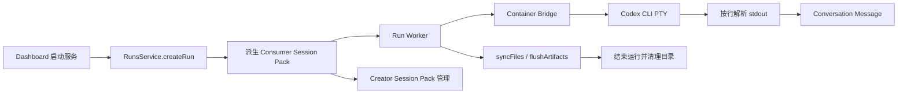
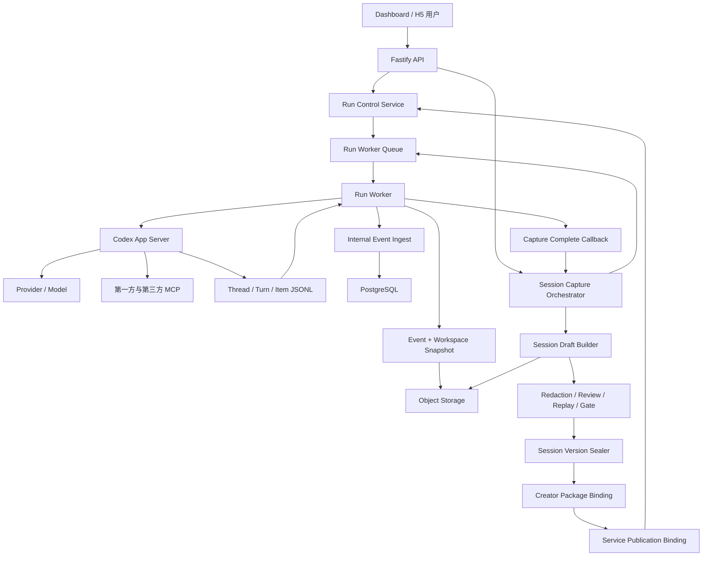
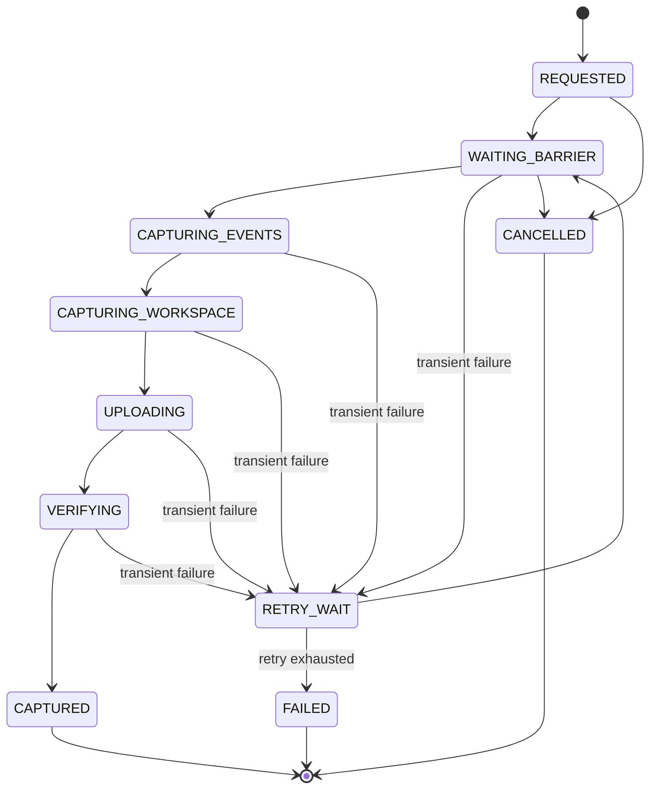
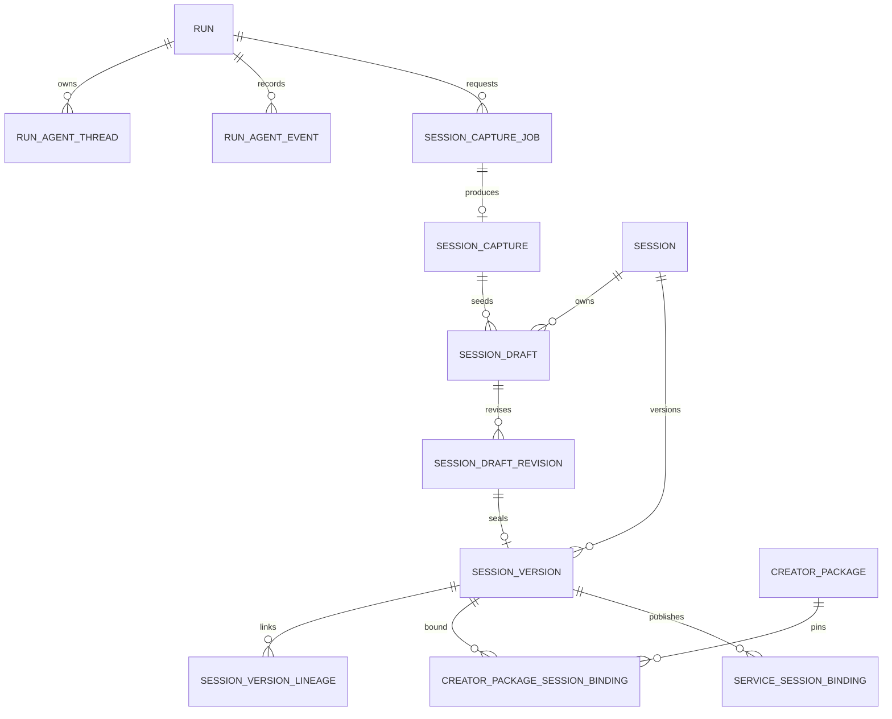

# 灵办词元 Session 控制修改方案

## 1. 文档控制

| 字段 | 内容 |
|---|---|
| 文档名称 | `20260717session控制修改方案.md` |
| 文档类型 | Session 控制域架构、数据、接口、运行时、前端与交付实施方案 |
| 产品 | 灵办词元 |
| 版本 | v1.0 |
| 编写日期 | 2026-07-17 |
| 适用范围 | `app/api`、`app/run-worker`、`app/container-bridge`、`app/dashboard`、`app/mobile`、`packages/contracts`、`packages/db`、`packages/api-sdk`、`packages/session-pack` |
| 关联文档 | `docs/产品需求草案.md`、`docs/后端设计文档.md`、`docs/后端开发文档.md`、`docs/前端需求.md`、`docs/dashboard开发文档.md`、`docs/小程序开发文档.md`、`docs/工坊服务与Session资产总表.md`、`docs/工坊资产打包、继承与发布消费执行总表.md` |
| 目标 | 建立 Run 到完整 Session Capture、脱敏草稿、不可变 Session Version、Creator Package 和工坊发布的闭环 |
| 状态 | 实施基线 |

本文档冻结 Session 控制修改的目标模型、状态机、事件协议、持久化规则、API、Worker 协议、前端交互、迁移路径和验收门槛。开发优先级用于安排实施顺序，不缩减最终交付范围。

## 2. 核心结论

| 决策项 | 冻结结论 |
|---|---|
| Codex 控制协议 | 生产控制链采用 `codex app-server` 的 stdio JSONL 双向协议 |
| 会话事实源 | App Server Thread、Turn、Item 原始事件与平台 Run 事件共同构成会话事实源 |
| 记忆选择单位 | 单个 Run 加终态或已完成 Turn 检查点，消息范围固定为该边界前的完整因果链 |
| 原始证据 | `Session Capture` 保存完整原始证据，采用内容寻址、加密存储和严格访问控制 |
| 编辑对象 | 脱敏、路径筛选、元数据补全和验证配置在 `Session Draft Revision` 层执行 |
| 发布对象 | `Session Version` 仅在密封后生成，内容、哈希、签名和来源均不可变 |
| Package 绑定 | Creator Package 通过正式绑定表引用 Session Version，`versionLine` 只承担展示职责 |
| Worker 职责 | Worker 在运行目录清理前完成事件屏障、文件同步、快照生成、上传和 API 确认 |
| API 职责 | API 负责编排 Capture Job、验证对象、构建草稿、治理审核、密封、绑定和发布 |
| Provider 记录 | Pack 保存 Provider、Model、Base URL 类型和配置指纹，禁止写入 API Key 明文 |
| MCP 记录 | Pack 保存 MCP 定义、版本、传输方式、工具事件和 Credential 引用 |
| 本地环境限制 | 禁止使用本地 Docker、WSL 或其他本地虚拟化环境；容器链路验证在远程测试节点或 CI 执行 |

## 3. 修改目标

### 3.1 产品目标

1. 用户可以从实例详情发起 Session 固化。
2. 用户可以选择 Run 终态或已完成 Turn 作为固化边界。
3. 用户可以选择目标路径中的文件范围，同时保留完整会话因果链。
4. 固化过程持续显示排队、屏障、快照、上传、验证、草稿和失败状态。
5. Creator 可以对原始 Capture 生成脱敏草稿、复核差异、执行 Replay、密封版本并绑定 Package。
6. 工坊服务可以明确绑定已密封 Session Version，并支持灰度、激活和回滚。
7. 新 Agent 实例可以从已发布 Session Version 恢复工作目录、Session 上下文、MCP 依赖和运行配置。

### 3.2 工程目标

1. 消除 PTY 文本按行解析造成的结构化事件丢失。
2. 消除 Run 终态与最终快照之间的竞态条件。
3. 消除 API 进程直接读取 Worker 运行目录的跨节点依赖。
4. 消除同一 `sessionVersionId` 对象覆盖和记录 upsert 风险。
5. 建立追加写事件、内容寻址对象、不可变版本和显式外键。
6. 建立幂等、可重试、可观测、可审计的异步 Capture 流程。
7. 保持第三方 OpenAI 兼容 Provider、第一方 MCP 和外部 MCP 的运行能力。

### 3.3 完整性原则

| 原则 | 约束 |
|---|---|
| 原始信息完整 | 原始 App Server 事件、平台事件、MCP 调用和文件清单完整保留 |
| 因果顺序完整 | 事件顺序使用平台分配的单调递增 `sequence`，禁止依赖时间戳排序 |
| 内容不可变 | Capture、Draft Revision 和 Sealed Version 均使用内容哈希标识 |
| 编辑可追溯 | 每次脱敏规则或文件范围修改生成新的 Draft Revision |
| 凭证隔离 | 资产只保存 Credential 引用、用途、类型和注入位置 |
| 发布可回滚 | 发布目标引用固定 Session Version，回滚只切换绑定 |
| 兼容可迁移 | 保留 Session Pack v1 读取器，新增 v2 写入器和迁移工具 |

## 4. 当前实现核查

### 4.1 当前链路



### 4.2 当前问题矩阵

| 编号 | 等级 | 当前实现 | 问题 | 影响 |
|---|---|---|---|---|
| CUR-001 | P0 | `CodexSession` 使用 `node-pty` 启动 Codex CLI | 交互协议依赖终端文本 | Thread、Turn、Item、审批和工具状态丢失 |
| CUR-002 | P0 | `EventParser` 将 stdout 每一行转换为 Agent 文本消息 | 原始结构被扁平化 | 无法可靠回放、分析和固化完整 Session |
| CUR-003 | P0 | `RunsService.syncRunStatus` 在终态仅记录计费并停止 Runtime | 缺少 Finalize 调度 | Run 完成后没有自动形成最终 Capture |
| CUR-004 | P0 | Worker 在 Runtime 结束后执行 `syncFiles` 和 `flushArtifacts`，随后调度清理 | 缺少归档确认门禁 | 快照失败后运行目录仍可能删除 |
| CUR-005 | P0 | API 通过 `aggregate.run.targetPath` 读取目录 | 路径依赖 API 主机本地文件系统 | 多节点 Worker、远端 Runtime 和容器路径不稳定 |
| CUR-006 | P0 | Session Archive 对象键由 `sessionVersionId` 固定生成 | 相同版本对应相同对象键 | 后续写入可能覆盖既有内容 |
| CUR-007 | P0 | Session Archive Record 使用 upsert | 版本记录可被原位替换 | 哈希、来源、审计和签名失去不可变保证 |
| CUR-008 | P1 | `buildRuntimeDerivedConversationFile` 只写 role、kind、text、时间 | messageId、附件、slot、Turn、Item 信息缺失 | 会话证据不完整 |
| CUR-009 | P1 | MCP Call 记录保存在独立审计 Repository | Pack Builder 未读取该数据 | `tool-events.jsonl` 缺少 MCP 事实 |
| CUR-010 | P1 | Package 从 `versionLine` 字符串查找 `sev_` | 缺少正式绑定字段和外键 | Session 版本绑定容易漂移 |
| CUR-011 | P1 | Creator 路由支持 Release、Replay 和 Gate 写操作 | 缺少 Package 创建和 Session 正式绑定接口 | 新固化资产无法完整进入 Creator 生产链 |
| CUR-012 | P1 | Dashboard 实例页没有 Capture 操作 | 用户无固化入口 | 产品流程中断 |
| CUR-013 | P1 | Session Pack 外层为 gzip JSON 加 Base64 | 大文件需要整体驻留内存 | 归档体积和内存峰值偏高 |
| CUR-014 | P1 | `workspace-base.tar.zst` 当前承载 gzip JSON envelope | 文件名与编码不一致 | 跨实现兼容性和诊断性不足 |

### 4.3 可直接复用能力

| 现有能力 | 复用方式 |
|---|---|
| Run Aggregate 和 Run Event Bus | 继续提供平台业务投影和 SSE 实时订阅 |
| MCP Call Audit Repository | 作为 Tool Event 构建输入 |
| Run File Index 和 Object Store | 作为文件清单、对象引用和下载能力基础 |
| Session Pack Schema、Validate、Sign、Redaction | 扩展到 v2，保留 v1 读取兼容 |
| Consumer Session 派生 | 继续用于每个 Run 的运行时隔离 |
| Creator Release、Replay、Gate、Activation | 接入显式 Session Version 绑定 |
| Dashboard 实例完整对话页 | 增加 Capture 操作、状态和跳转 |
| Worker 最终 `syncFiles` / `flushArtifacts` | 纳入 Capture Barrier 流程 |

## 5. 术语与对象边界

| 术语 | 定义 | 是否可编辑 | 是否可发布 |
|---|---|---:|---:|
| Agent Thread | Codex App Server 中的持久会话对象 | 运行期间可追加 Turn | 否 |
| Turn | 一次用户输入到 Codex 完成输出的执行单元 | 运行期间可中断 | 否 |
| Item | Turn 内的消息、命令、文件修改、工具调用、审批等结构化对象 | 由 App Server 产生 | 否 |
| Run | 平台中的一次 Agent 执行实例 | 运行期间可交互 | 否 |
| Capture Job | 对 Run 某个边界执行固化的异步任务 | 状态可变化 | 否 |
| Session Capture | 某个边界的原始不可变运行证据 | 否 | 否 |
| Session Draft | 面向 Creator 的可治理资产草稿 | 是 | 否 |
| Draft Revision | 某次文件范围、脱敏规则和配置确定后的不可变候选 | 否 | 否 |
| Session | 长期资产主对象 | 元数据可维护 | 否 |
| Session Version | 已密封、已签名、可执行的不可变版本 | 否 | 是 |
| Creator Package | Session、Runtime、Connector 和发布治理的聚合对象 | 是 | 通过 Release 发布 |
| Publication Binding | Service、Workspace、Entry Surface 到 Session Version 的绑定 | 可切换 | 是 |

### 5.1 关键边界

1. Run 保持用户交互和执行状态职责。
2. Capture 保存某个确定边界的完整原始证据。
3. Draft 保存治理过程和候选修订。
4. Session Version 保存密封后的执行资产。
5. Package 保存资产组合、Release、Replay、Gate 和 Activation。
6. Publication Binding 保存服务消费哪个固定版本。

## 6. 目标系统架构



### 6.1 组件职责

| 组件 | 新增或调整职责 |
|---|---|
| Dashboard | 发起 Capture、选择检查点和路径、查看进度、进入 Creator 审核 |
| Mobile H5 | 提供整次 Run 快速固化和状态查看 |
| API | Capture 编排、权限、幂等、状态机、对象验证、草稿、密封和发布 |
| Run Worker | 控制 App Server、建立屏障、生成快照、流式上传、等待确认后清理 |
| Container Bridge | 逐步退出生产会话控制职责，保留文件监控、Artifact、MCP Proxy 等 Runtime 能力 |
| Codex App Server Adapter | 管理 initialize、Thread、Turn、Item、审批、恢复和中断 |
| PostgreSQL | 保存 Thread 映射、原始事件索引、Capture 状态、Draft、Version 和绑定 |
| Object Storage | 保存原始事件、工作区快照、Draft Revision 和密封 Pack |
| Session Pack Builder | 从已验证 Capture 生成候选 Pack，禁止直接读取运行目录 |
| Creator | 管理脱敏、Replay、Gate、密封、Package 和发布 |

## 7. Codex App Server 接入方案

### 7.1 选型

生产交互使用 `codex app-server --listen stdio://`。协议采用逐行 JSON 消息，保持单个 Run 对应一个独立 App Server 进程和独立 `CODEX_HOME`。

官方协议参考：

- `https://github.com/openai/codex/blob/main/codex-rs/app-server/README.md`
- `https://github.com/openai/codex/blob/main/codex-rs/docs/codex_mcp_interface.md`

### 7.2 Adapter 接口

```ts
interface AgentRuntimeAdapter {
  initialize(): Promise<void>;
  startThread(input: StartAgentThreadInput): Promise<AgentThread>;
  resumeThread(threadId: string): Promise<AgentThread>;
  startTurn(threadId: string, input: AgentTurnInput): Promise<AgentTurn>;
  interruptTurn(threadId: string, turnId: string): Promise<void>;
  respondToApproval(requestId: string, decision: ApprovalDecision): Promise<void>;
  readThread(threadId: string): Promise<AgentThreadSnapshot>;
  flushEvents(): Promise<AgentEventBarrier>;
  stop(): Promise<void>;
}
```

### 7.3 生命周期映射

| 平台动作 | App Server 动作 | 平台记录 |
|---|---|---|
| 创建 Run | `initialize` + `thread/start` | `run_agent_threads` |
| 用户发送消息 | `turn/start` | 用户消息、Turn ID、输入附件 |
| Codex 输出 | `item/*` 通知 | 原始事件和会话投影 |
| 命令审批 | App Server 审批请求与响应 | `run_approvals`、原始审批事件 |
| 用户取消当前执行 | `turn/interrupt` | Turn interrupted、Run 状态投影 |
| Worker 恢复 | `thread/resume` | 恢复次数、恢复原因、Thread ID |
| Run 固化 | `thread/read` + Event Barrier | Thread 快照、事件高水位 |
| Run 关闭 | Adapter stop | Runtime finished、退出元数据 |

### 7.4 事件兼容规则

1. 所有 App Server 消息先按原始 JSON 保存，再执行已知事件投影。
2. 未识别通知保存为 `unknown_app_server_event`，禁止丢弃。
3. Adapter 使用协议版本和 Codex CLI 版本选择解析器。
4. 每次 Runner Image 更新必须执行 App Server 契约回归。
5. 解析失败进入隔离队列并保留原始行、stderr 和版本信息。

### 7.5 Provider 配置

每个 Run 的独立 `CODEX_HOME` 中生成运行级配置：

```text
/workspace/codex-home/
  config.toml
  sessions/
  logs/
```

记录规则：

| 配置 | 进入 Run 记录 | 进入 Capture | 进入发布 Pack |
|---|---:|---:|---:|
| Provider ID | 是 | 是 | 是 |
| Provider 类型 | 是 | 是 | 是 |
| Base URL | 是 | 保存规范化来源和哈希 | 按策略保存域名或 Provider 引用 |
| Model | 是 | 是 | 是 |
| API Key | 仅运行时注入 | 否 | 否 |
| Credential ID | 是 | 是 | 是 |
| Provider 配置指纹 | 是 | 是 | 是 |

第三方 OpenAI 兼容 Provider 继续通过平台 Provider、Workspace Binding 和 Credential Broker 注入。App Server Adapter 只消费已经解析完成的运行配置。

## 8. 原始事件模型

### 8.1 事件记录字段

| 字段 | 类型 | 说明 |
|---|---|---|
| `event_id` | UUID | 平台事件主键 |
| `run_id` | string | 所属 Run |
| `sequence` | bigint | Run 内单调递增序号 |
| `source` | enum | `app_server / bridge / api / worker / mcp` |
| `source_event_id` | string nullable | 上游事件 ID |
| `thread_id` | string nullable | Codex Thread ID |
| `turn_id` | string nullable | Codex Turn ID |
| `item_id` | string nullable | Codex Item ID |
| `event_type` | string | 原始或规范化事件类型 |
| `occurred_at` | timestamptz | 上游时间 |
| `recorded_at` | timestamptz | 平台落库时间 |
| `raw_json` | jsonb | 原始消息 |
| `normalized_json` | jsonb nullable | 平台投影数据 |
| `previous_hash` | char(64) nullable | 前一事件哈希 |
| `event_hash` | char(64) | 当前事件哈希 |

### 8.2 顺序与幂等

1. `sequence` 由数据库按 Run 分配。
2. 幂等键优先使用上游事件 ID。
3. 缺少上游 ID 时使用 `run_id + source + thread_id + turn_id + item_id + event_type + payload_hash`。
4. 重复事件返回既有记录，禁止重复投影和重复计费。
5. Capture 使用 `high_watermark_sequence` 固定边界。

### 8.3 事件投影

| App Server 或平台事件 | 平台投影 |
|---|---|
| `thread/started` | Agent Thread 记录 |
| `turn/started` | Run Turn 记录、运行状态 |
| User Message Item | Conversation Message |
| Agent Message Item | Conversation Message |
| Command Execution Item | Tool Event、审批和结果 |
| File Change Item | Tool Event、File Index 更新 |
| MCP Tool Item | MCP Call Audit、Tool Event |
| Approval Request | Run Approval |
| `turn/completed` | Turn 终态、Usage、Capture 可用检查点 |
| `turn/interrupted` | Turn 中断状态 |
| Runtime heartbeat | Runtime 健康状态 |

### 8.4 会话展示投影

Dashboard 对话继续读取平台 `RunSnapshot.messages`。投影必须保留：

- `messageId`
- `threadId`
- `turnId`
- `itemId`
- `sequence`
- `role`
- `kind`
- `text`
- `attachments`
- `slotValues`
- `createdAt`

原始事件是证据源，Conversation Message 是查询投影。

## 9. Capture 选择模型

### 9.1 选择范围

| 维度 | 用户可选项 | 系统约束 |
|---|---|---|
| 来源 Run | 当前工作区可访问 Run | 单次 Capture 只有一个主 Run |
| Capture 模式 | `terminal`、`checkpoint` | Checkpoint 必须对应已完成 Turn |
| 截止边界 | Run 最终事件或 `turnId` | 系统解析并固定 `high_watermark_sequence` |
| 会话范围 | 固定 `causal_complete` | 保留边界前完整因果链 |
| 工作区根 | Run Target Path | 禁止选择 Runtime Secret、CODEX_HOME 和 Browser Profile |
| 文件包含 | glob 列表 | 默认 `**/*` |
| 文件排除 | glob 列表 | 默认排除临时文件、缓存和已知敏感路径 |
| Artifact | 全部或选定 Artifact | 引用文件必须进入文件清单 |
| MCP 事件 | 固定包含 | API Key 和鉴权 Header 执行脱敏 |
| 审批事件 | 固定包含 | 保留决策和原因，隐藏敏感载荷 |
| 目标资产 | 新 Session、已有 Session、已有 Package | 绑定动作在 Capture 完成后执行 |

### 9.2 默认文件排除规则

```text
.git/**
node_modules/**
.cache/**
tmp/**
**/*.tmp
**/*.log
**/.DS_Store
```

以下路径由系统强制排除：

```text
/workspace/secrets/**
/workspace/codex-home/**
/workspace/browser-profile/**
/workspace/home/**
/workspace/tmp/**
```

Target Path 中仍需执行敏感内容扫描，因为 Agent 可能将敏感值写入业务文件。

### 9.3 多 Run 规则

1. 一个 Session Version 对应一个主 Capture。
2. 续跑通过 `parent_session_version_id` 形成谱系。
3. Replay Run 通过 Evidence 引用关联。
4. 多 Run 证据可以加入 Package 审核记录。
5. 禁止将不同 Run 的消息拼接为同一伪造时间线。

## 10. Capture 状态机



### 10.1 状态定义

| 状态 | 责任方 | 完成条件 |
|---|---|---|
| `REQUESTED` | API | 请求已校验并持久化 |
| `WAITING_BARRIER` | API / Worker | Run 满足终态或 Turn 完成条件 |
| `CAPTURING_EVENTS` | Worker / API | 原始事件和 Thread Snapshot 固定 |
| `CAPTURING_WORKSPACE` | Worker | 文件清单和 Workspace Archive 生成 |
| `UPLOADING` | Worker | 所有对象上传完成 |
| `VERIFYING` | API | 大小、哈希、边界和安全扫描通过 |
| `CAPTURED` | API | Session Capture 已形成且不可变 |
| `RETRY_WAIT` | Queue | 等待退避后重试 |
| `FAILED` | API | 达到重试上限或发生永久错误 |
| `CANCELLED` | API | Capture 在生成不可变对象前取消 |

### 10.2 重试策略

| 失败类型 | 重试 | 策略 |
|---|---:|---|
| Worker 暂时离线 | 是 | 指数退避，最大 10 次 |
| Object Storage 超时 | 是 | 分片续传，最大 8 次 |
| Event Barrier 超时 | 是 | 检查 Turn 状态后重试 |
| 文件在快照期间变化 | 是 | 重新建立屏障并重建快照 |
| 哈希不一致 | 是 | 删除未确认对象并重新上传 |
| 路径越界或符号链接逃逸 | 否 | 标记永久失败和安全事件 |
| 敏感内容策略阻断 | 否 | 进入 Creator 修订流程 |
| Run 无访问权限 | 否 | 返回权限错误 |

## 11. Capture Barrier 协议

### 11.1 Terminal Capture

```text
1. Codex App Server 发出 turn/completed 或终态事件
2. Run 状态进入 SUCCEEDED / FAILED / CANCELLED
3. Worker 停止接受新 Turn
4. Worker 执行 flushEvents
5. Worker 执行 syncFiles
6. Worker 执行 flushArtifacts
7. Worker 获取 API event high watermark
8. Worker 固定目标目录文件清单
9. Worker 生成并上传快照
10. API 验证并确认 Capture
11. Worker 更新 runtime.finishedAt
12. Worker 调度运行目录清理
```

### 11.2 Checkpoint Capture

1. 用户选择已完成 Turn。
2. API 校验当前没有进行中的早于或等于该边界的未决 Item。
3. API 对新 Turn 建立短时写入屏障。
4. Worker 刷新事件、文件和 Artifact。
5. API 固定目标 Turn 对应的事件高水位。
6. Worker 生成 Checkpoint Workspace Snapshot。
7. Capture 确认后解除写入屏障。

### 11.3 清理门禁

Worker 清理条件：

```text
capture_required = false
OR capture_status = CAPTURED
OR capture_status = FAILED AND retention_deadline_reached = true
```

Capture 失败时保留：

- Run Root
- Target Path
- Runtime Event Log
- Workspace Inventory
- 上传分片状态
- Capture Job ID

## 12. Worker 快照实现

### 12.1 Worker 职责调整

| 当前动作 | 调整后动作 |
|---|---|
| Runtime 结束后同步文件 | 保留，并纳入屏障 |
| Runtime 结束后刷新 Artifact | 保留，并纳入屏障 |
| 立即设置 finishedAt | Capture 确认后设置 |
| 立即调度 Cleanup | 通过 Cleanup Gate 判断 |
| API 读取 Target Path | Worker 生成快照并上传 |

### 12.2 新服务

```text
app/run-worker/src/services/session-capture/
  capture-orchestrator.ts
  event-exporter.ts
  workspace-inventory.ts
  workspace-snapshot.ts
  multipart-uploader.ts
  capture-retry.ts
  cleanup-gate.ts
```

### 12.3 Workspace Inventory

每个文件记录：

| 字段 | 说明 |
|---|---|
| `logicalPath` | 相对 Target Path 的规范化路径 |
| `kind` | file、directory、symlink |
| `sizeBytes` | 文件大小 |
| `mtimeNs` | 捕获时修改时间 |
| `mode` | POSIX 权限位 |
| `sha256` | 文件内容哈希 |
| `mimeType` | 推断 MIME |
| `source` | upload、runtime-output、generated、artifact |
| `included` | 是否进入 Pack |
| `exclusionReason` | 排除原因 |

### 12.4 文件安全

1. 路径必须规范化为相对路径。
2. 禁止 `..`、绝对路径和盘符逃逸。
3. Symlink 默认只记录，不跟随到 Target Path 外部。
4. Socket、Device、FIFO 等特殊文件禁止进入 Pack。
5. 单文件和总归档体积执行 Workspace Policy。
6. 快照前后分别校验 Inventory 指纹，变化时重试。
7. 已知 Credential 明文、私钥、Cookie 和 Token 触发隔离。

### 12.5 上传协议

1. API 生成预签名上传目标或平台上传票据。
2. Worker 对大对象执行分片上传。
3. 每个分片记录 ETag、大小和序号。
4. 完成回调携带整体 SHA-256、大小和对象键。
5. API 从 Object Storage 验证元数据并抽样读取。
6. 未确认对象由生命周期策略清理。

## 13. Session 数据模型

### 13.1 关系



### 13.2 `run_agent_threads`

| 字段 | 约束 |
|---|---|
| `run_id` | FK，唯一主 Thread |
| `thread_id` | App Server Thread ID，唯一 |
| `session_tree_id` | Thread 树根 ID nullable |
| `provider_id` | Provider 引用 |
| `provider_binding_id` | Workspace Provider Binding 引用 |
| `model` | 实际模型 |
| `provider_config_hash` | 配置指纹 |
| `codex_version` | Codex CLI 版本 |
| `protocol_version` | Adapter 协议版本 |
| `started_at` | 启动时间 |
| `last_turn_id` | 最近 Turn |
| `updated_at` | 更新时间 |

### 13.3 `session_capture_jobs`

| 字段 | 约束 |
|---|---|
| `capture_id` | UUID 主键 |
| `run_id` | FK |
| `workspace_id` | FK |
| `requested_by_user_id` | FK |
| `mode` | terminal、checkpoint |
| `checkpoint_turn_id` | Checkpoint 模式必填 |
| `high_watermark_sequence` | 屏障完成后写入 |
| `selection_json` | 路径和 Artifact 选择 |
| `status` | Capture 状态 |
| `attempt_count` | 重试次数 |
| `lease_owner` | Worker 租约 |
| `lease_expires_at` | 租约过期时间 |
| `last_error_code` | 最近错误码 |
| `last_error_message` | 最近错误摘要 |
| `created_at`、`updated_at` | 审计时间 |

约束：

```text
UNIQUE(run_id, mode, checkpoint_turn_id, selection_hash, request_idempotency_key)
```

### 13.4 `session_captures`

| 字段 | 约束 |
|---|---|
| `capture_id` | PK、FK Capture Job |
| `source_run_id` | FK |
| `source_thread_id` | Codex Thread ID |
| `source_turn_id` | 截止 Turn |
| `event_high_watermark` | 最终事件序号 |
| `raw_events_object_key` | 原始事件对象 |
| `raw_events_sha256` | 原始事件哈希 |
| `thread_snapshot_object_key` | Thread Snapshot 对象 |
| `workspace_object_key` | Workspace Snapshot 对象 |
| `workspace_sha256` | Workspace Snapshot 哈希 |
| `workspace_inventory_object_key` | Inventory 对象 |
| `capture_manifest_object_key` | Capture Manifest |
| `capture_manifest_sha256` | Capture 总指纹 |
| `security_state` | clean、quarantined、blocked |
| `captured_at` | 捕获时间 |

### 13.5 `sessions`

| 字段 | 约束 |
|---|---|
| `session_id` | 主键 |
| `workspace_id` | FK |
| `name` | 名称 |
| `description` | 描述 |
| `task_family` | 任务族 |
| `status` | active、archived |
| `created_by_user_id` | 创建者 |
| `created_at`、`updated_at` | 审计时间 |

### 13.6 `session_drafts`

| 字段 | 约束 |
|---|---|
| `draft_id` | UUID 主键 |
| `session_id` | FK |
| `source_capture_id` | FK |
| `parent_session_version_id` | 谱系父版本 nullable |
| `status` | editing、redaction_pending、review_pending、ready_to_seal、sealed、discarded |
| `current_revision_id` | 当前候选修订 |
| `created_by_user_id` | 创建者 |
| `created_at`、`updated_at` | 审计时间 |

### 13.7 `session_draft_revisions`

| 字段 | 约束 |
|---|---|
| `revision_id` | UUID 主键 |
| `draft_id` | FK |
| `revision_number` | Draft 内递增 |
| `selection_json` | 文件选择 |
| `redaction_map_json` | 脱敏规则 |
| `candidate_object_key` | 候选 Pack 对象 |
| `candidate_sha256` | 候选 Pack 哈希 |
| `validation_report_json` | 构建验证结果 |
| `security_report_json` | 敏感扫描结果 |
| `created_by_user_id` | 操作者 |
| `created_at` | 创建时间 |

约束：

```text
UNIQUE(draft_id, revision_number)
UNIQUE(candidate_sha256)
```

### 13.8 `session_versions`

| 字段 | 约束 |
|---|---|
| `session_version_id` | 主键 |
| `session_id` | FK |
| `sealed_from_revision_id` | FK、唯一 |
| `parent_session_version_id` | FK nullable |
| `manifest_version` | Pack Manifest 版本 |
| `pack_object_key` | 内容寻址对象键 |
| `pack_sha256` | 唯一内容哈希 |
| `pack_size_bytes` | 大小 |
| `signature_algorithm` | 签名算法 |
| `signature_key_id` | 签名 Key ID |
| `signature_value` | 签名值 |
| `content_state` | sealed、archived |
| `sealed_by_user_id` | 密封人 |
| `sealed_at` | 密封时间 |

密封后禁止 UPDATE 内容字段。归档只更新 `content_state` 和审计字段。

### 13.9 正式绑定表

| 表 | 关键字段 |
|---|---|
| `creator_package_session_bindings` | package_id、session_version_id、binding_state、created_at |
| `service_session_bindings` | service_id、workspace_context_key、entry_surface、task_version_id、session_version_id、state |
| `session_version_lineage` | parent_version_id、child_version_id、relation_type、reason |

## 14. 对象存储规范

### 14.1 对象键

```text
session-captures/{captureId}/raw-events/{sha256}.jsonl.gz
session-captures/{captureId}/thread/{sha256}.json.gz
session-captures/{captureId}/workspace/{sha256}.tar.zst
session-captures/{captureId}/inventory/{sha256}.json.gz
session-drafts/{draftId}/revisions/{revisionId}/{sha256}.pack
session-versions/{sessionVersionId}/{sha256}.session-pack.tar.zst
```

### 14.2 不可变规则

1. Object Key 包含内容哈希。
2. 上传时使用 `If-None-Match` 或等价条件。
3. 已存在对象必须验证大小和哈希。
4. 数据库事务只在对象验证通过后写入引用。
5. 对象删除通过 Retention Job 执行，禁止同步级联删除。
6. Sealed Version 对象进入 Object Lock 或逻辑 WORM 策略。

### 14.3 加密与保留

| 对象 | 加密 | 默认保留 |
|---|---|---|
| Raw Events | KMS/SSE，受限访问 | 180 天，可按企业策略延长 |
| Raw Workspace Capture | KMS/SSE，受限访问 | 180 天 |
| Draft Revision | KMS/SSE | Draft 删除后 30 天 |
| Sealed Session Version | KMS/SSE + WORM | Session 生命周期内保留 |
| Export 临时对象 | KMS/SSE | 24 小时 |

## 15. Session Pack v2

### 15.1 格式决策

1. 新写入格式使用 `lingban.session-pack/v2`。
2. 外层使用真实 `tar.zst` 流式归档。
3. `manifest.json` 位于根目录。
4. Manifest 对每个文件记录 SHA-256、大小、MIME 和 required 标记。
5. v1 gzip JSON Base64 读取器继续保留。
6. 新发布版本统一写 v2。

### 15.2 文件矩阵

| 文件 | 必需 | 来源 | 说明 |
|---|---:|---|---|
| `manifest.json` | 是 | Sealer | 版本、依赖、来源、文件哈希和签名 |
| `capture-provenance.json` | 是 | Capture | Run、Thread、Turn、事件边界和对象哈希 |
| `agent-events.jsonl` | 是 | App Server Event Log | 原始结构化事件的发布级脱敏投影 |
| `conversation.jsonl` | 是 | Conversation Projection | 完整消息、附件、slot、Turn 和 Item 引用 |
| `tool-events.jsonl` | 是 | App Server + MCP Audit | 命令、文件修改、MCP、结果和错误 |
| `approval-events.jsonl` | 是 | Run Approval | 请求、决策、原因和作用范围 |
| `workspace-base.tar.zst` | 是 | Worker Snapshot | 目标工作区快照 |
| `workspace-inventory.json` | 是 | Worker Inventory | 文件元数据和哈希 |
| `artifact-index.json` | 是 | Run Artifact | 产物清单和契约映射 |
| `slot-schema.json` | 是 | Parent Pack / Run Intake | 输入槽位定义 |
| `information-collection-review.json` | 条件必需 | Run Intake | 输入答案和复核轨迹 |
| `mcp-requirements.json` | 是 | Runtime Resolution | MCP 和 Credential 引用需求 |
| `runtime-profile.json` | 是 | Runtime Resolution | Runner Image 和环境能力 |
| `runtime-config.json` | 是 | Runtime Resolution | 已清理的运行配置 |
| `provider-profile.json` | 是 | Provider Resolution | Provider、Model 和配置指纹 |
| `validator-set.json` | 是 | Creator / Builder | Replay 和发布断言 |
| `redaction-map.json` | 是 | Draft Revision | 脱敏规则和覆盖信息 |
| `validation-report.json` | 是 | Builder | Pack、哈希、依赖和安全校验结果 |

### 15.3 `conversation.jsonl` 记录

```json
{
  "sequence": 1024,
  "message_id": "msg_xxx",
  "thread_id": "thr_xxx",
  "turn_id": "turn_xxx",
  "item_id": "item_xxx",
  "role": "user",
  "kind": "text",
  "text": "...",
  "attachments": [],
  "slot_values": [],
  "created_at": "2026-07-17T00:00:00.000Z"
}
```

### 15.4 `tool-events.jsonl` 记录

```json
{
  "sequence": 1031,
  "thread_id": "thr_xxx",
  "turn_id": "turn_xxx",
  "item_id": "item_xxx",
  "tool_type": "command_execution",
  "tool_name": "shell",
  "status": "completed",
  "input": { "command": "...", "cwd": "/workspace/target" },
  "output_ref": "capture://outputs/1031",
  "started_at": "2026-07-17T00:00:01.000Z",
  "finished_at": "2026-07-17T00:00:02.000Z"
}
```

敏感工具输入和输出使用引用或脱敏结果，Raw Capture 保留受限原始证据。

## 16. Pack Builder

### 16.1 纯输入模型

Pack Builder 只接受已验证对象：

```ts
interface BuildSessionDraftRevisionInput {
  capture: VerifiedSessionCapture;
  parentVersion?: SealedSessionVersion;
  selection: WorkspaceSelection;
  redactionMap: RedactionMap;
  runtimeRequirements: RuntimeRequirements;
  validatorSet: ValidatorSet;
  actor: SessionActor;
}
```

Builder 禁止访问 Run Target Path、Worker Root 和本地 Codex Session 目录。

### 16.2 构建步骤

| 顺序 | 动作 | 失败结果 |
|---:|---|---|
| 1 | 验证 Capture Manifest 和对象哈希 | 阻断 |
| 2 | 读取事件边界并验证 hash chain | 阻断 |
| 3 | 生成 Conversation、Tool、Approval 投影 | 阻断 |
| 4 | 应用路径选择并生成 Workspace Snapshot | 阻断 |
| 5 | 解析 Provider、MCP、Credential 引用 | 阻断 |
| 6 | 应用 Redaction Map | 敏感项未覆盖时阻断 |
| 7 | 生成 Artifact Contract 和 Validator Set | 缺必需产物时阻断 |
| 8 | 生成 Pack v2 | 阻断 |
| 9 | 校验文件哈希、Schema 和大小 | 阻断 |
| 10 | 保存 Draft Revision | 成功 |

### 16.3 确定性

同一 Capture、Selection、Redaction Map、Runtime Requirements 和 Validator Set 必须生成相同候选内容哈希。Manifest 中的审计时间字段使用 Draft Revision 固定时间，禁止在重复构建时产生随机变化。

## 17. 脱敏与安全复核

### 17.1 两层资产

| 层 | 内容 | 权限 |
|---|---|---|
| Raw Capture | 原始事件、原始工作区、原始工具证据 | owner、admin、creator 中具备敏感审阅权限的用户 |
| Candidate / Sealed Pack | 应用脱敏、路径策略和凭证清理后的资产 | Creator、发布和消费链 |

### 17.2 脱敏目标

| 目标 | 示例 |
|---|---|
| 文本 | API Key、税号、身份证号、手机号 |
| JSON Path | Tool Input、MCP Result、Provider Config |
| Header | Authorization、Cookie、Set-Cookie |
| 文件路径 | 用户名、主机目录、企业内部路径 |
| 文件内容 | `.env`、证书、浏览器状态、配置文件 |
| Slot | 标记为 `secret=true` 的输入槽位 |

### 17.3 审核 Gate

密封前必须满足：

1. 必需 Secret Slot 覆盖率为 100%。
2. 高置信敏感扫描结果为零。
3. 所有强制排除路径均未进入 Pack。
4. Credential 明文扫描结果为零。
5. Redaction Preview 与 Candidate Pack 哈希一致。
6. Reviewer 对当前 Draft Revision 明确批准。
7. Replay Gate 和 Validator Gate 满足发布策略。

## 18. MCP 与 Credential 固化

### 18.1 MCP 内容

| 内容 | 保存 |
|---|---:|
| MCP ID | 是 |
| MCP 类型 | 是 |
| Transport | 是 |
| Command 或 URL 模板 | 按治理策略 |
| 工具清单和 Schema Hash | 是 |
| 网络策略引用 | 是 |
| 调用事件 | 是 |
| 调用敏感参数 | 脱敏后保存 |
| OAuth Token / API Key | 否 |

### 18.2 Credential 内容

Pack 中只允许：

```json
{
  "credential_id": "cred_xxx",
  "credential_type": "api-key",
  "placement": "env",
  "required": true,
  "purpose": "image-generation-provider"
}
```

启动新 Run 时，由目标用户或工作区绑定满足相同 capability 的 Credential。源用户凭证禁止自动继承到其他主体。

## 19. API 设计

### 19.1 用户与 Creator API

| 方法 | 路径 | 作用 |
|---|---|---|
| `POST` | `/v1/runs/:runId/session-captures` | 发起 Capture |
| `GET` | `/v1/runs/:runId/session-captures` | 列出 Run 的 Capture |
| `GET` | `/v1/session-captures/:captureId` | 获取 Capture 状态和摘要 |
| `POST` | `/v1/session-captures/:captureId/retry` | 重试失败 Capture |
| `POST` | `/v1/session-captures/:captureId/drafts` | 创建 Session Draft |
| `GET` | `/v1/session-drafts/:draftId` | 获取 Draft 详情 |
| `POST` | `/v1/session-drafts/:draftId/revisions` | 生成新 Draft Revision |
| `POST` | `/v1/session-drafts/:draftId/redaction-review` | 提交脱敏复核 |
| `POST` | `/v1/session-drafts/:draftId/replay` | 发起 Replay |
| `POST` | `/v1/session-drafts/:draftId/seal` | 密封 Session Version |
| `POST` | `/v1/creator/packages` | 创建 Creator Package |
| `PUT` | `/v1/creator/packages/:packageId/session-binding` | 绑定 Session Version |
| `GET` | `/v1/sessions/:sessionId/versions` | 列出正式版本 |
| `GET` | `/v1/session-versions/:sessionVersionId` | 获取密封版本详情 |

### 19.2 Capture 请求

```json
{
  "mode": "terminal",
  "checkpointTurnId": null,
  "workspaceSelection": {
    "include": ["**/*"],
    "exclude": ["node_modules/**", ".git/**"],
    "artifactIds": [],
    "maxTotalBytes": 1073741824
  },
  "destination": {
    "sessionId": null,
    "packageId": null
  },
  "title": "2026 年度企业报税流程",
  "idempotencyKey": "client-generated-uuid"
}
```

响应：

```json
{
  "captureId": "cap_xxx",
  "runId": "run_xxx",
  "status": "REQUESTED",
  "statusUrl": "/v1/session-captures/cap_xxx",
  "createdAt": "2026-07-17T00:00:00.000Z"
}
```

### 19.3 Draft Revision 请求

```json
{
  "baseRevisionId": "sdr_xxx",
  "workspaceSelection": {
    "include": ["reports/**", "receipts/**"],
    "exclude": ["reports/private-source/**"]
  },
  "redactionMap": {
    "version": "redaction.v3",
    "secretSlotKeys": ["taxpayer_id"],
    "rules": []
  },
  "validatorSet": {
    "validators": []
  }
}
```

### 19.4 Seal 请求

```json
{
  "revisionId": "sdr_xxx",
  "sessionVersionLabel": "1.0.0",
  "signingPolicyId": "signing_default",
  "reviewDecisionId": "review_xxx",
  "replayId": "replay_xxx"
}
```

### 19.5 Internal API

| 方法 | 路径 | 作用 |
|---|---|---|
| `POST` | `/internal/runs/:runId/session-captures/:captureId/lease` | Worker 获取 Capture 租约 |
| `POST` | `/internal/runs/:runId/session-captures/:captureId/barrier` | 提交事件高水位和 Thread 边界 |
| `POST` | `/internal/runs/:runId/session-captures/:captureId/upload-tickets` | 获取上传票据 |
| `POST` | `/internal/runs/:runId/session-captures/:captureId/heartbeat` | 延长租约 |
| `POST` | `/internal/runs/:runId/session-captures/:captureId/complete` | 提交对象和哈希 |
| `POST` | `/internal/runs/:runId/session-captures/:captureId/fail` | 提交失败和重试建议 |

### 19.6 Internal Complete 请求

```json
{
  "leaseToken": "lease_xxx",
  "eventHighWatermark": 2048,
  "sourceThreadId": "thr_xxx",
  "sourceTurnId": "turn_xxx",
  "objects": {
    "rawEvents": { "objectKey": "...", "sha256": "...", "sizeBytes": 100 },
    "threadSnapshot": { "objectKey": "...", "sha256": "...", "sizeBytes": 100 },
    "workspace": { "objectKey": "...", "sha256": "...", "sizeBytes": 100 },
    "inventory": { "objectKey": "...", "sha256": "...", "sizeBytes": 100 }
  },
  "inventoryFingerprint": "sha256",
  "capturedAt": "2026-07-17T00:00:00.000Z"
}
```

## 20. 权限模型

| 动作 | owner | admin | creator | operator | viewer |
|---|---:|---:|---:|---:|---:|
| 查看本人可访问 Run | 是 | 是 | 是 | 是 | 是 |
| 发起 Run Capture | 是 | 是 | 是 | 是 | 否 |
| 查看 Capture 摘要 | 是 | 是 | 是 | 是 | 是 |
| 查看 Raw Capture 敏感内容 | 是 | 是 | 按工作区策略 | 否 | 否 |
| 创建 Session Draft | 是 | 是 | 是 | 否 | 否 |
| 修改脱敏规则 | 是 | 是 | 是 | 否 | 否 |
| 提交审核 | 是 | 是 | 是 | 否 | 否 |
| 密封 Session Version | 是 | 是 | 按工作区策略 | 否 | 否 |
| 绑定 Package | 是 | 是 | 是 | 否 | 否 |
| 发布服务 | 是 | 是 | 按发布策略 | 否 | 否 |

个人空间 owner 自动具备 Creator 资产治理能力。跨工作区访问必须返回 `404` 或统一对象不可见响应，防止枚举。

## 21. 幂等、并发与事务

### 21.1 幂等

| 动作 | 幂等键 |
|---|---|
| 发起 Capture | `workspace_id + run_id + idempotency_key` |
| 获取 Worker Lease | `capture_id + lease_generation` |
| Complete Callback | `capture_id + capture_manifest_sha256` |
| 创建 Draft | `capture_id + session_id + idempotency_key` |
| 创建 Revision | `draft_id + input_fingerprint` |
| Seal | `revision_id + signing_policy_id` |
| Package Binding | `package_id + session_version_id + state` |

### 21.2 乐观锁

以下对象增加 `version` 字段：

- Capture Job
- Session Draft
- Creator Package Binding
- Service Session Binding

写请求必须携带 `expectedVersion`。冲突返回 `409 RESOURCE_VERSION_CONFLICT`。

### 21.3 事务边界

1. 对象上传和数据库事务分离。
2. 上传完成后先验证对象，再提交数据库引用。
3. Session Version 密封事务同时写 Version、Lineage、Audit。
4. Publication Binding 切换使用单事务，并记录旧版本和新版本。

## 22. 错误码

| 错误码 | HTTP | 说明 |
|---|---:|---|
| `RUN_CAPTURE_NOT_ALLOWED` | 409 | Run 当前状态不允许 Capture |
| `RUN_CAPTURE_TURN_IN_PROGRESS` | 409 | Checkpoint Turn 尚未完成 |
| `RUN_CAPTURE_BARRIER_TIMEOUT` | 504 | 事件屏障超时 |
| `RUN_CAPTURE_WORKER_UNAVAILABLE` | 503 | Worker 不可用 |
| `RUN_CAPTURE_PATH_INVALID` | 400 | 文件路径规则非法 |
| `RUN_CAPTURE_PATH_ESCAPE` | 409 | 路径或 Symlink 越界 |
| `RUN_CAPTURE_SIZE_LIMIT_EXCEEDED` | 413 | 超出体积限制 |
| `RUN_CAPTURE_HASH_MISMATCH` | 409 | 对象哈希不一致 |
| `RUN_CAPTURE_SECURITY_BLOCKED` | 409 | 安全策略阻断 |
| `SESSION_DRAFT_REVISION_CONFLICT` | 409 | Draft Revision 并发冲突 |
| `SESSION_REDACTION_COVERAGE_INCOMPLETE` | 409 | 脱敏覆盖不足 |
| `SESSION_REVIEW_REQUIRED` | 409 | 缺少有效审核 |
| `SESSION_REPLAY_GATE_REQUIRED` | 409 | 缺少 Replay Gate |
| `SESSION_VERSION_ALREADY_SEALED` | 409 | Revision 已密封 |
| `SESSION_VERSION_IMMUTABLE` | 409 | 尝试修改密封版本 |
| `CREATOR_PACKAGE_SESSION_BINDING_CONFLICT` | 409 | Package 绑定冲突 |

## 23. Dashboard 交互

### 23.1 实例页入口

实例详情顶层操作区增加“固化会话”按钮。

可用条件：

| Run 状态 | 行为 |
|---|---|
| `SUCCEEDED` | 默认 Terminal Capture |
| `FAILED` | 允许固化，明确标记失败证据 |
| `CANCELLED` | 允许固化，明确标记中断证据 |
| `RUNNING` | 仅在当前 Turn 完成后允许 Checkpoint Capture |
| `WAITING_APPROVAL` | 允许选择上一已完成 Turn，待审批 Item 不进入边界 |
| `STARTING` | 禁用 |

### 23.2 固化抽屉

固定为四个步骤：

| 步骤 | 内容 |
|---|---|
| 1. 来源 | Run、Thread、Provider、Model、当前状态、可用 Turn |
| 2. 文件 | Target Path 浏览、包含/排除规则、Artifact、体积估算 |
| 3. 目标 | 新 Session、已有 Session、已有 Package、名称和任务族 |
| 4. 确认 | 事件数量、文件数量、大小、敏感风险、幂等提交 |

### 23.3 Capture 状态展示

| 状态 | UI |
|---|---|
| REQUESTED | 排队状态 |
| WAITING_BARRIER | 等待会话边界 |
| CAPTURING_EVENTS | 固定会话事件 |
| CAPTURING_WORKSPACE | 生成工作区快照 |
| UPLOADING | 上传进度和字节数 |
| VERIFYING | 校验哈希和安全策略 |
| CAPTURED | 显示“进入 Creator” |
| RETRY_WAIT | 显示下次重试时间 |
| FAILED | 显示错误码、诊断 ID 和重试操作 |

状态通过 SSE 或现有 Realtime Client 推送，页面刷新后从 API 恢复。

### 23.4 实例详情补充信息

实例 Overview 增加：

- Codex Thread ID
- 当前 Turn ID
- App Server 连接状态
- 事件高水位
- Capture 数量
- 最近 Capture 状态
- 当前 Consumer Session 引用
- 已固化 Session Version 引用

## 24. Creator 交互

### 24.1 信息架构

Creator 增加以下工作面：

```text
Creator
  待处理 Capture
  Session Draft
  Creator Package
  Replay
  Release / Gate / Activation
```

### 24.2 待处理 Capture

列表字段：

| 字段 | 说明 |
|---|---|
| Capture | Capture ID、名称 |
| 来源 | Run、Workshop、Service、用户 |
| 边界 | Terminal 或 Turn |
| Provider | Provider、Model |
| 内容 | 消息、Tool Event、文件、Artifact 数量 |
| 安全 | clean、quarantined、blocked |
| 状态 | Capture 状态 |
| 时间 | 请求、完成、更新时间 |

### 24.3 Session Draft 页面

页面分区：

1. 来源证据摘要。
2. Conversation 和 Tool Event 时间线。
3. Workspace Inventory 和路径选择。
4. Provider、MCP、Credential Requirement。
5. Redaction Map 和敏感扫描。
6. Candidate Revision 历史。
7. Replay 和 Validator 结果。
8. 审核记录。
9. 密封操作。

### 24.4 原始与候选差异

差异类型：

- 文本替换、掩码、删除和哈希
- 文件包含或排除
- 路径规范化
- Provider 配置清理
- MCP 输入输出清理
- Credential 引用替换
- Manifest 元数据补全

每个差异必须显示规则 ID、目标、策略、匹配数量和审核状态。

### 24.5 Package 绑定

密封成功后提供：

1. 创建新 Creator Package。
2. 绑定到已有 Package。
3. 设置为 Package 当前候选 Session Version。
4. 创建 Replay。
5. 创建 Release。
6. 执行 Gate。
7. 激活到 Workspace 和 Entry Surface。

## 25. Mobile H5 与小程序

### 25.1 首发 H5

任务对话页增加“固化会话”操作，默认参数：

- Terminal Capture
- 完整会话因果链
- Target Path 全部业务文件
- 系统默认排除规则
- 新建 Session Draft

H5 支持查看进度、失败原因和重试。文件规则深度编辑、Raw Capture 审阅、脱敏配置、Replay 和密封进入 Dashboard。

### 25.2 小程序特化

后续微信和支付宝小程序沿用同一 API，增加：

- 后台 Capture 状态订阅降级为轮询
- 大文件列表分页
- Deep Link 或二维码进入 Dashboard 审核
- 小程序登录态到 Dashboard 的一次性换票

## 26. Creator Package 与发布修复

### 26.1 Package 模型调整

`creatorPackageDetailSchema.versionLine` 保留展示，新增正式字段：

```ts
type CreatorPackageDetail = {
  packageId: string;
  currentSessionVersionId: string | null;
  candidateSessionVersionId: string | null;
  currentTaskVersionId: string | null;
  versionLine: string[];
};
```

服务端查询、Release、Activation 和 Launch Template 全部读取正式绑定。

### 26.2 发布顺序

```text
Sealed Session Version
→ Package Session Binding
→ Replay
→ Release Gate
→ Creator Release
→ Activation
→ Service Session Binding
→ Launch Template Resolution
```

### 26.3 回滚

回滚只执行：

1. 创建新的 Binding 变更记录。
2. 将 Service Session Binding 切换到旧 Sealed Version。
3. 保留当前 Version、Capture、Draft 和审计记录。
4. 新 Run 读取回滚后的绑定。
5. 已运行 Run 继续引用启动时固定版本。

## 27. SDK 与 Contract 修改

### 27.1 `packages/contracts`

新增：

```text
agent-runtime.ts
session-captures.ts
session-drafts.ts
session-versions.ts
session-bindings.ts
```

扩展：

- Run Snapshot 增加 Agent Thread 摘要和 Capture 摘要。
- Bridge Event 增加结构化 Agent Event 引用。
- Realtime Event 增加 Capture 状态事件。
- Creator Package 增加正式 Session Binding 字段。

### 27.2 `packages/api-sdk`

新增客户端：

```ts
createSessionCapturesApiClient()
createSessionDraftsApiClient()
createSessionVersionsApiClient()
```

支持：

- 发起和重试 Capture
- 状态查询
- Draft 和 Revision
- Redaction Review
- Replay
- Seal
- Package Binding
- 下载脱敏 Pack

## 28. Repository 与服务拆分

### 28.1 API 模块

```text
app/api/src/modules/session-captures/
  routes.ts
  schemas.ts
  service.ts
  repository.ts
  orchestrator.ts
  policy.ts

app/api/src/modules/session-drafts/
  routes.ts
  service.ts
  repository.ts
  builder.ts
  redaction.ts
  review.ts

app/api/src/modules/session-versions/
  routes.ts
  service.ts
  repository.ts
  sealer.ts
  lineage.ts
  publication.ts
```

现有 `app/api/src/modules/sessions/service.ts` 逐步收敛为兼容 Facade，禁止继续扩大单文件职责。

### 28.2 DB Repository

`packages/db` 新增：

```text
agent-events-repository.ts
session-capture-repository.ts
session-draft-repository.ts
session-version-repository.ts
session-binding-repository.ts
```

正式数据链优先使用 PostgreSQL。File-backed Repository 只承担测试和开发兼容。

## 29. 迁移方案

### 29.1 数据迁移

| 旧对象 | 新对象 | 迁移动作 |
|---|---|---|
| `lingban_session_archives` | `session_versions` + Object Storage v2 | 校验旧 Pack、生成内容哈希、写 legacy-imported Version |
| Imported Archive Record | Capture Evidence nullable + Session Version | 保留来源 imported |
| Runtime-derived Archive | Session Capture + Draft + Version | 关联 `runtimeSourceRunId`，补充缺失证据标记 |
| Consumer Session Pack | Run Consumer Reference | 标记 runtime-consumer，禁止直接发布 |
| Creator Package `versionLine` | Package Session Binding | 解析并回填显式字段 |
| Launch Template Session ID | Service Session Binding | 生成 active binding |

### 29.2 迁移规则

1. 迁移过程只读旧对象。
2. 每个旧对象生成迁移报告和哈希。
3. 缺少完整事件或 Workspace Snapshot 的版本标记 `legacy_incomplete=true`。
4. Legacy Version 可以继续运行，发布新 Release 前要求补 Replay。
5. 双读期间优先读取新模型，缺失时读取旧 Facade。
6. 完成核对后停止旧表写入。

### 29.3 Feature Flag

| 开关 | 作用 |
|---|---|
| `CODEX_RUNTIME_PROTOCOL=app-server` | 切换 App Server Adapter |
| `SESSION_CAPTURE_V2_ENABLED` | 开启 Capture API 和 Worker 流程 |
| `SESSION_PACK_V2_WRITE_ENABLED` | 开启 v2 写入 |
| `SESSION_VERSION_IMMUTABILITY_ENFORCED` | 开启密封版本不可变校验 |
| `CREATOR_EXPLICIT_SESSION_BINDING_ENABLED` | 开启显式 Package 绑定 |

## 30. 兼容与回滚

### 30.1 兼容期

| 读路径 | 顺序 |
|---|---|
| Session Detail | 新 Session Version → 旧 Session Archive Facade |
| Package Binding | 显式 Binding → `versionLine` 兼容解析 |
| Run Launch | Service Session Binding → Launch Template 兼容记录 |
| Pack Import | v2 Reader → v1 Reader |

### 30.2 系统回滚

1. 关闭新 Capture 入口。
2. 停止创建新的 Capture Job。
3. 允许进行中的 Capture 完成或进入安全失败。
4. Run 控制可以切回旧 Bridge Adapter。
5. 新数据保持只读，禁止删除。
6. Launch Resolution 切回旧 Binding 兼容读取。

## 31. 可观测性

### 31.1 Metrics

| Metric | 类型 |
|---|---|
| `session_capture_requested_total` | Counter |
| `session_capture_completed_total` | Counter |
| `session_capture_failed_total{code}` | Counter |
| `session_capture_duration_seconds{stage}` | Histogram |
| `session_capture_bytes_total{object_type}` | Counter |
| `session_capture_retry_total` | Counter |
| `session_capture_workspace_files` | Histogram |
| `agent_event_ingest_total{event_type}` | Counter |
| `agent_event_parse_failure_total` | Counter |
| `session_draft_revision_build_seconds` | Histogram |
| `session_redaction_uncovered_total` | Gauge |
| `session_version_sealed_total` | Counter |
| `session_pack_restore_seconds` | Histogram |

### 31.2 日志字段

所有日志至少携带：

```text
traceId
workspaceId
runId
captureId
sessionId
draftId
revisionId
sessionVersionId
packageId
workerId
threadId
turnId
```

### 31.3 告警

| 告警 | 条件 |
|---|---|
| Capture 堆积 | REQUESTED / RETRY_WAIT 超过阈值 |
| Barrier 超时 | 5 分钟内持续失败 |
| 上传失败 | Object Storage 错误率超阈值 |
| Hash Mismatch | 任意生产事件立即告警 |
| Workspace Cleanup Blocked | 保留目录数量或体积超阈值 |
| Agent Event Parse Failure | 新 Codex 版本后解析失败 |
| Secret Scan Block | 按工作区和服务聚合告警 |
| Seal Failure | 签名或验证错误 |

## 32. 安全要求

1. Raw Capture API 禁止返回对象真实地址。
2. 下载使用短期票据并记录审计。
3. Raw Capture 查看需要强权限和访问原因。
4. API Key、OAuth Token、Cookie、私钥和浏览器状态禁止进入发布 Pack。
5. Tool Output 和 MCP Result 必须经过结构化脱敏。
6. Capture 对象使用工作区级授权边界。
7. Worker 上传票据只允许指定对象键、大小和 Content Type。
8. Complete Callback 必须使用内部身份、租约 Token 和幂等键。
9. Pack 密封使用平台签名 Key，记录 Key ID 和算法。
10. 导入 Pack 必须验证 Schema、文件哈希、签名、路径和压缩炸弹风险。
11. 归档解压限制文件数、总大小、嵌套层级和压缩比。
12. 发布前执行 Credential 明文扫描和高熵 Token 扫描。

## 33. 性能与容量

| 项目 | 初始目标 |
|---|---:|
| 单 Capture 文件数 | 100,000 |
| 单文件默认上限 | 256 MiB |
| 单 Capture 默认上限 | 1 GiB，可按工作区策略调整 |
| Event 数量 | 1,000,000 |
| Event 导出 | 流式读取和压缩 |
| Workspace 打包 | 流式 tar + zstd |
| Object 上传 | 64 MiB 分片 |
| Capture API | 202 异步返回小于 500 ms |
| 状态推送延迟 | P95 小于 2 秒 |
| 重复 Capture | 命中内容对象时复用对象 |

## 34. 测试方案

### 34.1 单元测试

| 模块 | 覆盖 |
|---|---|
| App Server Parser | 已知事件、未知事件、分片行、错误行、协议版本 |
| Event Sequencer | 并发、重复、顺序、hash chain |
| Capture State Machine | 合法和非法状态转换 |
| Barrier | Terminal、Checkpoint、超时、恢复 |
| Workspace Inventory | 路径、Symlink、特殊文件、哈希、变化检测 |
| Pack Builder | 确定性、文件完整性、v1/v2 兼容 |
| Redaction | 文本、JSON Path、Header、Cookie、文件内容 |
| Sealer | 签名、不可变、重复请求 |
| Binding | 显式版本、并发切换、回滚 |

### 34.2 API 集成测试

1. 创建 Run 后形成 Agent Thread 映射。
2. 多 Turn 事件完整落库。
3. Terminal Capture 自动排队并完成。
4. Checkpoint Capture 固定正确 Turn。
5. Capture 失败进入重试并保留目录。
6. Complete Callback 重复提交保持幂等。
7. 跨工作区 Capture 访问被拒绝。
8. Draft Revision 构建生成稳定哈希。
9. 脱敏覆盖不足阻断密封。
10. 密封版本内容字段禁止更新。
11. Package 绑定和 Service 激活读取显式 Version。
12. 回滚后新 Run 使用旧 Version。

### 34.3 Worker 测试

本地测试只使用 Node.js 临时目录和 Mock Object Store，禁止启动本地 Docker 或 WSL。

远程 CI 或测试节点覆盖：

- 标准 Runner Image 中的 App Server 启动
- 第三方 Provider 配置
- 第一方 MCP 和第三方 MCP
- Runtime 文件快照
- 大文件分片上传
- Runtime 退出和 Cleanup Gate
- Pack 恢复到新隔离实例

### 34.4 E2E

| 场景 | 端 |
|---|---|
| 工坊启动 → 多轮对话 → Terminal Capture → Creator Draft | Dashboard |
| 运行中 Turn 完成 → Checkpoint Capture | Dashboard |
| 文件路径选择和体积预估 | Dashboard |
| Capture 失败和重试 | Dashboard |
| Redaction Diff → Review → Seal | Dashboard Creator |
| 创建 Package → Replay → Release → Activation | Dashboard Creator |
| H5 完整 Run 快速固化 | H5 |
| 发布 Session 启动新 Run 并恢复工作区 | Dashboard / H5 |

## 35. 验收门槛

### 35.1 数据完整性

| 验收项 | 通过条件 |
|---|---|
| Event 数量 | Capture 中事件数与高水位范围内数据库事件数一致 |
| Event 顺序 | sequence 连续或缺口有明确 Tombstone |
| Message 完整 | messageId、Turn、Item、附件和 Slot 引用完整 |
| Tool 完整 | Command、File Change、MCP、审批和结果可追溯 |
| Workspace 完整 | Inventory 与 Archive 解包结果哈希一致 |
| Artifact 完整 | 必需 Artifact 全部存在并满足 Contract |
| Provider 完整 | Provider、Model 和配置指纹存在 |
| MCP 完整 | Requirement 和调用证据存在 |

### 35.2 不可变与安全

| 验收项 | 通过条件 |
|---|---|
| Capture 不可变 | 相同 Capture ID 的对象引用和哈希禁止变更 |
| Version 不可变 | 密封后更新内容字段返回 409 |
| 对象寻址 | 对象键包含内容哈希 |
| 凭证明文 | 发布 Pack 扫描结果为零 |
| 路径逃逸 | 所有越界测试被阻断 |
| 签名 | 导入和启动前验签通过 |
| 审计 | Capture、Revision、Review、Seal、Binding、Publish 全部可追溯 |

### 35.3 产品闭环

1. 用户在实例页可以发起固化。
2. 用户可以查看实时进度和失败原因。
3. Creator 可以创建和修订 Draft。
4. Creator 可以完成脱敏复核和 Replay。
5. Creator 可以密封 Session Version。
6. Creator 可以创建或绑定 Package。
7. Release 和 Activation 可以将版本发布到服务。
8. 新 Agent 实例可以从版本恢复并继续完整对话。

## 36. 开发阶段与任务

### 36.1 阶段总表

| 阶段 | 目标 | 预计工作量 | 退出条件 |
|---|---|---:|---|
| A | App Server Adapter 和原始事件 | 6–8 人日 | 多 Turn、Item、审批结构化落库 |
| B | Capture 数据与对象存储 | 5–7 人日 | Capture Job、对象寻址和状态机成立 |
| C | Worker Barrier、Snapshot、Upload、Cleanup Gate | 6–8 人日 | 终态 Capture 在远程节点通过 |
| D | Draft、Pack v2、Redaction、Seal | 7–10 人日 | 不可变 Session Version 生成 |
| E | Package Binding、Release 和 Launch Resolution | 4–6 人日 | 新 Run 消费显式版本 |
| F | Dashboard 和 H5 | 5–7 人日 | 用户固化和 Creator 审核闭环 |
| G | 迁移、安全、回归和灰度 | 5–7 人日 | Go-Live Gate 通过 |

总量约 `38–53` 人日。

### 36.2 Backlog

| ID | 优先级 | 仓库/模块 | 开发项 | 验收输出 |
|---|---|---|---|---|
| SC-001 | P0 | contracts | 定义 Agent Thread、Turn、Item 和 Raw Event Contract | Schema 和测试 |
| SC-002 | P0 | container-bridge/run-worker | 建立 App Server stdio Adapter | initialize/thread/turn 可用 |
| SC-003 | P0 | api/db | 建立 `run_agent_threads`、`run_agent_events` | PostgreSQL Migration |
| SC-004 | P0 | api | 建立事件序号、幂等和 hash chain | 并发测试通过 |
| SC-005 | P0 | dashboard/api | Conversation 投影接入结构化事件 | 多轮对话正常 |
| SC-006 | P0 | contracts/db | 定义 Capture Job 和 Capture | Schema、Migration |
| SC-007 | P0 | api | Capture Orchestrator 和状态机 | API 集成测试 |
| SC-008 | P0 | run-worker | Capture Lease 和 Barrier | Worker 测试 |
| SC-009 | P0 | run-worker | Event Exporter | 高水位一致 |
| SC-010 | P0 | run-worker | Workspace Inventory | 路径安全测试 |
| SC-011 | P0 | run-worker | tar.zst Snapshot | 大文件流式测试 |
| SC-012 | P0 | run-worker | Multipart Uploader | 断点重试测试 |
| SC-013 | P0 | api | Complete Callback 验证 | 哈希和幂等测试 |
| SC-014 | P0 | run-worker | Cleanup Gate | Capture 失败目录保留 |
| SC-015 | P0 | db | Session、Draft、Revision、Version 数据模型 | Migration |
| SC-016 | P0 | session-pack | Pack v2 Schema 和 Reader/Writer | v1/v2 兼容测试 |
| SC-017 | P0 | api/session-pack | Pure Capture Pack Builder | 确定性测试 |
| SC-018 | P0 | api | Raw Capture 安全扫描 | Secret 测试集通过 |
| SC-019 | P0 | api/dashboard | Draft Revision API 和 UI | Revision 历史可用 |
| SC-020 | P0 | api/dashboard | Redaction Diff 和 Review | 覆盖 Gate 通过 |
| SC-021 | P0 | api | Session Version Sealer | 不可变和签名测试 |
| SC-022 | P0 | creator/db | Package Session Binding | 显式外键可用 |
| SC-023 | P0 | creator | Package 创建 API | 新 Package 可创建 |
| SC-024 | P0 | workshops/api | Service Session Binding | Launch Resolution 可用 |
| SC-025 | P0 | dashboard | 实例固化抽屉 | Terminal/Checkpoint 可提交 |
| SC-026 | P0 | dashboard | Capture 状态实时展示 | 刷新可恢复 |
| SC-027 | P0 | dashboard | Creator Capture/Draft 工作面 | 审核闭环 |
| SC-028 | P1 | mobile | H5 快速固化 | H5 E2E |
| SC-029 | P1 | creator | Replay 和 Gate 接入 Draft Revision | Gate 证据 |
| SC-030 | P1 | db/scripts | Legacy Archive 迁移工具 | 迁移报告 |
| SC-031 | P1 | api | 双读和旧 Facade | 兼容测试 |
| SC-032 | P1 | observability | Metrics、日志、告警 | Dashboard/Alert |
| SC-033 | P1 | security | Raw Capture 下载审计和强权限 | 安全测试 |
| SC-034 | P1 | CI | 远程隔离运行时全链测试 | CI 证据 |
| SC-035 | P1 | docs | API、运维、迁移和故障手册 | 文档验收 |

## 37. 代码修改清单

### 37.1 `app/container-bridge`

| 文件/目录 | 动作 |
|---|---|
| `src/bridge/codex-session.ts` | 迁移为兼容 Adapter，逐步退出生产主链 |
| `src/bridge/event-parser.ts` | 只保留 Legacy PTY 模式 |
| `src/agent-runtime/app-server-adapter.ts` | 新增 |
| `src/agent-runtime/protocol-parser.ts` | 新增 |
| `src/agent-runtime/event-normalizer.ts` | 新增 |
| `src/agent-runtime/approval-router.ts` | 新增 |

### 37.2 `app/run-worker`

| 文件/目录 | 动作 |
|---|---|
| `src/daemon.ts` | 重排终态、Capture 和 Cleanup 顺序 |
| `src/services/bridge-runner.ts` | 支持 App Server 进程和 Adapter |
| `src/services/workspace-preparer.ts` | 增加 Capture 工作目录和权限 |
| `src/services/session-capture/*` | 新增 Capture 服务族 |
| `src/services/session-pack-materializer.ts` | 增加 v2 恢复 |

### 37.3 `app/api`

| 文件/目录 | 动作 |
|---|---|
| `src/modules/runs/service.ts` | 接入 Agent Event、Capture 摘要和终态调度 |
| `src/modules/sessions/service.ts` | 收敛为兼容 Facade |
| `src/modules/sessions/repository.ts` | 停止 Sealed Version upsert |
| `src/modules/session-captures/*` | 新增 |
| `src/modules/session-drafts/*` | 新增 |
| `src/modules/session-versions/*` | 新增 |
| `src/modules/creator/routes.ts` | 增加 Package 创建和 Session Binding |
| `src/modules/workshops/service.ts` | 读取 Service Session Binding |

### 37.4 前端与共享包

| 工程 | 动作 |
|---|---|
| `app/dashboard` | 实例 Capture、Creator Capture/Draft、Binding 和状态推送 |
| `app/mobile` | H5 快速固化和状态页 |
| `packages/contracts` | 新增 Capture、Draft、Version、Binding Contract |
| `packages/db` | 新增 Repository 和 Migration |
| `packages/api-sdk` | 新增 Session Control Clients |
| `packages/session-pack` | v2、流式 Archive、Provenance、Raw Event 和确定性 Builder |

## 38. 部署与灰度

### 38.1 环境顺序

```text
CI Contract Tests
→ 远程 Integration 环境
→ HZ01 内部工作区
→ 单个测试 Workshop
→ 指定 Creator
→ 指定企业工作区
→ 全量
```

### 38.2 灰度指标

| 指标 | 放量要求 |
|---|---|
| App Server 启动成功率 | >= 99.5% |
| Event Parse Failure | 0 个未处理协议事件 |
| Capture 成功率 | >= 99% |
| Capture Hash Mismatch | 0 |
| Workspace Cleanup 泄漏 | 低于容量阈值且全部可追踪 |
| Secret Scan 漏报回归 | 0 个测试样本 |
| Pack Restore 成功率 | >= 99% |
| Version Immutability 违规 | 0 |

### 38.3 Go-Live Gate

1. P0 Backlog 全部完成。
2. PostgreSQL Migration 和回滚脚本通过。
3. v1 Pack 读取和 v2 Pack 读写通过。
4. 远程隔离 Runtime 端到端测试通过。
5. 第三方 Provider 和第三方 MCP 场景通过。
6. Raw Capture 权限和脱敏测试通过。
7. HZ01 灰度运行至少 7 天无 P0/P1 数据问题。
8. 监控、告警、容量和清理任务已启用。
9. 运维手册、事故处理和迁移报告齐全。

## 39. 禁止项

1. 禁止继续以 PTY stdout 文本作为生产 Session 事实源。
2. 禁止 API 进程读取远端 Worker Target Path。
3. 禁止覆盖已密封 Session Version 对象。
4. 禁止通过 `versionLine` 决定正式运行版本。
5. 禁止在 Capture 确认前清理运行目录。
6. 禁止将 Credential 明文、Browser Profile 或 Codex Home 打入发布 Pack。
7. 禁止按语义摘要替代原始 Session 事件。
8. 禁止跨 Run 拼接消息形成伪造会话顺序。
9. 禁止在本地启动 Docker、WSL 或其他虚拟化环境进行验证。

## 40. 最终完成判定

该修改在同时满足以下条件后完成：

```text
完整结构化 Agent 事件可追溯
+ Run 终态自动形成不可变 Capture
+ 用户可以选择终态或 Turn 检查点
+ Worker 快照和清理顺序可靠
+ Draft Revision 可脱敏、复核和 Replay
+ Sealed Session Version 不可覆盖
+ Package 和 Service 使用显式版本绑定
+ 新 Agent 可从 Pack 恢复并继续会话
+ 第三方 Provider、MCP 和 Credential 引用链可用
+ Dashboard/H5 操作闭环
+ 远程隔离运行时与安全验收通过
```

## 41. 2026-07-17 实现基线

本节记录本轮系统升级后的实际代码基线。前述章节继续作为设计约束，本节用于开发、测试、迁移和部署核对。

### 41.1 实现结论

| 能力域 | 实现状态 | 代码主路径 | 运行结论 |
|---|---|---|---|
| Codex App Server | 已实现 | `app/container-bridge/src/bridge/app-server-session.ts` | `initialize`、`thread/start`、`turn/start`、`turn/steer`、审批、结构化输入和多 Turn 可用 |
| 原始事件 | 已实现 | `packages/contracts/src/agent-runtime.ts`、`packages/db/src/agent-runtime-repository.ts` | 原始 JSON-RPC 事件按 Run、Sequence、Hash 持久化 |
| Capture Orchestrator | 已实现 | `app/api/src/modules/session-captures/` | Terminal、Checkpoint、Lease、Barrier、Retry、恢复扫描和 Cleanup Gate 可用 |
| Worker Snapshot | 已实现 | `app/run-worker/src/services/session-capture/` | Event、Thread、Workspace、Inventory、Manifest 五类对象形成内容寻址快照 |
| Session Pack v2 | 已实现 | `packages/session-pack/src/v2.ts` | 17 个根文件、tar.zst、完整哈希校验、路径与压缩限制可用 |
| Draft Revision | 已实现 | `app/api/src/modules/session-drafts/` | 确定性候选包、乐观锁、修订历史和对象不可变写入可用 |
| Redaction | 已实现 | `app/api/src/modules/session-drafts/service.ts` | 文本、文件、Header、Cookie、JSON Path 和逐行 JSONL 脱敏可用 |
| Replay Gate | 已实现 | `app/api/src/modules/session-drafts/service.ts` | Pack、Workspace、Inventory、事件流、Schema 和候选哈希恢复验证可用 |
| Version Seal | 已实现 | `app/api/src/modules/session-drafts/service.ts` | HMAC-SHA256、Ed25519、内嵌签名和密封对象验证可用 |
| 显式绑定 | 已实现 | `packages/db/src/session-asset-repository.ts` | Package Candidate/Active 与 Service Active Binding 可用 |
| Legacy 迁移 | 已实现 | `packages/session-pack/src/legacy-migration.ts`、`app/api/src/modules/session-migrations/` | v1→v2、Dry Run、迁移报告、幂等重跑和旧 Facade 可用 |
| Raw Capture 审计 | 已实现 | `session-captures/routes.ts`、`lingban_session_capture_access_audit` | 强鉴权、访问原因、代理流/短期签名 URL 和审计查询可用 |
| Dashboard | 已实现 | `SessionCaptureDrawer.tsx`、`SessionAssetWorkbench.tsx` | 实例固化、Creator 修订、审核、Replay、密封、Package 绑定和原始证据访问可用 |
| H5 | 已实现 | `app/mobile/src/pages/tasks/detail.tsx` | 任务对话内 Terminal/Checkpoint 固化、轮询、重试和 Creator 深链可用 |
| Metrics | 已实现 | `app/api/src/app/ops.ts` | Capture、Draft、Replay、Seal、Raw Access、Migration 和 Feature Flag 指标可用 |

### 41.2 Backlog 完成状态

| ID 范围 | 状态 | 验收证据 |
|---|---|---|
| SC-001～SC-005 | 完成 | App Server 25 项组件测试；Turn/Thread ID 在原始事件入库前完成绑定 |
| SC-006～SC-014 | 完成 | Capture Worker 28 项测试；Lease、Barrier、tar.zst、重试恢复和 Cleanup Gate 覆盖 |
| SC-015～SC-021 | 完成 | DB 27 项、Session Pack 24 项、Session Control 端到端测试覆盖 |
| SC-022～SC-029 | 完成 | Package/Service 显式绑定、Dashboard/H5 和 Replay Gate 已接入 |
| SC-030 | 完成 | Legacy 转换器、API、CLI、报告对象、Dry Run 与重复迁移测试通过 |
| SC-031 | 完成 | 新 Version 优先、旧 Session Archive Facade 回退、v2→v1 导入回退可用 |
| SC-032 | 完成 | Prometheus 指标和 Readiness 回归通过 |
| SC-033 | 完成 | Raw Capture 强鉴权、原因字段、审计表和下载模式测试通过 |
| SC-034 | 代码完成 | 本地无虚拟化回归通过；HZ01 远程发布验证记录在部署章节维护 |
| SC-035 | 完成 | 主方案、后端、Dashboard、H5、迁移和仓库 README 已同步 |

## 42. 实际运行链

### 42.1 Agent 到 Capture

```text
Run Worker 启动隔离运行环境
→ Container Bridge 启动 codex app-server --listen stdio://
→ initialize
→ thread/start
→ turn/start / turn/steer / approval / requestUserInput
→ Bridge 保留每一条 JSON-RPC 原始事件
→ API 按 run_id + sequence 落库并维护 event_high_watermark
→ 用户或终态策略创建 Capture Job
→ Worker 获取 Lease
→ Worker 等待 throughTurnId 和 eventHighWatermark Barrier
→ 导出 Events、Thread、Workspace、Inventory、Manifest
→ 内容寻址上传
→ API 校验对象键、SHA-256、大小、租约和边界
→ Capture 进入 CAPTURED
→ Cleanup Gate 释放 Run 工作目录
```

### 42.2 Capture 到可发布版本

```text
CAPTURED
→ 创建 Session / Draft
→ 构建 Revision 候选 Pack
→ Secret Scan
→ Redaction Revision
→ Creator Review
→ Replay Gate
→ 平台签名
→ 不可变 Session Version
→ Package Candidate Binding
→ Package Active Binding
→ Release / Activation
→ Service Active Binding
→ 新 Run 验签、恢复 Workspace 和继续对话
```

### 42.3 恢复扫描

API 启动后每 5 秒扫描 `REQUESTED` 和到期的 `RETRY_WAIT`。扫描过程满足以下规则：

1. 同一 API 进程只允许一个扫描循环进入分发区。
2. `RETRY_WAIT` 到期后先通过乐观锁转换为 `REQUESTED`。
3. API 重启不会丢失 PostgreSQL 中尚未领取的 Capture。
4. Worker 通过 Lease Generation 阻止旧 Worker 回调覆盖新尝试。
5. Capture 已进入 `CAPTURED`、`FAILED` 或 `CANCELLED` 后不再领取。

## 43. 实际 API

### 43.1 用户与 Creator API

| Method | Path | 权限 | 作用 |
|---|---|---|---|
| GET | `/v1/session-captures` | owner/admin/operator/creator | 当前工作区 Capture 列表 |
| POST | `/v1/runs/:runId/session-captures` | owner/admin/operator/creator | 创建 Terminal 或 Checkpoint Capture |
| GET | `/v1/runs/:runId/session-captures` | 工作区成员 | Run Capture 列表 |
| GET | `/v1/session-captures/:captureId` | 工作区成员 | Capture 状态与对象摘要 |
| POST | `/v1/session-captures/:captureId/retry` | 工作区成员 | 重试失败 Capture |
| GET | `/v1/session-captures/:captureId/access-audit` | owner/admin/creator | 查询原始证据访问审计 |
| POST | `/v1/session-captures/:captureId/objects/:objectType/download` | owner/admin/creator + 登录身份 | 提交访问原因并下载原始对象 |
| POST | `/v1/session-captures/:captureId/drafts` | owner/admin/creator | 从 Capture 创建 Draft |
| GET | `/v1/session-drafts` | owner/admin/creator | Draft 列表 |
| GET | `/v1/session-drafts/:draftId` | owner/admin/creator | Draft、Revision、Review、Replay、Version 详情 |
| POST | `/v1/session-drafts/:draftId/revisions` | owner/admin/creator | 创建候选修订 |
| POST | `/v1/session-drafts/:draftId/redaction-review` | owner/admin/creator | 提交脱敏审核 |
| POST | `/v1/session-drafts/:draftId/replay` | owner/admin/creator | 执行恢复验证 |
| POST | `/v1/session-drafts/:draftId/seal` | owner/admin/creator | 密封当前修订 |
| GET | `/v1/sessions/:sessionId/versions` | owner/admin/creator | Session Version 列表 |
| GET | `/v1/session-versions/:sessionVersionId` | owner/admin/creator | 新 Version 详情；缺失时读取旧 Facade |
| POST | `/v1/session-versions/import` | owner/admin/creator | 优先导入 v2；格式不匹配时回退 v1 并迁移 |
| POST | `/v1/session-migrations/legacy-archives` | owner/admin/creator | 批量 Dry Run 或执行 Legacy Archive 迁移 |
| POST | `/v1/creator/packages` | owner/admin/creator | 创建 Creator Package |
| PUT | `/v1/creator/packages/:packageId/session-binding` | owner/admin/creator | 写 Candidate、Active 或 Inactive Binding |

### 43.2 Worker Internal API

| Method | Path | 关键约束 |
|---|---|---|
| GET | `/internal/runs/:runId/session-captures/claimable` | Internal Token |
| GET | `/internal/runs/:runId/session-captures/cleanup-gate` | Run 清理前调用 |
| POST | `/internal/runs/:runId/session-captures/:captureId/lease` | Worker ID + Lease Seconds |
| POST | `/internal/runs/:runId/session-captures/:captureId/barrier` | Worker ID + Generation + Boundary |
| GET | `/internal/runs/:runId/session-captures/:captureId/evidence` | 有效租约 |
| POST | `/internal/runs/:runId/session-captures/:captureId/heartbeat` | 状态迁移与租约续期 |
| POST | `/internal/runs/:runId/session-captures/:captureId/objects/:objectType` | 指定类型、Hash 和二进制内容 |
| POST | `/internal/runs/:runId/session-captures/:captureId/complete` | 五类对象、Boundary 和统计一致 |
| POST | `/internal/runs/:runId/session-captures/:captureId/fail` | 稳定错误码和 Retryable |

## 44. 数据与不可变约束

### 44.1 Migration 0030

`app/api/migrations/0030_session_control.sql` 新增以下表：

| 表 | 用途 |
|---|---|
| `lingban_run_agent_threads` | App Server Thread 当前状态 |
| `lingban_run_agent_events` | 原始事件事实流 |
| `lingban_session_capture_jobs` | Capture 状态机、租约和重试 |
| `lingban_session_captures` | 已完成 Capture 边界和统计 |
| `lingban_session_capture_objects` | Capture 内容对象描述符 |
| `lingban_session_capture_access_audit` | 原始对象访问原因和身份审计 |
| `lingban_sessions` | Session 资产 |
| `lingban_session_drafts` | 可编辑 Draft |
| `lingban_session_draft_revisions` | 不可变候选 Revision |
| `lingban_session_redaction_reviews` | 脱敏审核 |
| `lingban_session_draft_replays` | Replay Gate 证据 |
| `lingban_session_versions` | 密封 Session Version |
| `lingban_session_version_lineage` | 版本谱系 |
| `lingban_creator_package_session_bindings` | Package 显式绑定 |
| `lingban_service_session_bindings` | Service 显式绑定 |

### 44.2 不可变实现

1. Capture 完成表和 Capture Object 表通过 PostgreSQL Trigger 阻止 UPDATE。
2. Session Version 内容字段、签名、来源字段和 `record_json` 内容通过 Trigger 阻止修改。
3. Filesystem Object Store 使用临时文件和 Hard Link 实现原子条件创建。
4. S3 Object Store 使用 `If-None-Match: *`，冲突后执行 Head 和 SHA-256 核对。
5. 同一对象键写入相同内容保持幂等，写入不同内容返回不可变冲突。
6. Version Registry 在启动、信息收集模板读取和 Run 恢复前校验对象大小、对象哈希、内嵌签名和 Keyring。

## 45. Legacy Archive 迁移

### 45.1 迁移语义

| 项目 | 规则 |
|---|---|
| 源对象 | 只读 `lingban_session_archives` 与原 Archive 对象 |
| 目标格式 | `lingban.session-pack/v2` |
| 原始会话 | `conversation.jsonl` 原样保留 |
| Workspace | 可解析 tar.zst 时保留；旧占位格式转换为空快照并记录缺失原因 |
| Agent Events | 旧 Conversation 逐条包装为 `legacy/conversation` 证据 |
| 完整性 | 固定 `legacyIncomplete=true` |
| 发布约束 | 允许继续运行和设为 Candidate；Active Package/Service Binding 会返回 `LEGACY_SESSION_REPLAY_REQUIRED` |
| 报告 | 每个版本生成内容寻址 JSON 迁移报告 |
| 幂等 | 已迁移版本返回 `skipped`；同 ID 不同 Hash 返回冲突 |

### 45.2 CLI

```bash
# Dry Run，默认不写目标对象
pnpm -C app/api migrate:legacy-sessions -- --api http://127.0.0.1:38100 --token "$LINGBAN_ACCESS_TOKEN"

# 指定版本
pnpm -C app/api migrate:legacy-sessions -- --ids sev_a,sev_b --api http://127.0.0.1:38100 --token "$LINGBAN_ACCESS_TOKEN"

# 执行迁移
pnpm -C app/api migrate:legacy-sessions -- --apply --ids sev_a,sev_b --api http://127.0.0.1:38100 --token "$LINGBAN_ACCESS_TOKEN"
```

返回码：`0` 表示无失败，`2` 表示至少一个版本迁移失败，HTTP 非成功状态直接终止。

## 46. 配置基线

| 环境变量 | 生产建议 | 作用 |
|---|---|---|
| `CODEX_RUNTIME_PROTOCOL` | `app-server` | Bridge 使用结构化 App Server |
| `SESSION_CAPTURE_V2_ENABLED` | `true` | Capture 写入口和恢复扫描 |
| `SESSION_PACK_V2_WRITE_ENABLED` | `true` | Draft、Seal、Import 和 Migration 写入 |
| `SESSION_VERSION_IMMUTABILITY_ENFORCED` | `true` | 密封与导入前强制不可变门禁 |
| `CREATOR_EXPLICIT_SESSION_BINDING_ENABLED` | `true` | Package/Service 显式绑定 |
| `LINGBAN_SESSION_PACK_SIGNATURE_ENABLED` | `true` | 启用平台签名 |
| `LINGBAN_SESSION_PACK_SIGNATURE_ALGORITHM` | `hmac-sha256` 或 `ed25519` | 签名算法 |
| `LINGBAN_SESSION_PACK_SIGNATURE_KEY_ID` | 平台 Key ID | 签名标识 |
| `LINGBAN_SESSION_PACK_SIGNATURE_HMAC_SECRET` | Secret Manager 注入 | HMAC Secret |
| `LINGBAN_SESSION_PACK_SIGNATURE_HMAC_KEYS_JSON` | Keyring JSON | 历史 Key 验签 |
| `LINGBAN_SESSION_PACK_SIGNATURE_ED25519_PRIVATE_KEY_PEM` | Secret Manager 注入 | Ed25519 私钥 |
| `LINGBAN_SESSION_PACK_SIGNATURE_ED25519_PUBLIC_KEYS_JSON` | Keyring JSON | 公钥集合 |

关闭 Capture 开关时只读查询继续可用，新的 Capture 和 Retry 返回 `SESSION_CAPTURE_V2_DISABLED`。关闭 v2 写入时 Capture 读取、版本读取和旧 Facade 保持可用。

## 47. Metrics 与告警

| Metric | 类型 | 主要标签 |
|---|---|---|
| `session_control_feature_enabled` | Gauge | `feature` |
| `session_capture_requested_total` | Counter | 无 |
| `session_capture_completed_total` | Counter | 无 |
| `session_capture_failed_total` | Counter | `code` |
| `session_capture_retry_total` | Counter | 无 |
| `session_capture_bytes_total` | Counter | `object_type` |
| `session_capture_duration_seconds` | Histogram | `stage` |
| `session_capture_workspace_files` | Histogram | 无 |
| `session_draft_revision_build_seconds` | Histogram | 无 |
| `session_redaction_uncovered_total` | Gauge | 无 |
| `session_replay_completed_total` | Counter | `status` |
| `session_pack_restore_seconds` | Histogram | 无 |
| `session_version_sealed_total` | Counter | 无 |
| `session_capture_raw_access_total` | Counter | `object_type`、`mode` |
| `session_legacy_migration_total` | Counter | `status` |

建议告警：

1. 5 分钟 `session_capture_failed_total` 增量大于 0。
2. Capture 成功率 15 分钟低于 99%。
3. `RUN_CAPTURE_HASH_MISMATCH` 任意出现。
4. `SESSION_VERSION_SIGNATURE_INVALID` 任意出现。
5. `session_redaction_uncovered_total` 大于 0 且持续 10 分钟。
6. Legacy Migration `failed` 增量大于 0。
7. `session_control_feature_enabled{feature="version_immutability"}` 低于 1。

## 48. 验证证据

| 验证层 | 结果 |
|---|---|
| TypeScript 后端全量编译 | 通过 |
| Session Pack | 24/24 通过 |
| DB Repository 与迁移解析 | 27/27 通过 |
| Session Control 端到端 | 2/2 通过，覆盖 Capture→Draft→Review→Replay→Seal、v2 导入、v1 迁移和 Raw Access |
| API 全量 Smoke | 62/62 通过 |
| Run Worker | 28/28 通过 |
| Container Bridge | 25/25 通过 |
| Dashboard/Admin/H5 E2E | 32/32 通过 |
| Dashboard 生产构建 | 通过 |
| Admin 生产构建 | 通过 |
| Taro H5 生产构建 | 通过 |
| Dashboard 视觉检查 | 1440×1000、1024×768、390×844 无横向溢出或控制台错误 |

验证过程没有启动本地 Docker、WSL 或其他虚拟化环境。容器运行时测试通过 Mock Process/Command Plan 完成，远程隔离节点负责真实运行环境验证。
