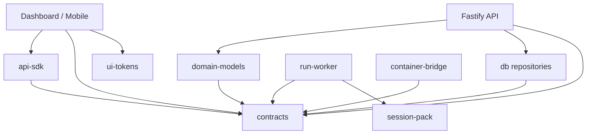

# 灵办词元系统更新要求文档

## 1. 文档控制

| 字段 | 内容 |
|---|---|
| 文档名称 | `20260717系统更新要求文档.md` |
| 文档类型 | 产品闭环修复、系统架构更新、双端交互与交付验收要求 |
| 产品 | 灵办词元 |
| 版本 | v1.1 |
| 编写日期 | 2026-07-17 |
| 状态 | 开发指导冻结基线 |
| 适用范围 | Dashboard、H5、API、Run Worker、Container Bridge、Session 资产域、Creator、工坊与服务目录 |
| 工程范围 | `app/dashboard`、`app/mobile`、`app/api`、`app/run-worker`、`app/container-bridge`、`packages/contracts`、`packages/db`、`packages/api-sdk`、`packages/domain-models`、`packages/session-pack` |
| 关联文档 | `docs/产品需求草案.md`、`docs/前端需求.md`、`docs/dashboard开发文档.md`、`docs/小程序开发文档.md`、`docs/后端设计文档.md`、`docs/后端开发文档.md`、`docs/20260717session控制修改方案.md`、`docs/工坊服务与Session资产总表.md` |
| 核心目标 | 补齐空白 Codex 到 Session 固化、工坊封装、发布消费和持续迭代的供给侧闭环 |

本文档冻结本次系统更新的产品要求、领域模型、页面结构、交互流程、接口边界、运行时行为、数据约束、测试范围和交付标准。本文档描述完整目标系统，不以临时假数据、静态种子、硬编码版本或手工数据库操作作为验收结果。

## 2. 更新背景与当前结论

### 2.1 原始需求基线

原始产品需求已经明确以下 Creator 能力：

1. 创建 Session 项目。
2. 启动 Session 录制。
3. 在完整 Codex 对话中完成一次成功业务执行。
4. 保存完整对话、工具调用、文件变化、浏览器操作和运行状态。
5. 对 Session 执行脱敏、回放、密封和版本治理。
6. 将密封 Session Version 封装为工坊服务。
7. 发布服务并允许用户快速实例化。
8. 用户在新实例中继续与 Codex 完整对话。
9. 用户运行结果可以继续生成新的 Session Revision 或版本。

### 2.2 当前实现能力

| 能力 | 当前状态 | 说明 |
|---|---|---|
| 浏览已有工坊和服务 | 已具备 | 依赖目录数据和既有服务记录 |
| 从已有服务创建 Run | 已具备 | 需要 `taskVersionId` 和 `sessionVersionId` |
| 实例完整对话 | 已具备 | 支持消息、审批、文件和运行状态 |
| 从既有 Run 发起 Capture | 已具备 | 支持终态或检查点固化 |
| Draft、Revision、Replay、Seal | 已具备主要链路 | 仍需纳入本次端到端验收 |
| Creator Package 绑定 | 已具备主要链路 | 需要与工坊创建和发布流程连通 |
| 空白 Codex Source Run | 缺失 | 首个 Session 无法产生 |
| Session 项目创建入口 | 缺失 | Creator 录制没有正式起点 |
| 工坊和服务正式创建流程 | 缺失或不完整 | 密封资产无法顺畅封装和发布 |
| 双端统一闭环 | 缺失 | Dashboard 和 H5 当前无法覆盖完整产品链 |

### 2.3 当前系统结论

当前系统具备已有资产消费和运行后固化能力，供给侧冷启动链路尚未完成。系统无法通过正式界面创建首个空白 Codex、首个 Session 项目和首个自主工坊服务。此前关于完整闭环已经完成的结论停止使用，直至本文档全部 P0 验收项通过。

## 3. 本次更新范围

### 3.1 必须完成的系统闭环

```mermaid
flowchart LR
  A["创建 Session 项目"] --> B["创建空白 Creator Source Run"]
  B --> C["完整 Codex 对话与工具执行"]
  C --> D["Session Capture"]
  D --> E["Draft 与 Revision"]
  E --> F["脱敏审核"]
  F --> G["Replay 验证"]
  G --> H["密封 Session Version"]
  H --> I["绑定 Creator Package"]
  I --> J["创建 Workshop 与 Service"]
  J --> K["创建 Task Version 和发布绑定"]
  K --> L["发布工坊服务"]
  L --> M["用户创建 Consumer Run"]
  M --> N["Codex 对话式收集业务信息"]
  N --> O["执行与文件交付"]
  O --> P["新 Capture 或新 Revision"]
  P --> F
```



### 3.2 更新原则

| 原则 | 固定要求 |
|---|---|
| Session 原始信息完整 | 保留 App Server Thread、Turn、Item、工具调用、MCP 调用、文件变化和平台事件 |
| Source Run 空白启动 | 不继承业务 Session Version、历史对话或业务工作目录 |
| 运行能力可配置 | Provider、模型、MCP、凭证和网络策略在 Source Run 启动前配置 |
| 业务信息对话收集 | 服务启动前不收集业务参数、材料、定时设置或重复执行配置 |
| 资产与凭证分离 | Session Pack 保存凭证引用和注入位置，禁止保存 API Key 明文 |
| 不可变发布 | 已密封 Session Version 使用固定内容哈希和签名，运行期间禁止回写 |
| 发布绑定显式化 | Workshop、Service、Task Version、Session Version 和 Package 关系必须持久化 |
| 双端职责清晰 | Dashboard 承担重度生产和治理，H5/小程序同时具备空白实例、固化和发布闭环 |
| 正式数据驱动 | 页面不得依赖硬编码 `taskVersionId`、`sessionVersionId` 或静态工坊种子完成主流程 |
| 本地环境限制 | 禁止调度本地 Docker、WSL 或其他本地虚拟化环境 |

## 4. 目标领域模型

### 4.1 核心对象

| 对象 | 标识建议 | 作用 | 主要来源 |
|---|---|---|---|
| Session Project | `spj_*` | Creator 生产工作的顶层项目 | Creator 创建 |
| Run | `run_*` | 一次 Agent 运行实例 | Source、Consumer、Replay 或 Batch 创建 |
| Session Capture | `cap_*` | 某个 Run 在确定边界上的原始证据快照 | Run 固化 |
| Session Draft | `sdr_*` | 可持续编辑的 Session 工作副本 | Capture 创建 |
| Draft Revision | `srv_*` | 每次文件范围、脱敏和元数据修改的不可变修订 | Draft 编辑 |
| Replay | `rpl_*` | 对候选 Revision 的恢复与执行验证 | Creator 发起 |
| Session | `ses_*` | Session 资产主记录 | Capture 或导入 |
| Session Version | `sev_*` | 已回放、已审核、已签名的不可变资产 | Seal 生成 |
| Creator Package | `pkg_*` | Session、依赖、发布策略和治理配置的分发包 | Creator 创建 |
| Workshop | `wks_*` | 面向用户的服务集合和内容分发容器 | Creator 创建 |
| Service | `svc_*` | 用户可以直接启动的业务能力 | Workshop 内创建 |
| Task Version | `tsv_*` | Service 的执行配置版本 | Service 发布生成 |
| Service Session Binding | `ssb_*` | Service、入口端和 Session Version 的活动绑定 | 发布阶段生成 |
| Release | `rel_*` | 工坊或服务的一次正式发布记录 | 发布操作生成 |

### 4.2 Run 类型

新增正式字段 `runPurpose`：

| 值 | 使用场景 | Session 启动方式 | 业务信息收集 |
|---|---|---|---|
| `creator_source` | Creator 从空白 Codex 开始录制 | `sessionVersionId = null` | Creator 主动发送第一条业务指令 |
| `service_consumer` | 用户从工坊服务启动 | 强制绑定已发布 Session Version | 系统要求 Codex 在首轮对话中询问缺失信息 |
| `replay_validation` | Creator 验证 Draft Revision | 绑定待验证 Revision 或候选版本 | 使用 Replay 测试输入 |
| `batch_consumer` | 重度用户批量执行服务 | 每个子 Run 绑定已发布版本 | 每个子 Run 保留独立输入和结果 |

新增正式字段 `sessionBootstrapMode`：

| 值 | 含义 | Worker 行为 |
|---|---|---|
| `blank` | 空白运行空间 | 跳过 Session Pack 下载与恢复 |
| `sealed_version` | 从密封 Session Version 恢复 | 下载、验签、解包并恢复工作目录 |
| `draft_revision` | Replay 专用候选资产 | 下载候选 Revision，放入隔离 Replay 环境 |

### 4.3 Run 字段约束

| 字段 | Source Run | Consumer Run | Replay Run |
|---|---:|---:|---:|
| `runPurpose` | 必填 `creator_source` | 必填 `service_consumer` | 必填 `replay_validation` |
| `sessionBootstrapMode` | 必填 `blank` | 必填 `sealed_version` | 必填 `draft_revision` |
| `sessionProjectId` | 必填 | 可空 | 必填 |
| `taskVersionId` | 可空 | 必填 | 可空 |
| `sessionVersionId` | 必须为空 | 必填 | 可空 |
| `draftRevisionId` | 必须为空 | 必须为空 | 必填 |
| `catalogMetadata` | 可空 | 必填工坊和服务信息 | 可空 |
| `providerSelection` | 支持 | 支持 | 支持 |
| `bindings` | 支持 | 服务要求与用户授权合并 | Replay 依赖配置 |
| `targetPath` | 系统生成，允许高级配置 | 由启动模板生成 | 系统生成 |

契约必须通过判别联合或 `superRefine` 校验以上组合，禁止产生字段组合不一致的 Run。

## 5. 核心业务状态机

### 5.1 Session Project 状态

```text
DRAFT
→ RECORDING
→ CAPTURED
→ EDITING
→ REPLAYING
→ READY_TO_SEAL
→ SEALED
→ PACKAGED
→ PUBLISHED
→ ARCHIVED
```

| 状态 | 进入条件 | 可执行操作 |
|---|---|---|
| `DRAFT` | 项目创建成功 | 配置运行环境、启动 Source Run |
| `RECORDING` | Source Run 已创建 | 对话、上传、审批、文件操作、Capture |
| `CAPTURED` | Capture 上传和校验完成 | 创建 Draft、检查原始证据 |
| `EDITING` | Draft 和 Revision 已存在 | 修改文件范围、脱敏规则、元数据 |
| `REPLAYING` | Replay Job 已创建 | 查看验证过程和失败原因 |
| `READY_TO_SEAL` | Replay 和审核门禁通过 | 密封 Session Version |
| `SEALED` | Session Version 已签名 | 创建 Package、封装服务 |
| `PACKAGED` | Package 和候选绑定完成 | 创建工坊、服务和发布绑定 |
| `PUBLISHED` | Release 激活完成 | 查看运行指标、创建新修订 |
| `ARCHIVED` | 项目归档 | 查看历史和恢复到新项目 |

### 5.2 发布门禁

发布服务前必须通过：

1. Session Version 状态为 `sealed`。
2. Pack 内容哈希与对象存储对象一致。
3. 签名验证通过。
4. Replay 结果通过全部强制检查项。
5. 脱敏复核状态为批准。
6. Provider 要求能够在目标工作区解析。
7. MCP 依赖均存在正式 Registry 记录。
8. 凭证依赖只包含类型和引用，不包含明文。
9. Service、Task Version 和 Session Version 绑定完整。
10. 目标入口 `dashboard`、`h5` 的启动模板可解析。
11. 可见范围和工作区策略有效。
12. 发布者具有当前工作区的 Creator 管理权限。

## 6. Dashboard 总体改造要求

### 6.1 产品定位

Dashboard 继续采用 `React + Vite + TypeScript`，承担重度用户运行协作、Creator 生产、工作区 Provider/MCP/凭证配置和资产发布。总管理后台继续由独立 `app/admin` 承担，禁止将平台总管理模块重新混入 Dashboard。

### 6.2 一级导航

| 一级导航 | 核心职责 | 禁止混入的内容 |
|---|---|---|
| 工坊 | 浏览、搜索、查看和启动已发布服务 | Session Draft 深度编辑、平台 Provider 管理 |
| 实例 | 多实例列表、完整对话、文件、审批和 Source Run | 工坊内容编排、平台 Admin 配置 |
| Creator | Session 项目、Capture、Replay、Seal、Package、工坊封装和发布 | 普通用户消费列表 |
| Provider | 用户或工作区 Provider 选择与绑定 | 平台级 Provider 总管理 |
| MCP 与凭证 | 工作区连接器、MCP、凭证引用和授权 | API Key 明文回显 |
| 工作区设置 | 当前空间、成员和基础策略 | 平台级租户总管理 |

左侧边栏保持抽屉式可折叠。折叠状态、工作区选择和当前导航状态需要持久化到用户偏好。

## 7. Dashboard 工坊模块

### 7.1 工坊列表

建议路由：

```text
/workspace/workshops
```

| 区域 | 内容 | 交互要求 |
|---|---|---|
| 顶部工具栏 | 搜索、分类、标签、排序、工作区范围 | 筛选状态写入 URL Query |
| 最近使用 | 最近启动过的工坊和服务 | 基于真实 Recent Activity |
| 推荐区域 | 工作区推荐、收藏、Creator 新发布 | 允许隐藏该区域 |
| 工坊列表 | 封面、名称、简介、服务数、发布者、更新时间 | 卡片和紧凑列表可切换 |
| 侧边详情 | 当前工坊摘要和服务目录 | 桌面宽屏显示，窄屏使用抽屉 |

工坊浏览页使用正式 Catalog API。主流程禁止读取前端静态种子完成展示和启动。

### 7.2 工坊详情

建议路由：

```text
/workspace/workshops/:workshopId
```

必须展示：

- 工坊名称、封面、简介和完整说明。
- 发布主体和可见范围。
- 分类、标签和适用场景。
- 服务列表和各服务当前版本。
- Provider、MCP 和凭证类型要求。
- 输出类型和样例文件。
- 发布历史、更新时间和变更摘要。
- 运行次数、完成率和近期异常状态。

### 7.3 服务详情与启动

建议路由：

```text
/workspace/services/:serviceId
```

启动前只处理基础运行条件：

| 检查项 | 处理方式 |
|---|---|
| Provider | 使用工作区默认绑定或用户选择 |
| 模型 | 使用服务约束范围内的默认模型或用户选择 |
| MCP | 显示必需能力和当前授权状态 |
| 凭证 | 选择已经托管的 Credential 引用或发起授权 |
| 成本 | 显示预估和额度策略 |
| 风险 | 对需要审批的能力显示确认项 |

启动表单禁止收集业务参数、业务材料、定时计划和重复执行配置。点击启动后创建 Consumer Run，并直接进入实例完整对话。系统向 Codex 注入信息收集指令，Codex 根据已继承 Session 引导用户补充本次执行所需资料。

## 8. Dashboard 实例模块

### 8.1 实例列表

建议路由：

```text
/workspace/instances
```

页面顶部增加高优先级主按钮 `新建实例`。

列表必须支持：

| 能力 | 具体要求 |
|---|---|
| 搜索 | 实例名称、Run ID、工坊、服务、Session 项目 |
| 状态筛选 | 全部、待处理、运行中、已完成、失败、已取消 |
| 类型筛选 | 空白 Source Run、服务 Consumer Run、Replay、批量运行 |
| 标签筛选 | 系统标签、工作区标签、自定义标签 |
| 排序 | 最近更新、创建时间、状态优先级、名称 |
| 分组 | 待审批、运行中、最近完成 |
| 批量操作 | 归档、取消、标签、导出运行摘要 |

实例卡片或列表行必须展示：

- 实例名称。
- Source Run 或工坊服务来源。
- 运行状态。
- 最近一条消息摘要。
- 待审批数量。
- 输出文件数量。
- 创建人。
- 最近更新时间。

### 8.2 新建实例抽屉

新建入口提供分段模式：

| 模式 | 创建对象 | 适用场景 |
|---|---|---|
| 空白 Codex | Creator Source Run | 首次录制、开放式工作、创建 Session 资产 |
| 从工坊启动 | Service Consumer Run | 使用已经发布的业务能力 |

#### 空白 Codex 表单

| 字段 | 必填 | 默认行为 |
|---|---:|---|
| 实例名称 | 是 | 默认生成可编辑名称 |
| Session 项目 | 否 | 可在启动时创建新项目 |
| Provider | 否 | 使用工作区默认绑定 |
| 模型 | 否 | 使用 Provider 默认模型 |
| MCP | 否 | 默认附加工作区 `autoAttach` 能力 |
| 凭证 | 否 | 仅选择凭证引用 |
| Target Path | 否 | 平台按 Workspace 和 Run ID 自动生成 |
| 网络策略 | 否 | 使用工作区默认策略 |

创建表单不出现业务资料、业务参数、文件材料、定时计划和重复执行配置。

#### 从工坊启动表单

表单只允许选择服务、Provider/模型可选覆盖、授权和凭证绑定。创建成功后直接进入实例详情。

### 8.3 实例详情

建议路由：

```text
/workspace/instances/:runId/conversation
```

布局要求：

```text
┌────────────────────────────────────────────────────┐
│ 可折叠实例摘要：状态 / 模型 / 路径 / 审批 / 运行时 │
├──────────────────────────────────┬─────────────────┤
│                                  │ 右侧详情抽屉    │
│ 完整 Codex 对话                  │ 详情            │
│ 消息、工具状态、上传、审批卡片   │ 文件            │
│                                  │ 审批            │
│                                  │ 事件            │
├──────────────────────────────────┴─────────────────┤
│ 输入、上传、发送、停止、Capture                    │
└────────────────────────────────────────────────────┘
```

顶部摘要默认折叠，折叠状态必须清晰。展开图标方向必须与当前状态一致，图标统一使用项目图标库。

折叠态展示：

- 实例名称。
- 运行状态。
- Provider 和模型。
- 运行时长。
- 待审批数量。
- 展开按钮。

展开态增加：

- Run ID。
- `runPurpose`。
- Session Project。
- 工坊和服务来源。
- Task Version 和 Session Version。
- MCP 和凭证引用摘要。
- Target Path。
- Worker、Bridge 和 Codex Thread 状态。
- 创建人与工作区。

### 8.4 完整对话要求

实例详情以对话作为主工作面，支持：

1. 用户消息和 Codex 流式响应。
2. 系统状态消息。
3. 工具调用和 MCP 调用摘要。
4. 文件引用、上传和预览。
5. 审批卡片和就地确认。
6. 错误卡片、失败原因和重试。
7. 停止、恢复和继续执行。
8. 多轮信息补充。
9. Source Run 的录制状态。
10. Consumer Run 的继承来源。

页面中不再创建语义重复的“会话”和“运行”主视图。运行状态、遥测和技术信息归入顶部摘要与右侧详情，对话保持主区域。

### 8.5 文件能力

文件功能归属具体实例，要求支持：

- 目录树。
- 面包屑路径。
- 路径输入和直接跳转。
- 搜索和类型筛选。
- 文本、图片、PDF 和常见文件预览。
- 单文件下载。
- 目录或结果包下载。
- 文件来源、大小、哈希、修改时间和存储层展示。
- 输出文件和中间文件区分。

## 9. Dashboard Creator 模块

### 9.1 Creator 首页

建议路由：

```text
/workspace/creator
```

顶部提供主按钮 `新建 Session`。

首页由以下区域组成：

| 区域 | 内容 |
|---|---|
| Session 项目 | 草稿、录制中、编辑中、待密封、已发布 |
| 最近 Source Run | Source Run 状态、最后消息、Capture 状态 |
| 待处理资产 | 待脱敏、待复核、待 Replay、待 Seal |
| 待发布内容 | 待 Package、待工坊封装、待发布 |
| 已发布工坊 | 当前版本、运行量、失败率、更新时间 |

### 9.2 创建 Session 项目

建议路由：

```text
/workspace/creator/projects/new
```

创建步骤：

1. 填写项目名称和说明。
2. 选择 Provider、模型、MCP 和凭证引用。
3. 创建空白 Source Run。
4. 跳转 Source Run 完整对话。
5. 自动建立 Session Project 与 Source Run 关联。

项目详情必须显示：

- Source Run。
- Capture。
- Draft 和当前 Revision。
- 脱敏复核状态。
- Replay。
- Session Version。
- Creator Package。
- Workshop 和 Service 绑定。
- Release 状态。

### 9.3 Source Run 对话

Source Run 启动时只注入平台运行协议、安全边界、凭证保护规则和录制上下文。对话区等待 Creator 发送第一条业务指令。Source Run 不执行 Consumer Run 的“询问本次业务资料”首轮引导。

Source Run 页面持续显示录制状态，并提供 `固化为 Session` 主操作。

### 9.4 Capture 抽屉

| 配置 | 具体要求 |
|---|---|
| Capture 边界 | 当前已完成 Turn、指定检查点、Run 终态 |
| 对话范围 | 固定保留边界前完整因果链 |
| 文件范围 | 全部、目录选择、排除规则 |
| 工具记录 | App Server Item、MCP 调用、平台工具事件 |
| 运行状态 | Provider、模型、环境、网络策略和依赖指纹 |
| 目标 Session | 新建 Session 或追加到现有 Session |
| 完成行为 | 创建 Draft 和初始 Revision |

Capture 必须展示排队、屏障、文件同步、打包、上传、校验和完成状态。失败状态必须展示可操作的重试入口和失败阶段。

### 9.5 Session 资产工作台

建议路由：

```text
/workspace/creator/projects/:projectId/assets
```

步骤导航固定为：

```text
Capture
→ Draft
→ Redaction
→ Replay
→ Seal
→ Package
→ Publish
```

每一步必须展示：

- 当前状态。
- 输入对象。
- 输出对象。
- 校验结果。
- 阻断原因。
- 操作人与时间。
- 下一步操作。

脱敏、路径筛选和元数据修订只在 Draft Revision 层执行。Raw Capture 保持内容寻址和只读。每次修改生成新的 Revision，禁止原地覆盖历史 Revision。

### 9.6 工坊封装

密封 Session Version 后提供 `封装为工坊服务`。

| 步骤 | 配置内容 | 输出对象 |
|---|---|---|
| 选择目标 | 新建工坊或选择已有工坊 | Workshop Draft |
| 工坊信息 | 名称、简介、封面、分类、标签、可见范围 | Workshop Metadata |
| 服务信息 | 服务名、说明、适用场景、输出类型 | Service Draft |
| 能力依赖 | Provider 范围、MCP、凭证类型、运行环境 | Dependency Declaration |
| 版本绑定 | Package、Task Version、Session Version | Service Session Binding |
| 入口配置 | Dashboard、H5 启动模板 | Launch Templates |
| 发布检查 | Replay、签名、权限、依赖、可见范围 | Release Gate Result |
| 发布确认 | 激活版本和目录记录 | Release |

发布完成后提供：

- 查看工坊。
- 试运行服务。
- 复制分享链接。
- 查看发布版本。
- 创建下一 Revision。
- 回滚到历史 Session Version。

## 10. H5 总体改造要求

### 10.1 产品定位

H5 继续采用 `Taro + React + TypeScript`，面向轻度用户和移动协作场景。首发导航保持 `工坊 / 任务 / 我的` 三个 Tab。文件功能归属任务详情，禁止新增一级文件 Tab。

### 10.2 底部导航

| Tab | 职责 | 主要页面 |
|---|---|---|
| 工坊 | 发现、搜索、收藏和启动服务 | 工坊列表、工坊详情、服务详情 |
| 任务 | 多任务列表、完整对话和文件入口 | 任务列表、任务详情、文件页 |
| 我的 | 账号、工作区、授权和显示设置 | 个人信息、空间切换、授权状态 |

## 11. H5 工坊模块

### 11.1 工坊首页

工坊页承担移动端首页功能，包含：

- 搜索。
- 分类和标签筛选。
- 最近使用。
- 收藏工坊。
- 工作区推荐。
- 公开工坊。
- 工坊卡片和服务预览。
- 明暗主题适配。

工坊卡片展示封面、名称、简介、服务数量、发布者和最近更新时间。页面必须使用真实视觉资产和统一扁平化图标。

### 11.2 工坊与服务详情

工坊详情展示工坊说明、发布者、服务列表、适用场景和更新时间。服务详情展示服务说明、输出类型、所需账号和权限、结果样例及当前可用状态。

底部固定主按钮为 `启动服务`。

启动前只检查：

- Provider 可用性。
- MCP 授权。
- 凭证绑定。
- 成本确认。
- 风险确认。

启动后直接创建 Consumer Run 并进入任务对话。业务资料通过对话消息、上传和授权逐步提供。

## 12. H5 任务模块

### 12.1 任务列表

任务 Tab 首屏为多任务列表，要求支持：

| 能力 | 要求 |
|---|---|
| 搜索 | 任务名、工坊、服务和消息摘要 |
| 状态分类 | 全部、待处理、运行中、已完成、失败 |
| 自定义标签 | 用户和工作区标签 |
| 工坊筛选 | 按来源工坊筛选 |
| 排序 | 最近活动优先 |
| 特殊筛选 | 待审批、有新文件、有新消息 |

任务卡片展示：

- 任务名称。
- 工坊和服务来源。
- 当前状态。
- 最近消息。
- 待审批数量。
- 输出文件数量。
- 更新时间。

点击任务卡片进入具体任务详情，禁止在列表页展开完整对话。

### 12.2 任务详情

任务详情默认展示完整 Codex 对话。顶部摘要可折叠，折叠态显示状态、服务、运行时长、文件数和审批数；展开态增加 Run ID、Provider、模型、MCP 和 Target Path。

对话必须支持：

1. 用户消息与 Codex 流式消息。
2. 图片、文件和材料上传。
3. 审批卡片和就地确认。
4. 文件引用和结果预览。
5. 失败原因和重试。
6. 停止和继续执行。
7. 多轮信息补充。
8. 后台切换后的消息恢复。

### 12.3 文件页面

建议页面路径：

```text
/tasks/:runId/files
```

必须支持：

- 返回当前任务。
- 当前路径展示。
- 可点击面包屑。
- 路径输入和直接跳转。
- 最近访问路径。
- 文件夹和文件列表。
- 文件搜索。
- 文件预览。
- 文件下载。
- 输出文件筛选。
- 返回 Target Path 根目录。

## 13. H5 我的模块

### 13.1 页面结构

| 模块 | 内容 |
|---|---|
| 当前账号 | 头像、名称、登录方式和账号状态 |
| 当前工作区 | 个人空间或组织空间 |
| 切换工作区 | 工作区列表、搜索和最近使用 |
| Provider 状态 | 当前可用 Provider 和默认模型 |
| 账号授权 | MCP、OAuth 和凭证授权状态 |
| 文件与存储 | 使用量和下载记录 |
| 通知 | 审批、完成和失败通知 |
| 显示设置 | 语言、明暗主题 |
| Creator 入口 | 打开移动端“我的创作”，管理 Session Project、Draft、Seal 与发布 |

个人用户显示 `个人空间`。存在多个工作区时，用户从“我的”进入独立工作区选择页面。切换工作区后，工坊、任务、授权和 Provider 状态必须同时刷新。

### 13.2 Source Run 移动协作

H5首发允许用户创建、查看和继续当前工作区的 Source Run：

- 继续发送消息。
- 上传材料。
- 处理审批。
- 查看和下载文件。
- 查看录制状态。

H5/小程序必须支持 Session Project 创建、脱敏规则、Replay、Seal、Package、工坊创建和发布。移动端与 Dashboard 使用相同 API、对象 ID、状态机和工作区边界，任一端产生的资产均可在另一端继续处理。

## 14. 对话式信息收集要求

### 14.1 Consumer Run

Consumer Run 创建完成后，系统必须在用户第一条业务消息之前向 Codex 注入信息收集指令。指令目标为：

```text
请问你需要我提供什么信息给你。
请根据当前继承的 Session、服务目标、可用 MCP、凭证状态和当前工作目录，
明确询问本次执行仍缺少的资料、账号、授权、审批和说明。
```

Codex 需要通过完整对话完成信息收集。结构化 Slot 可以作为对话状态和校验依据，轻度用户界面不显示 Session、Slot、Fork 和 Trace 等专业术语。

### 14.2 Creator Source Run

Source Run 使用独立系统提示：

- 声明当前运行属于 Creator Session 录制。
- 声明目标路径和运行能力范围。
- 声明凭证保护和敏感信息处理规则。
- 声明完整事件和文件将进入 Capture。
- 等待 Creator 发送第一条业务指令。

Source Run 禁止注入已有业务 Session 内容。

## 15. 后端 API 更新要求

### 15.1 Session Project API

| 方法 | 路径建议 | 作用 |
|---|---|---|
| `POST` | `/v1/creator/session-projects` | 创建 Session 项目 |
| `GET` | `/v1/creator/session-projects` | 查询当前工作区项目 |
| `GET` | `/v1/creator/session-projects/:projectId` | 查询项目完整链路 |
| `PATCH` | `/v1/creator/session-projects/:projectId` | 修改项目元数据 |
| `POST` | `/v1/creator/session-projects/:projectId/archive` | 归档项目 |

### 15.2 Source Run API

| 方法 | 路径建议 | 作用 |
|---|---|---|
| `POST` | `/v1/creator/source-runs` | 创建空白 Codex Source Run |
| `GET` | `/v1/creator/source-runs` | 查询当前工作区 Source Run |
| `GET` | `/v1/creator/source-runs/:runId` | 查询 Source Run 与项目关系 |

`POST /v1/creator/source-runs` 输入至少包含：

- `workspaceId`。
- `sessionProjectId` 或 `createProject` 元数据。
- `title`。
- `entrySurface`。
- `providerSelection`。
- `bindings`。
- 可选 `targetPath`。

服务端固定写入：

- `runPurpose = creator_source`。
- `sessionBootstrapMode = blank`。
- `sessionVersionId = null`。
- `catalogMetadata = null`。

### 15.3 Run API 兼容更新

现有 `POST /v1/runs` 继续服务 Consumer Run 和批量运行。接口契约需要根据 `runPurpose` 校验字段组合。旧客户端未传 `runPurpose` 时，兼容期内根据是否存在 Service Catalog Metadata 推导为 `service_consumer`，并记录兼容告警。

### 15.4 Workshop 与 Service 写 API

| 方法 | 路径建议 | 作用 |
|---|---|---|
| `POST` | `/v1/workshops` | 创建工坊草稿 |
| `PATCH` | `/v1/workshops/:workshopId` | 更新工坊元数据 |
| `POST` | `/v1/workshops/:workshopId/services` | 创建服务草稿 |
| `PATCH` | `/v1/services/:serviceId` | 更新服务元数据 |
| `POST` | `/v1/services/:serviceId/versions` | 创建 Task Version |
| `PUT` | `/v1/services/:serviceId/session-bindings/candidate` | 设置候选 Session Version |
| `POST` | `/v1/services/:serviceId/releases` | 创建发布记录并执行门禁 |
| `POST` | `/v1/services/:serviceId/releases/:releaseId/activate` | 激活发布 |
| `POST` | `/v1/services/:serviceId/rollback` | 回滚到历史绑定 |

所有写接口要求：

- 工作区访问校验。
- Creator 管理权限校验。
- 幂等键。
- 乐观锁版本号。
- 审计事件。
- 输入 Schema 校验。
- 对象关系校验。

## 16. Worker 与运行时更新要求

### 16.1 Source Run 启动

当 `sessionBootstrapMode = blank` 时，Run Worker 必须：

1. 创建独立 Run Workspace。
2. 创建空 Target Path。
3. 跳过 Session Pack 下载、验签、解包和工作目录恢复。
4. 物化 Provider 配置。
5. 物化 MCP 配置和网络策略。
6. 以只读引用方式物化凭证。
7. 启动 Container Bridge 和 Codex App Server。
8. 建立 Thread、Turn、Item 事件采集。
9. 上报 READY、QUEUED、STARTING、RUNNING 状态。
10. 等待 Creator 第一条消息。

Source Run 运行时仍需使用生产隔离容器策略。受本地环境约束影响，容器链路只允许在远程服务器或 CI 节点执行验证。

### 16.2 Consumer Run 启动

当 `sessionBootstrapMode = sealed_version` 时，Worker 必须：

1. 获取活动 Service Session Binding。
2. 下载指定 Session Version。
3. 验证哈希与签名。
4. 解包到运行时目录。
5. 恢复工作目录基线。
6. 物化 Provider、MCP 和凭证引用。
7. 启动 Codex App Server。
8. 注入对话式信息收集消息。
9. 持续上报完整事件。

### 16.3 Capture 屏障

Capture 执行前必须完成：

- 阻止新的 Turn 进入固化边界。
- 等待当前 Turn 到达可固化状态。
- 刷新 App Server 事件。
- 刷新 MCP 审计事件。
- 同步 Target Path 文件。
- 生成文件清单和内容哈希。
- 上传 Capture 对象。
- API 确认 Capture 完整性。

运行目录只能在 Capture 完成确认或明确失败处理后进入清理流程。

## 17. Provider、MCP 与凭证要求

### 17.1 Provider

Source Run 和 Consumer Run 均支持：

- 平台默认 Provider。
- 工作区默认 Provider。
- 用户可选 Provider。
- Provider 默认模型。
- 用户可选模型。
- 第三方 OpenAI 兼容 Base URL。
- Provider 测活与模型同步结果引用。

Run 记录保存 Provider ID、Model ID、Base URL 类型、配置版本和指纹。API Key 明文禁止写入 Run、Session Pack、事件日志和前端状态。

Provider 路由优先级固定为：

```text
平台默认 < 工作区覆盖 < Run 显式选择
```

| 约束 | 开发要求 |
|---|---|
| 平台绑定 | Admin 录入 Provider API Key 后生成 `scope=platform` 的 Provider Binding，所有工作区可继承 |
| 工作区绑定 | 工作区可使用自有 Credential 覆盖平台路由，绑定只在当前工作区生效 |
| 显式选择 | Run 只能选择当前工作区可解析的工作区绑定或平台绑定，并遵守模型白名单 |
| 历史数据 | Admin 鉴权流程生成的旧绑定在初始化时升级为平台绑定，升级过程保持 Credential ID 和审计链 |
| 启动校验 | Source Run 创建时必须解析出有效 Provider、Model 和 Credential；失败返回 `PROVIDER_BINDING_UNAVAILABLE`，禁止创建可运行的半成品 Run |
| 前端状态 | Dashboard 合并同一 Provider 的平台与工作区绑定，优先展示工作区覆盖；平台继承绑定只读显示 |

#### 17.1.1 Codex CLI Provider 物化协议

Worker 在容器启动前写入 `${CODEX_HOME}/config.toml`。仅设置 `OPENAI_BASE_URL` 无法保证 Codex CLI 使用第三方端点，运行配置必须显式选择自定义 `model_provider`，并注册对应的 `model_providers` 表。

```toml
model = "<resolved-model>"
model_provider = "lingban_runtime"

[model_providers.lingban_runtime]
name = "<provider-display-name>"
base_url = "<resolved-provider-base-url>"
env_key = "<provider-auth-env-name>"
wire_api = "responses"
requires_openai_auth = false
supports_websockets = false

[projects."/workspace/target"]
trust_level = "trusted"
```

| 约束 | 开发要求 |
|---|---|
| 配置来源 | `model`、`base_url`、`env_key` 必须来自 API 已解析并写入 Start Run Payload 的 Provider 快照 |
| API 协议 | Codex CLI 运行协议固定为 `responses`；Provider 上线前必须完成 Responses API 兼容性验证 |
| 凭证边界 | `config.toml` 只保存 `env_key` 名称；API Key 由 Credential Broker 物化为容器环境变量，禁止写入配置文件 |
| 文件权限 | Worker 以 `0600` 写入 `config.toml`；`${CODEX_HOME}` 只挂载到当前 Run 容器 |
| 工作目录 | 宿主机 Target Path 和容器内 `/workspace/target` 均登记为 trusted project |
| 生命周期 | 每个 Run 独立生成配置；Run 销毁时配置与 `${CODEX_HOME}` 同步清理 |
| 可观测性 | 诊断信息允许记录 Provider ID、Base URL、模型和配置摘要；禁止记录 Credential 明文 |
| 验收 | 容器内实际请求必须命中已解析 Base URL，并完成用户消息、Codex 回复和 Target Path 文件写入 |

### 17.2 MCP

支持以下来源：

| 类型 | 示例 | 约束 |
|---|---|---|
| 第一方 MCP | 平台托管浏览器、文件、内部能力 | 平台 Registry 和策略控制 |
| 外部托管 MCP | 第三方 HTTP/SSE MCP | URL、鉴权和网络策略校验 |
| 外部 stdio MCP | 用户指定命令型 MCP | 运行镜像能力和 stdio 策略校验 |
| Remote Unmanaged MCP | 第三方不受控服务 | 强制网络策略、风险等级和审计 |

Source Run 创建页必须能够选择显式 MCP，并自动合并工作区 `autoAttach` 绑定。

### 17.3 凭证

凭证通过 Vault 引用传入：

- 环境变量挂载。
- 只读文件挂载。
- OAuth Token 引用。
- MCP 专用鉴权引用。
- Provider API Key 引用。

前端只显示凭证名称、类型、作用域、状态和最近验证时间。

平台 Provider Credential 允许服务于不同租户 Run，授权范围固定为当前 Run 已解析 Provider 的单个 Credential ID。Credential Broker 接口接收 `platformCredentialIds` 白名单，并同时校验 Run、Workspace、Provider Binding Scope 和 Credential 状态。任意未列入白名单的跨工作区 Credential 请求返回 `RUN_CREDENTIAL_SCOPE_DENIED`。

## 18. 数据持久化要求

### 18.1 新增或调整的数据表

| 表 | 作用 |
|---|---|
| `lingban_session_projects` | Session 项目主记录 |
| `lingban_session_project_runs` | Project 与 Source/Replay Run 关系 |
| `lingban_runs` | 增加 Run Purpose 和 Bootstrap Mode 的正式查询字段或 JSON 索引 |
| `lingban_catalog_workshops` | 工坊正式主数据 |
| `lingban_catalog_services` | 服务正式主数据 |
| `lingban_task_versions` | 服务版本记录 |
| `lingban_service_session_bindings` | 服务与 Session Version 的候选和活动绑定 |
| `lingban_releases` | 发布记录、门禁结果和激活状态 |
| `lingban_release_audit_events` | 发布、回滚和下架审计 |

### 18.2 数据约束

1. Source Run 的 `sessionVersionId` 必须为空。
2. Consumer Run 的 `sessionVersionId` 和 `taskVersionId` 必须存在。
3. Active Service Binding 在相同 `serviceId + workspaceContextKey + entrySurface` 下只允许一个。
4. 已密封 Session Version 禁止更新内容字段。
5. 发布记录固定引用 Task Version 和 Session Version。
6. 删除工坊采用归档状态，禁止级联删除 Session 资产和历史 Run。
7. 所有 Creator 写操作记录操作人、工作区、时间、来源 IP 和幂等键。

## 19. 实时通信与状态恢复

Dashboard 和 H5 必须共享同一套实时事件：

| 事件 | 用途 |
|---|---|
| `run.status.changed` | 更新运行状态 |
| `conversation.message` | 流式或完成消息 |
| `agent.thread.state` | Thread 和 Turn 状态 |
| `approval.requested` | 展示审批卡片 |
| `informationCollection.updated` | 更新信息收集状态 |
| `file.changed` | 更新文件列表和预览 |
| `files.synced` | 标记目录同步完成 |
| `capture.status.changed` | 更新 Capture 进度 |
| `replay.status.changed` | 更新 Replay 结果 |
| `release.status.changed` | 更新发布和激活状态 |

断线恢复要求：

- 客户端保存最后事件序号。
- 重连时从最后序号续传。
- 事件缺口通过 Run Snapshot 补齐。
- 页面刷新后恢复当前对话、审批、文件和 Capture 状态。
- 重复事件通过 Event ID 幂等处理。

## 20. 权限与工作区边界

| 操作 | 权限要求 |
|---|---|
| 浏览公开或工作区工坊 | 当前工作区成员 |
| 启动 Consumer Run | 具有运行权限的成员 |
| 创建 Source Run | 具有 Creator 或工作区管理权限的成员 |
| 发起 Capture | Run 所有者、Creator 或工作区管理者 |
| 查看 Raw Capture | Creator 或工作区管理者 |
| 编辑 Draft Revision | Creator 或工作区管理者 |
| Seal Session Version | Creator 或工作区管理者 |
| 创建工坊和服务 | Creator 或工作区管理者 |
| 发布、回滚和下架 | Creator 或工作区管理者 |

所有查询和写入必须同时校验 Runtime Workspace ID 与 Workspace Context Key，防止跨工作区读取 Run、文件、Session 和凭证引用。

## 21. 国际化、主题与响应式要求

### 21.1 Dashboard

- `zh-CN` 和 `en-US` 首发完整覆盖。
- 使用 `i18next + react-i18next`。
- 禁止在组件内部散落双语三元表达作为最终实现。
- 明暗主题使用共享 Design Token 和 CSS Variables。
- 抽屉侧栏在窄屏下自动切换为覆盖层。
- 对话输入、顶部摘要和右侧详情不得发生重叠。
- 页面密度采用分层信息架构，技术详情默认折叠。

### 21.2 H5

- 适配 320px 至常见移动端宽度。
- 适配安全区、软键盘和横竖屏变化。
- 底部导航、固定启动按钮和输入框不得互相遮挡。
- 明暗主题完整覆盖工坊、任务、文件和我的页面。
- 长文件名、长路径、长模型名和长工作区名必须换行或省略并可查看完整值。
- 使用现代扁平化图标，禁止使用文本字符模拟展开、返回、上传和下载图标。

## 22. 可观测性与审计

### 22.1 指标

至少提供：

- Source Run 创建成功率。
- Source Run 首条消息等待时间。
- Capture 成功率和各阶段耗时。
- Replay 成功率和失败检查项。
- Seal 成功率。
- Package 绑定成功率。
- 工坊发布成功率。
- Consumer Run 启动成功率。
- Session Pack 下载、验签和恢复耗时。
- Provider、MCP 和凭证解析失败率。

### 22.2 审计事件

需要记录：

- Session Project 创建和归档。
- Source Run 创建、停止和 Capture。
- Raw Capture 访问。
- Draft Revision 创建。
- 脱敏规则修改和审核。
- Replay 创建和结果。
- Session Version Seal。
- Package 候选和活动绑定。
- Workshop、Service 和 Task Version 创建。
- Release 创建、激活、回滚和下架。
- 凭证引用和 MCP 绑定变更。

## 23. 错误处理要求

| 错误场景 | 前端行为 | 后端要求 |
|---|---|---|
| 无可用 Provider | 阻止启动并跳转 Provider 配置 | 返回明确错误码和修复信息 |
| MCP 不可用 | 标明具体 MCP 和健康状态 | 返回 Registry/Binding 校验结果 |
| 凭证缺失 | 引导选择或创建凭证 | 禁止回传敏感内容 |
| Source Run 启动失败 | 保留项目草稿并允许重试 | 幂等创建，清理失败运行资源 |
| Capture 屏障失败 | 显示失败阶段和重试 | 保留原 Run 和已上传分片 |
| Replay 失败 | 展示失败检查项和日志摘要 | 保存完整 Replay 证据 |
| Seal 失败 | 禁止生成版本 | 保留 Revision 和失败审计 |
| 发布门禁失败 | 展示逐项结果 | 禁止创建 Active Binding |
| 实时连接断开 | 显示重连状态并继续轮询 | 支持续传和 Snapshot 恢复 |

## 24. 兼容与迁移要求

1. 现有 Consumer Run 数据默认补充 `runPurpose = service_consumer`。
2. 现有 Run 根据 Session Version 存在情况补充 `sessionBootstrapMode = sealed_version`。
3. 现有静态工坊种子迁移为正式 Catalog 记录，并标记来源。
4. 前端硬编码启动模板迁移到正式 Service Launch Template。
5. 已有 Session v1 继续支持读取，新增资产统一写入 v2。
6. 已有 Package Binding 迁移后必须能够解析关联工坊和服务。
7. 迁移过程生成报告，列出未解析 Task Version、Session Version 和 Service ID。
8. 兼容期结束后移除依赖字段推导的旧 Run 创建方式。

## 25. 测试要求

### 25.1 契约与单元测试

- Source Run 字段组合校验。
- Consumer Run 字段组合校验。
- Replay Run 字段组合校验。
- Session Project 状态迁移。
- 发布门禁。
- Active Binding 唯一性。
- 工作区权限和跨空间拒绝。
- Provider/MCP/凭证引用解析。

### 25.2 API 集成测试

至少覆盖：

1. 创建 Session Project。
2. 创建空白 Source Run。
3. Source Run 启动时不请求 Session Pack。
4. Source Run 完整对话。
5. Source Run Capture。
6. Draft、Revision、Replay 和 Seal。
7. Package 绑定。
8. 创建 Workshop、Service 和 Task Version。
9. 发布并激活 Service Binding。
10. 从新服务创建 Consumer Run。
11. Consumer Run 恢复 Session Pack。
12. Codex 首轮询问缺失信息。
13. Dashboard 和 H5 同时查看同一 Run。

### 25.3 前端端到端测试

Dashboard：

- 实例列表存在“新建实例”。
- 空白 Codex 可以创建并进入对话。
- Creator 可以创建 Session 项目。
- Capture 到 Publish 全步骤可操作。
- 工坊创建后出现在工坊列表。
- 新服务可以从详情页启动。
- 实例摘要可正确折叠和展开。
- 文件路径可输入、选择和下载。
- 中英文和明暗主题完整。

H5：

- 三个底部 Tab 正确切换。
- 工坊搜索、详情和启动完整。
- 启动前不出现业务参数表单。
- 任务列表支持多任务和筛选。
- 任务详情保持完整对话。
- 顶部摘要正确折叠。
- 文件路径可输入和选择。
- 工作区从“我的”切换。
- 明暗主题和移动端安全区正确。

### 25.4 视觉验收

- Dashboard 在 1440x900、1280x800 和窄屏布局下无错位。
- H5 在 320x568、375x812、390x844、430x932 下无重叠。
- 对话输入框、底部导航、固定按钮和软键盘区域无冲突。
- 长文本、长路径和长模型名不溢出容器。
- 展开图标方向和状态一致。
- 所有可点击图标具备工具提示或可访问名称。

使用浏览器进行验收后必须关闭全部无用标签页并释放浏览器资源。

## 26. 实施顺序

### 26.1 P0 闭环阻断项

| 编号 | 开发项 | 完成标准 |
|---|---|---|
| SYS-001 | Run Purpose 与 Bootstrap Mode 契约 | Source、Consumer、Replay 组合校验通过 |
| SYS-002 | Session Project 后端域 | 正式创建、查询、更新和关联 Run |
| SYS-003 | Source Run API | 可创建 `sessionVersionId = null` 的空白 Run |
| SYS-004 | Worker 空白启动 | Source Run 跳过 Session Pack 并启动 Codex |
| SYS-005 | Dashboard 新建空白实例 | 从实例列表可创建并进入对话 |
| SYS-006 | Creator 新建 Session | 可创建项目并自动创建 Source Run |
| SYS-007 | Capture 全链验证 | Source Run 可以产生 Draft 和 Revision |
| SYS-008 | 工坊与服务写 API | 正式持久化 Workshop、Service、Task Version |
| SYS-009 | Creator 工坊封装 | Session Version 可绑定服务并发布 |
| SYS-010 | 发布后消费 | 新服务可创建 Consumer Run 并恢复 Session |

### 26.2 P1 双端完整体验

| 编号 | 开发项 | 完成标准 |
|---|---|---|
| SYS-011 | Dashboard 实例信息架构 | 列表、新建、对话、详情、文件完整 |
| SYS-012 | Dashboard Creator 工作台 | 项目状态和资产步骤连续可见 |
| SYS-013 | H5 工坊启动更新 | 取消业务参数前置表单，进入对话收集 |
| SYS-014 | H5 多任务列表 | 搜索、分类、标签、状态完整 |
| SYS-015 | H5 任务对话 | 消息、上传、审批、文件完整 |
| SYS-016 | H5 我的与工作区 | 个人空间和多空间切换完整 |
| SYS-017 | 双端实时恢复 | 消息、文件、审批和状态一致 |

### 26.3 P2 治理和质量

| 编号 | 开发项 | 完成标准 |
|---|---|---|
| SYS-018 | 指标和审计 | 闭环关键动作均可查询 |
| SYS-019 | 迁移工具 | 旧 Run、静态 Catalog 和 Session v1 有报告 |
| SYS-020 | 国际化与主题 | Dashboard/H5 中英文和明暗主题通过 |
| SYS-021 | 响应式与可访问性 | 指定视口无重叠并支持键盘操作 |
| SYS-022 | 远程部署验收 | HZ01 或 CI 环境完成真实运行链验证 |

P0、P1 和 P2 均属于最终交付范围。优先级只表示实施顺序。

## 27. 交付完成定义

系统同时满足以下条件后，才可以声明本次闭环更新完成：

1. Creator 可以从 Dashboard 创建空白 Codex。
2. 空白 Codex 不依赖任何已有业务 Session Version。
3. Creator 可以在完整对话中完成一次业务工作流。
4. Source Run 可以完成 Capture、Draft、Revision、脱敏、Replay 和 Seal。
5. 密封 Session Version 可以绑定 Creator Package。
6. Creator 可以创建正式 Workshop、Service 和 Task Version。
7. Service 可以绑定并激活指定 Session Version。
8. 新工坊可以在 Dashboard 和 H5 中被发现。
9. 用户可以启动新服务并直接进入完整对话。
10. Codex 可以通过对话询问并收集本次执行所需信息。
11. 用户可以在 Dashboard 和 H5 查看消息、审批和文件。
12. 新 Consumer Run 不会修改原始 Session Version。
13. Consumer Run 结果可以产生新 Capture 和 Revision。
14. 所有对象、绑定、状态和审计均来自正式后端数据。
15. 不依赖前端假数据、硬编码版本或手工数据库操作。
16. Dashboard 与 H5 完成中英文、明暗主题和响应式验收。
17. API、Worker、Bridge、Dashboard 和 H5 的自动化测试通过。
18. 远程部署环境完成真实 Provider、Codex、MCP、文件和 Capture 验证。

## 28. 本次冻结结论

| 决策项 | 冻结要求 |
|---|---|
| 供给起点 | Dashboard 或 H5/小程序创建 Session Project 和空白 Source Run |
| 空白语义 | Source Run 的 `sessionVersionId` 为空，Worker 跳过 Session Pack |
| 消费起点 | 用户从已发布 Workshop Service 创建 Consumer Run |
| 信息收集 | Consumer Run 进入完整对话后由 Codex 主动询问 |
| Session 处理 | 保留完整原始 Session，脱敏和筛选通过 Revision 管理 |
| 工坊封装 | Session Version 经 Package、Task Version 和 Service Binding 发布 |
| Dashboard | 承担空白实例、完整协作、Creator 生产和发布 |
| H5 | 承担工坊发现、空白实例、任务对话、固化、封装、发布和移动协作 |
| 文件入口 | 文件归属具体实例或任务，不新增一级文件 Tab |
| 正式验收 | 以空白 Codex 到发布消费再到新 Revision 的端到端链路为准 |

## 29. 规范使用方式

### 29.1 规范级别

本文档中的约束按以下级别解释：

| 词语 | 工程含义 | 评审处理 |
|---|---|---|
| 必须 | 强制实现，缺失时阻断合并或发布 | 代码评审和验收必须提供证据 |
| 禁止 | 明确排除的实现方式 | 发现后要求修改 |
| 应当 | 默认实现方式，偏离时需要 ADR 说明 | 架构评审确认 |
| 可以 | 在不破坏约束的前提下允许实现 | 团队自行决定 |
| 建议 | 提供优选实现方向 | 不作为单独阻断项 |

### 29.2 需求标识

所有新增代码、测试、PR 和发布记录必须引用本文档中的需求标识。标识按领域划分：

| 前缀 | 领域 |
|---|---|
| `RUN-*` | Run 契约、状态与运行编排 |
| `SPJ-*` | Session Project |
| `CAP-*` | Capture、Draft、Revision、Replay、Seal |
| `CAT-*` | Workshop、Service、Task Version 和目录 |
| `PUB-*` | Package、Binding、Release 和回滚 |
| `DASH-*` | Dashboard 页面和交互 |
| `MOB-*` | H5 页面和交互 |
| `SEC-*` | Provider、MCP、凭证、权限和审计 |
| `OPS-*` | 部署、监控、迁移和运维 |
| `QA-*` | 自动化测试、视觉验收和交付门禁 |

### 29.3 变更控制

涉及以下内容的修改必须同步更新本文档和关联契约：

1. Run Purpose 或 Bootstrap Mode。
2. Session Project 状态机。
3. Session Capture 边界或 Pack 格式。
4. Workshop、Service、Task Version 和 Session Version 关系。
5. Dashboard 或 H5 一级导航。
6. 服务启动前的信息收集方式。
7. Provider、MCP 或凭证注入协议。
8. 发布门禁和回滚规则。

架构级偏离需要在 `docs/adr/` 下增加 ADR，说明背景、选项、决定、兼容影响、迁移方式和回滚方式。

## 30. 工程仓库与模块归属

### 30.1 仓库职责

| 路径 | 现有职责 | 本次新增职责 |
|---|---|---|
| `app/dashboard` | React + Vite 用户工作台 | Source Run 创建、Session Project、工坊封装与发布连续交互 |
| `app/mobile` | Taro H5 与微信小程序 | 消费启动、多任务对话、空白 Source Run、Session 固化和发布闭环 |
| `app/api` | Fastify API 与业务编排 | Session Project、Source Run、Catalog 写入和发布事务 |
| `app/run-worker` | Run Queue 消费与运行环境准备 | `blank` Bootstrap、Source Run 生命周期和 Capture 屏障 |
| `app/container-bridge` | Codex 进程控制和 API 桥接 | Source Run 上下文、完整 App Server 事件和 Capture Barrier |
| `packages/contracts` | Zod API 和事件契约 | Run 判别联合、Session Project、Catalog 写入和 Release 契约 |
| `packages/domain-models` | 纯领域规则 | Run 组合校验、项目状态机、发布门禁规则 |
| `packages/db` | Repository 与 PostgreSQL 实现 | Project、Task Version、Release、Outbox 和 Idempotency Repository |
| `packages/api-sdk` | 双端共享 API SDK | Source Run、Project、Catalog Write 和 Release Client |
| `packages/session-pack` | Pack、解包、哈希、签名 | Source Capture v2 字段验证和 Replay 恢复 |
| `packages/realtime` | 实时连接能力 | Capture、Replay 和 Release 事件适配 |
| `packages/ui-tokens` | 双端设计 Token | Source、Capture、Release 状态色和组件 Token |

### 30.2 API 模块落位

新增或调整模块固定如下：

```text
app/api/src/modules/
  session-projects/
    routes.ts
    service.ts
    repository.ts
    schemas.ts
  runs/
    routes.ts
    service.ts
    runtime-orchestrator.ts
  session-captures/
  session-drafts/
  creator/
  workshops/
    routes.ts
    service.ts
    repository.ts
  releases/
    routes.ts
    service.ts
    repository.ts
```

`session-projects` 负责项目聚合和 Source Run 关联。`runs` 负责通用运行编排。`workshops` 负责目录主数据。`releases` 负责发布门禁、激活和回滚。禁止在路由层直接组合多个 Repository 完成跨域写入。

### 30.3 前端模块落位

Dashboard 新增或拆分：

```text
app/dashboard/src/pages/
  instances/
    InstancesPage.tsx
    NewInstanceDrawer.tsx
    InstanceConversation.tsx
    InstanceSummary.tsx
    InstanceDetailsDrawer.tsx
    InstanceFilesPanel.tsx
    SessionCaptureDrawer.tsx
  creator/
    CreatorHomePage.tsx
    SessionProjectCreatePage.tsx
    SessionProjectDetailPage.tsx
    SessionAssetWorkbench.tsx
    WorkshopPackagingFlow.tsx
    ReleaseReviewPanel.tsx
  workshops/
    WorkshopsPage.tsx
    WorkshopDetailPage.tsx
    ServiceDetailPage.tsx
```

H5 页面继续落在现有 Taro 目录：

```text
app/mobile/src/pages/
  workshops/index.tsx
  workshops/detail.tsx
  services/detail.tsx
  tasks/index.tsx
  tasks/detail.tsx
  tasks/files.tsx
  me/index.tsx
```

单个页面文件超过 800 行时必须拆分业务组件、Hook 和映射函数。共享层只保存跨页面稳定逻辑，禁止将页面局部状态提前抽象为全局模块。

## 31. 依赖方向与代码边界

### 31.1 固定依赖方向



### 31.2 边界规则

1. Dashboard 和 Mobile 页面必须通过 `packages/api-sdk` 或各端 `src/lib/api.ts` 的薄适配层访问 API。
2. 页面禁止自行拼接业务 API URL。
3. `packages/contracts` 只包含契约、Schema、枚举和类型，禁止访问数据库或网络。
4. `packages/domain-models` 只包含纯函数和领域规则，禁止依赖 Fastify、React、Taro 和 PostgreSQL。
5. Repository 接口与 PostgreSQL 实现归属 `packages/db` 或 API 模块 Repository，业务服务只依赖接口。
6. Worker 禁止直接写业务数据库，通过内部 API 和队列协议回传状态。
7. Container Bridge 禁止直接访问 Vault 主密钥，只消费 Worker 已物化的只读凭证挂载。
8. Dashboard 禁止导入 `app/mobile`，Mobile 禁止导入 `app/dashboard`。
9. Platform Admin 继续使用独立 API 前缀 `/admin/v1` 和独立前端工程。
10. 本次更新不引入 Kafka。异步运行继续使用现有 Run Queue，跨事务事件采用 PostgreSQL Outbox。

## 32. 契约设计规范

### 32.1 Run 契约

`packages/contracts/src/runs.ts` 必须增加：

```ts
export const runPurposeSchema = z.enum([
  "creator_source",
  "service_consumer",
  "replay_validation",
  "batch_consumer",
]);

export const sessionBootstrapModeSchema = z.enum([
  "blank",
  "sealed_version",
  "draft_revision",
]);
```

Create Run 输入应采用判别联合表达业务约束：

```ts
const creatorSourceRunInputSchema = runBaseInputSchema.extend({
  runPurpose: z.literal("creator_source"),
  sessionBootstrapMode: z.literal("blank"),
  sessionProjectId: sessionProjectIdSchema,
  taskVersionId: z.null(),
  sessionVersionId: z.null(),
  draftRevisionId: z.null(),
  catalogMetadata: z.null(),
});

const serviceConsumerRunInputSchema = runBaseInputSchema.extend({
  runPurpose: z.literal("service_consumer"),
  sessionBootstrapMode: z.literal("sealed_version"),
  sessionProjectId: sessionProjectIdSchema.nullable(),
  taskVersionId: taskVersionIdSchema,
  sessionVersionId: sessionVersionIdSchema,
  draftRevisionId: z.null(),
  catalogMetadata: runCatalogMetadataSchema,
});
```

运行记录、Start Job Payload、Bridge Session Context、Realtime Snapshot 和 API SDK 类型必须同步更新。禁止在不同包内重复声明近似枚举。

### 32.2 Session Project 契约

建议新增 `packages/contracts/src/session-projects.ts`：

```ts
export const sessionProjectStatusSchema = z.enum([
  "DRAFT",
  "RECORDING",
  "CAPTURED",
  "EDITING",
  "REPLAYING",
  "READY_TO_SEAL",
  "SEALED",
  "PACKAGED",
  "PUBLISHED",
  "ARCHIVED",
]);

export const sessionProjectRecordSchema = z.object({
  sessionProjectId: sessionProjectIdSchema,
  workspaceId: workspaceIdSchema,
  workspaceContextKey: workspaceContextKeySchema,
  name: z.string().trim().min(1).max(160),
  description: z.string().trim().max(4000).default(""),
  status: sessionProjectStatusSchema,
  sourceRunId: runIdSchema.nullable(),
  currentCaptureId: sessionCaptureIdSchema.nullable(),
  currentDraftId: sessionDraftIdSchema.nullable(),
  currentSessionVersionId: sessionVersionIdSchema.nullable(),
  packageId: creatorPackageIdSchema.nullable(),
  workshopId: workshopIdSchema.nullable(),
  serviceId: serviceIdSchema.nullable(),
  version: z.number().int().positive(),
  createdByUserId: userIdSchema,
  createdAt: isoDatetimeSchema,
  updatedAt: isoDatetimeSchema,
});
```

项目详情响应应返回关系摘要，禁止将完整 Raw Capture、完整 Session Pack 或凭证明文嵌入详情响应。

### 32.3 Catalog 写入契约

`packages/contracts/src/catalog.ts` 增加：

- `createWorkshopInputSchema`。
- `updateWorkshopInputSchema`。
- `createServiceInputSchema`。
- `updateServiceInputSchema`。
- `createTaskVersionInputSchema`。
- `createServiceReleaseInputSchema`。
- `rollbackServiceInputSchema`。

更新 Schema 统一包含 `expectedVersion`。创建 Schema 统一支持 `idempotencyKey` 或使用请求头 `Idempotency-Key`，两种方式只选择一种作为正式协议。本文档建议统一使用请求头。

### 32.4 兼容解析

读取旧 Run 时，兼容解析层可以填充默认值：

```text
存在 sessionVersionId → service_consumer + sealed_version
不存在 sessionVersionId → 只允许迁移工具判定，禁止自动作为 Source Run 执行
```

新写入数据必须显式包含两个字段。兼容默认值不得进入新写 API。

## 33. 数据库实现规范

### 33.1 Session Project 表

建议表结构：

| 字段 | 类型 | 约束 |
|---|---|---|
| `session_project_id` | `text` | 主键，`spj_` 前缀 |
| `workspace_id` | `text` | 非空，索引 |
| `workspace_context_key` | `text` | 非空，联合索引 |
| `name` | `text` | 非空 |
| `status` | `text` | 非空，状态检查 |
| `source_run_id` | `text` | 可空，唯一部分索引 |
| `current_capture_id` | `text` | 可空 |
| `current_draft_id` | `text` | 可空 |
| `current_session_version_id` | `text` | 可空 |
| `package_id` | `text` | 可空 |
| `workshop_id` | `text` | 可空 |
| `service_id` | `text` | 可空 |
| `version` | `integer` | 非空，大于 0 |
| `created_by_user_id` | `text` | 非空 |
| `created_at` | `timestamptz` | 非空 |
| `updated_at` | `timestamptz` | 非空 |
| `record_json` | `jsonb` | 完整契约快照 |

索引至少包含：

- `(workspace_id, updated_at desc)`。
- `(workspace_context_key, status, updated_at desc)`。
- `source_run_id where source_run_id is not null` 唯一索引。
- `current_session_version_id where current_session_version_id is not null` 普通索引。

### 33.2 Run 存储

`lingban_runs.aggregate_json` 继续作为完整 Aggregate。为查询和约束增加实体列：

- `run_purpose`。
- `session_bootstrap_mode`。
- `session_project_id`。
- `task_version_id`。
- `session_version_id`。
- `workspace_context_key`。
- `service_id`。

数据库增加 Check Constraint：

```text
creator_source:
  session_bootstrap_mode = blank
  session_version_id is null
  session_project_id is not null

service_consumer:
  session_bootstrap_mode = sealed_version
  session_version_id is not null
  task_version_id is not null
  service_id is not null
```

### 33.3 Task Version 与 Release

Task Version 必须成为正式不可变记录，禁止只存在于前端启动模板：

| 表 | 关键字段 |
|---|---|
| `lingban_task_versions` | `task_version_id`、`service_id`、`version_number`、`runtime_requirements_json`、`created_at` |
| `lingban_releases` | `release_id`、`workshop_id`、`service_id`、`task_version_id`、`session_version_id`、`status`、`gate_result_json` |
| `lingban_release_activations` | `activation_id`、`release_id`、`workspace_context_key`、`entry_surface`、`activated_at` |

Task Version 和 Release 创建后禁止修改版本内容。说明性元数据修订通过新版本完成。

### 33.4 Idempotency 与 Outbox

建议增加：

```text
lingban_idempotency_records
lingban_outbox_events
```

Idempotency Record 保存：工作区、操作名、幂等键、请求哈希、响应状态、响应体、创建时间和过期时间。相同幂等键配合不同请求哈希时返回 `409 IDEMPOTENCY_KEY_REUSED`。

Outbox Event 与业务事务一起提交，后台发布器负责投递 Realtime、通知或 Worker Queue。状态包含 `pending`、`published`、`failed`，并记录尝试次数和最后错误。

### 33.5 Repository 规则

1. Repository 输入和输出均通过 Zod Schema 解析。
2. 所有更新使用 `expectedVersion` 乐观锁。
3. `save` 返回数据库实际保存结果。
4. 查询必须包含工作区范围或在 Service 层先完成工作区校验。
5. 多对象写入通过 PostgreSQL Transaction 完成。
6. 禁止先更新内存 Cache 再异步忽略数据库失败。
7. Cache 只能保存数据库已确认的数据。

## 34. API 通用协议

### 34.1 请求头

写请求统一支持：

| 请求头 | 用途 |
|---|---|
| `Authorization` | 用户访问令牌 |
| `Content-Type: application/json` | JSON 请求 |
| `Idempotency-Key` | 创建、激活、回滚等关键操作幂等 |
| `X-Workspace-Context-Key` | 显式工作区上下文 |
| `X-Request-ID` | 调用链追踪，可由网关生成 |

### 34.2 错误响应

所有新接口使用统一错误结构：

```json
{
  "error": {
    "code": "SOURCE_RUN_PROVIDER_UNAVAILABLE",
    "message": "No active provider binding is available for this workspace.",
    "requestId": "req_...",
    "details": {
      "workspaceId": "wsp_...",
      "remediation": "Create or activate a workspace provider binding."
    }
  }
}
```

错误码必须稳定，前端只根据 `code` 决定交互。禁止根据英文 `message` 进行业务分支。

### 34.3 分页

列表接口采用 Cursor 分页：

```json
{
  "items": [],
  "nextCursor": null,
  "totalApproximate": 0
}
```

首期数据量较小时仍需保留 `limit` 和 `cursor` 契约，禁止把全量 Raw Capture 或全量事件放入普通列表接口。

### 34.4 并发控制

更新请求携带 `expectedVersion`。版本冲突返回：

```text
409 RESOURCE_VERSION_CONFLICT
```

响应 `details` 包含当前版本号，前端重新获取详情并提示用户确认，禁止静默覆盖。

## 35. 关键 API 请求响应

### 35.1 创建 Session Project

```http
POST /v1/creator/session-projects
Idempotency-Key: 6d3303f6-...
```

```json
{
  "workspaceId": "wsp_00000009",
  "workspaceContextKey": "personal",
  "name": "短剧生产流程录制",
  "description": "通过 Seedance 和素材管理完成短剧生产"
}
```

响应：

```json
{
  "sessionProject": {
    "sessionProjectId": "spj_...",
    "status": "DRAFT",
    "version": 1
  }
}
```

### 35.2 创建 Source Run

```http
POST /v1/creator/source-runs
Idempotency-Key: 151d0ffd-...
```

```json
{
  "workspaceId": "wsp_00000009",
  "sessionProjectId": "spj_...",
  "title": "短剧生产流程录制",
  "entrySurface": "dashboard",
  "providerSelection": {
    "providerId": "prv_...",
    "modelId": "model_..."
  },
  "bindings": {
    "firstPartyMcpIds": [],
    "externalConnectorRefs": ["mcp_seedance"],
    "credentialIds": ["cred_seedance"]
  }
}
```

响应必须明确返回：

```json
{
  "run": {
    "runId": "run_...",
    "runPurpose": "creator_source",
    "sessionBootstrapMode": "blank",
    "taskVersionId": null,
    "sessionVersionId": null,
    "status": "CREATED"
  },
  "sessionProject": {
    "sessionProjectId": "spj_...",
    "status": "RECORDING"
  }
}
```

### 35.3 创建 Workshop 和 Service

Workshop 创建请求至少包含：

- 双语名称和说明。
- Scope。
- 封面资产引用。
- 分类和标签。
- 可见工作区范围。
- 创建来源 Session Project。

Service 创建请求至少包含：

- 双语名称和说明。
- 工坊 ID。
- 启动模式。
- 输出类型。
- Provider、MCP 和凭证依赖声明。
- 当前 Package ID。

创建接口先产生 Draft 状态，发布激活后才进入目录 Active 状态。

### 35.4 创建 Release

```json
{
  "taskVersionId": "tsv_...",
  "sessionVersionId": "sev_...",
  "packageId": "pkg_...",
  "targets": [
    { "workspaceContextKey": "personal", "entrySurface": "dashboard" },
    { "workspaceContextKey": "personal", "entrySurface": "h5" }
  ],
  "expectedServiceVersion": 3
}
```

Release 创建只生成候选发布和 Gate 结果。激活操作单独调用，并通过事务写入 Active Binding、Launch Template、Activation 和 Audit Event。

## 36. 后端服务实现规范

### 36.1 Session Project Service

职责：

1. 创建项目。
2. 校验工作区和 Creator 权限。
3. 关联 Source Run、Capture、Draft、Version、Package 和 Catalog 对象。
4. 根据下游事实计算合法状态迁移。
5. 提供项目聚合详情。

项目状态禁止由前端直接写入。Service 根据动作和下游对象结果推进状态。

### 36.2 Source Run 创建事务

创建 Source Run 的顺序固定为：

```text
认证与工作区校验
→ 读取 Idempotency Record
→ 锁定 Session Project
→ 校验项目状态
→ 解析 Provider
→ 解析 MCP 与 Credential 引用
→ 创建 Run Aggregate
→ 关联 Project 与 Run
→ 写入 Outbox StartRunRequested
→ 提交事务
→ Queue Publisher 投递 Start Job
```

Provider、MCP 或凭证不可用时，事务不得创建半成品 Run。Queue 投递失败时依赖 Outbox 重试，禁止回滚已经提交的业务记录。

### 36.3 发布激活事务

激活 Release 必须在单个数据库事务内完成：

1. 锁定 Release 和 Service。
2. 重新验证 Release Gate 时效。
3. 将旧 Active Binding 更新为 Inactive。
4. 创建新 Active Binding。
5. 写入 Dashboard 和 H5 Launch Template。
6. 更新 Service Active Version 引用。
7. 写入 Activation 和 Audit Event。
8. 写入 Outbox CatalogChanged。
9. 提交事务。

任何一步失败均回滚整个激活事务。

### 36.4 删除和归档

Workshop、Service、Project、Package 和 Session 采用状态归档。历史 Run、Release、Audit、Capture 和 Session Version 保留。物理删除只允许数据保留策略任务在满足审计期限后执行。

## 37. Worker 与 Bridge 实施协议

### 37.1 Start Job Payload

Start Job Payload 必须包含：

- 完整 Run Record。
- `runPurpose`。
- `sessionBootstrapMode`。
- 初始系统提示。
- 可选请求初始消息。
- Provider 解析结果。
- MCP Binding 和 Network Policy。
- Credential Mount 描述。
- Trace Context。

Worker 只接受通过 `startRunJobPayloadSchema` 校验的 Payload。

### 37.2 Bootstrap 分支

```ts
switch (run.sessionBootstrapMode) {
  case "blank":
    await prepareEmptyTargetPath();
    break;
  case "sealed_version":
    await materializeSealedSessionVersion();
    break;
  case "draft_revision":
    await materializeReplayRevision();
    break;
}
```

`blank` 分支禁止调用 Session Pack Archive 下载接口。测试必须对该调用设置失败断言。

### 37.3 Source Run 初始状态

Source Run 启动完成后：

- Run 状态为 `RUNNING`。
- Codex Thread 已创建。
- 当前没有用户 Turn。
- 对话区显示运行环境就绪状态。
- Worker 等待 `sendMessage` 控制命令。

系统提示属于 App Server System/Developer 上下文，禁止伪装成用户消息。

### 37.4 关闭和清理

Run 关闭顺序：

```text
停止接收新 Turn
→ 等待当前 Turn 或执行取消
→ 刷新事件
→ 同步文件
→ 完成待处理 Capture
→ 上传最终运行摘要
→ 停止 Codex 和 MCP 子进程
→ 撤销凭证挂载
→ 标记运行终态
→ 按保留策略清理运行目录
```

强制终止也必须记录终止原因和清理结果。

## 38. Dashboard 前端工程规范

### 38.1 路由

`app/dashboard/src/lib/routes.ts` 统一定义：

```text
/workspace/workshops
/workspace/workshops/:workshopId
/workspace/services/:serviceId
/workspace/instances
/workspace/instances/new
/workspace/instances/:runId/conversation
/workspace/instances/:runId/files
/workspace/creator
/workspace/creator/projects/new
/workspace/creator/projects/:projectId
/workspace/creator/projects/:projectId/assets
/workspace/creator/projects/:projectId/package
/workspace/creator/projects/:projectId/publish
```

详情 ID 和筛选状态写入 URL。刷新页面必须恢复当前对象和页面状态。抽屉可使用 Search Params 表达，禁止只保存在不可恢复的组件 State 中。

### 38.2 服务端状态

TanStack Query 负责：

- Workshop、Service 和 Launch Template。
- Run List、Run Snapshot、File Tree 和 Billing。
- Session Project、Capture、Draft、Replay 和 Version。
- Package、Binding、Release 和 Gate。
- Provider、MCP 和 Credential 摘要。

Zustand 只负责：

- 侧栏折叠。
- 主题和语言偏好。
- 实例列表展示模式。
- 本地抽屉和面板状态。
- 未提交输入草稿。

禁止把 API 实体副本长期存入 Zustand。

### 38.3 Query Key

Query Key 通过工厂函数统一生成：

```ts
queryKeys.sessionProjects.list(workspaceContextKey, filters)
queryKeys.sessionProjects.detail(projectId)
queryKeys.runs.list(workspaceId, filters)
queryKeys.runs.detail(runId)
queryKeys.runs.files(runId, path)
queryKeys.workshops.list(workspaceContextKey, filters)
queryKeys.services.detail(serviceId, workspaceContextKey)
queryKeys.releases.detail(releaseId)
```

Mutation 成功后按对象关系精确失效。禁止使用无范围的全局 Query Cache 清空。

### 38.4 新建实例交互

`NewInstanceDrawer` 状态分为：

```text
closed
→ selecting_mode
→ editing
→ validating
→ submitting
→ created
→ failed
```

要求：

1. 默认模式为“空白 Codex”或根据入口显式指定。
2. 工作区默认 Provider 可用时允许一键创建。
3. Provider 不可用时显示修复入口。
4. MCP 和凭证使用选择器，不允许输入明文 Secret。
5. 提交期间防止重复点击，并携带稳定 Idempotency Key。
6. 创建成功后关闭抽屉并导航到 Run 对话。
7. 创建失败时保留表单内容。

### 38.5 Creator 页面状态

Session Project 详情使用后端返回的状态和关系摘要驱动。步骤条禁止根据前端局部布尔值推断资产状态。每一步需要显示：对象 ID、状态、版本、最后操作人、更新时间和阻断原因。

### 38.6 对话性能

- 长消息列表使用窗口化或分段加载。
- 流式 Token 更新按动画帧或小时间窗合并，避免每个 Token 触发完整页面渲染。
- 文件面板和技术详情使用懒加载。
- 切换右侧面板不得卸载对话输入草稿。
- SSE/WebSocket 重连不得重复插入消息。

## 39. H5 前端工程规范

### 39.1 Taro 路由

路由继续由 `src/app.config.ts` 注册。页面参数使用 Taro Router Params，页面返回行为使用 Taro Navigation API。禁止引入 React Router。

### 39.2 页面状态

TanStack Query 管理服务端数据，Zustand 管理当前工作区、主题、底部导航偏好和本地草稿。页面离开后保留未发送消息草稿，成功发送后清理对应 Run 草稿。

### 39.3 任务详情布局

移动端任务详情固定区域：

```text
安全区顶部
→ 返回与任务标题
→ 可折叠任务摘要
→ 消息列表
→ 待审批或上传状态
→ 输入工具栏
→ 安全区底部
```

软键盘打开时，输入工具栏保持可见，底部导航在任务详情页隐藏。返回任务列表后恢复底部导航。

### 39.4 H5 启动链

服务详情启动顺序：

```text
读取 Launch Template
→ 检查 Provider
→ 检查 MCP 与 Credential
→ 展示必要授权
→ 创建 Consumer Run
→ 导航任务详情
→ 订阅 Run 事件
→ 展示 Codex 信息收集消息
```

禁止在启动前加入业务参数 Form Schema 渲染。结构化信息收集状态只用于对话卡片和后台验证。

### 39.5 Source Run 与 Creator 闭环

H5任务列表允许显示有权限访问的 Source Run，使用“录制实例”业务文案。任务页和工坊页均提供空白实例入口；Source Run 完成 Capture 后进入移动端 Creator 项目，依次执行 Revision、脱敏审核、Replay、Seal、Package、Workshop/Service、Release Gate 和激活。移动端禁止依赖 Dashboard 深链完成上述流程。

## 40. Realtime 与缓存一致性

### 40.1 事件处理

客户端事件处理器必须：

1. 校验事件 Schema。
2. 根据 Event ID 去重。
3. 检查 Sequence 连续性。
4. 将事件应用到对应 Query Cache。
5. 出现缺口时重新获取 Snapshot。
6. 将不可恢复错误写入客户端诊断日志。

### 40.2 Mutation 与实时事件竞争

Mutation 响应和实时事件可能同时到达。实体记录使用 `version` 和 `updatedAt` 比较，版本较旧的数据禁止覆盖新缓存。消息和文件使用稳定 ID 去重。

### 40.3 状态失效表

| 操作 | 必须失效或更新的 Query |
|---|---|
| 创建 Source Run | Project Detail、Run List、Run Detail |
| 创建 Capture | Run Detail、Capture List、Project Detail |
| 创建 Revision | Draft Detail、Project Detail |
| Seal | Draft Detail、Session Versions、Project Detail |
| 绑定 Package | Package Detail、Project Detail |
| 创建 Workshop | Workshop List、Project Detail |
| 激活 Release | Service Detail、Workshop Detail、Launch Template、Project Detail |

## 41. UI 组件与视觉约束

### 41.1 共用组件

优先建设以下稳定组件：

- `StatusBadge`。
- `EntityId`。
- `WorkspaceSwitcher`。
- `ProviderModelPicker`。
- `McpCredentialPicker`。
- `CollapsibleRunSummary`。
- `ConversationTimeline`。
- `MessageComposer`。
- `ApprovalCard`。
- `FilePathNavigator`。
- `AssetPipelineStepper`。
- `ReleaseGateList`。

共用组件只接收稳定业务类型和回调，禁止在组件内部直接创建全局 API Client。

### 41.2 视觉状态

| 状态 | 语义 | 要求 |
|---|---|---|
| 空白 | 尚无数据 | 提供清晰主操作 |
| 加载 | 请求进行中 | 保持布局尺寸稳定 |
| 骨架 | 首次加载 | 与最终结构一致 |
| 错误 | 请求或运行失败 | 显示错误码、原因和修复操作 |
| 禁用 | 权限或门禁阻止 | 显示阻断原因 |
| 成功 | 创建或发布完成 | 提供下一步深链 |

### 41.3 图标

Dashboard 使用现有图标体系或统一引入 Lucide。H5使用可跨 Taro 目标构建的图标组件。禁止使用 `^`、`v`、`>`、`...` 等文本字符模拟操作图标。图标按钮必须具有 `aria-label`、Title 或移动端可访问名称。

## 42. 安全开发约束

### 42.1 Secret 保护

1. API 响应禁止返回 Secret 明文。
2. 日志在结构化输出前执行字段级脱敏。
3. Provider Base URL 可以记录，API Key 只保存 Vault Ref。
4. MCP Auth Header 禁止进入 Session Pack。
5. 文件凭证挂载使用只读权限和运行级临时路径。
6. Run 清理时销毁临时凭证文件。
7. 前端错误上报禁止包含输入框 Secret。

### 42.2 SSRF 与外部 MCP

外部 URL MCP 和第三方 Provider 必须经过：

- URL Scheme 校验。
- DNS 和私网地址策略。
- 重定向次数限制。
- 超时和响应体限制。
- Network Policy。
- 健康检查与运行调用分离。
- 调用审计。

### 42.3 文件安全

- 所有路径先标准化再校验 Target Path 边界。
- 禁止 `..`、绝对路径和符号链接逃逸。
- 上传文件执行类型、大小和配额校验。
- 下载使用短期 Ticket。
- 预览 HTML 和富文本执行隔离与净化。
- Session Pack 解包执行 Zip Slip 和 Tar Path Traversal 防护。

### 42.4 权限测试

每个新写接口至少包含：允许角色、只读角色拒绝、跨工作区拒绝、Suspended Membership 拒绝和过期 Token 拒绝测试。

## 43. 迁移实施方案

### 43.1 数据迁移阶段

| 阶段 | 操作 | 回滚能力 |
|---|---|---|
| 1 | 增加可空新列和新表 | 可直接回滚 DDL |
| 2 | 部署兼容读取代码 | 旧写入继续工作 |
| 3 | 回填 Run Purpose 和 Bootstrap Mode | 保存迁移报告和原值 |
| 4 | 迁移静态 Catalog 到正式数据 | 使用来源标识去重 |
| 5 | 启用新写接口和前端入口 | Feature Flag 可关闭入口 |
| 6 | 验证新闭环 | 旧 Consumer Run 保持可用 |
| 7 | 增加非空和 Check Constraint | 只约束新模型适用字段 |
| 8 | 停止旧硬编码写入 | 保留读取兼容窗口 |

### 43.2 Feature Flag

建议使用：

- `creator_source_runs_enabled`。
- `session_projects_enabled`。
- `catalog_writes_enabled`。
- `creator_publish_flow_enabled`。
- `mobile_dialogue_first_launch_enabled`。

Flag 由后端工作区策略返回，前端只控制入口显示。安全和契约校验必须始终在后端执行。

### 43.3 迁移报告

迁移报告至少包含：

- 扫描数量。
- 成功数量。
- 跳过数量和原因。
- 未解析 Service、Task Version 和 Session Version。
- 数据冲突。
- 每批次时间范围。
- 校验哈希。
- 回滚所需原值。

## 44. 自动化测试实施指南

### 44.1 测试文件建议

| 范围 | 文件建议 |
|---|---|
| Run 契约 | `packages/contracts/tests/run-purpose.test.*` |
| 项目状态机 | `packages/domain-models/tests/session-project.test.*` |
| Repository | `packages/db/tests/session-projects-repository.smoke.test.*` |
| Source Run API | `app/api/tests/creator-source-runs.smoke.test.mjs` |
| Source Worker | `app/run-worker/tests/source-run-start.test.*` |
| Blank Bootstrap | `app/run-worker/tests/blank-session-bootstrap.test.*` |
| Project/Capture | `app/api/tests/session-project-capture.smoke.test.mjs` |
| Catalog Write | `app/api/tests/workshop-service-write.smoke.test.mjs` |
| Release 激活 | `app/api/tests/service-release-activation.smoke.test.mjs` |
| Dashboard E2E | `tests/e2e/dashboard-creator-source-run.spec.*` |
| H5 E2E | `tests/e2e/mobile-service-dialogue-launch.spec.*` |

### 44.2 Source Run 核心测试

测试必须证明：

1. 创建结果的 `sessionVersionId` 为 `null`。
2. Worker 不调用 `downloadRunSessionPackArchive`。
3. 空 Target Path 创建成功。
4. Provider 和 MCP 配置正确物化。
5. Codex Thread 创建后等待用户消息。
6. 第一条 Creator 消息创建首个 Turn。
7. Capture 可以从 Source Run 生成 Draft。

### 44.3 发布闭环测试

单个集成测试链路应覆盖：

```text
Project
→ Source Run
→ Synthetic Successful Turn
→ Capture
→ Revision
→ Review
→ Replay
→ Seal
→ Package Binding
→ Workshop
→ Service
→ Task Version
→ Release
→ Activate
→ Consumer Run
```

测试完成后验证所有对象关系、状态、版本号、审计事件和 Launch Template。

### 44.4 负向测试

至少覆盖：

- Source Run 携带 Session Version 被拒绝。
- Consumer Run 缺少 Session Version 被拒绝。
- 跨工作区 Project 与 Run 关联被拒绝。
- 未 Replay 的 Revision 无法 Seal。
- 未批准脱敏复核的版本无法发布。
- 过期 Provider Binding 阻止 Run。
- 未注册外部 MCP 阻止 Run。
- Active Binding 版本冲突。
- 重复幂等请求返回同一结果。
- 相同幂等键和不同请求体被拒绝。

## 45. 构建与 CI 门禁

### 45.1 本地允许执行

在禁止本地 Docker、WSL 和虚拟化环境的约束下，允许使用原生 Node.js 与 pnpm 执行：

```powershell
pnpm build:shared
pnpm typecheck:backend
pnpm typecheck:frontend
pnpm -C app/api test:session-control
pnpm -C app/api test:smoke:compiled
pnpm -C app/run-worker test:compiled
pnpm -C app/container-bridge test:compiled
pnpm -C app/dashboard lint
pnpm -C app/dashboard build
pnpm -C app/mobile build:h5
```

依赖 PostgreSQL、Redis、对象存储、容器或真实 Codex 的测试在 HZ01 或 CI 环境执行。

### 45.2 禁止本地执行

以下根脚本涉及本地 Docker 或本地容器编排，受当前约束禁止执行：

```text
infra:runner:build
infra:api:build
infra:stack:*
infra:local:*
```

### 45.3 PR 门禁

每个阶段至少通过：

| 门禁 | 要求 |
|---|---|
| Contract | Contracts Build 和相关单测 |
| Backend | Typecheck、Repository、API Smoke |
| Runtime | Worker 和 Bridge Test |
| Dashboard | Typecheck、Lint、Build、目标 E2E |
| Mobile | Typecheck、H5 Build、目标 E2E |
| Migration | Dry Run、Up、Status、Rollback 演练 |
| Security | Secret Scan、依赖审计、权限负向测试 |
| Visual | 指定视口截图和重叠检查 |

## 46. 开发拆分与提交约束

### 46.1 推荐开发批次

| 批次 | 内容 | 前置条件 |
|---|---|---|
| A | Contracts、Domain Model、DB Migration | 无 |
| B | Session Project API 和 Source Run API | A |
| C | Worker Blank Bootstrap 和 Bridge 上下文 | A、B |
| D | Dashboard 新建实例和 Project 创建 | B、C |
| E | Catalog 写入和 Release 激活 | A |
| F | Creator Packaging Flow | D、E |
| G | H5 Dialogue-first 启动和多任务 | B、E |
| H | 迁移、可观测性、安全和完整 E2E | A 至 G |

### 46.2 提交要求

提交应按领域保持可回滚：

- 契约和迁移可以独立构建。
- 后端能力先于前端入口合并。
- Feature Flag 默认关闭时不得影响现有 Consumer Run。
- 每个提交包含对应测试或在提交说明中标明后续测试提交。
- 禁止把无关格式化、依赖升级和闭环功能混入同一提交。

## 47. 代码评审检查表

### 47.1 通用检查

- [ ] PR 引用需求标识和本文档章节。
- [ ] 修改范围符合模块归属。
- [ ] 新契约由 Zod 定义并导出类型。
- [ ] API SDK 同步更新。
- [ ] 没有引入本地 Docker/WSL 操作。
- [ ] 没有硬编码业务版本和测试 ID。
- [ ] 没有新增前端假数据主流程。
- [ ] 没有 Secret 明文进入日志、响应或 Pack。
- [ ] 错误码稳定且包含修复信息。
- [ ] 写操作具有权限、幂等和并发控制。

### 47.2 Source Run 检查

- [ ] `runPurpose = creator_source`。
- [ ] `sessionBootstrapMode = blank`。
- [ ] `sessionVersionId = null`。
- [ ] Worker 跳过 Session Pack。
- [ ] Source Run 关联 Session Project。
- [ ] 第一条消息来自 Creator。
- [ ] Capture 可以获取完整事件和文件。

### 47.3 发布检查

- [ ] Session Version 已密封和验签。
- [ ] Replay 与脱敏门禁通过。
- [ ] Task Version 为正式不可变对象。
- [ ] Active Binding 唯一。
- [ ] Dashboard 和 H5 Launch Template 同步生成。
- [ ] 激活操作使用事务。
- [ ] 回滚路径有自动化测试。

### 47.4 前端检查

- [ ] 路由支持刷新和深链。
- [ ] Server State 未复制到 Zustand。
- [ ] Loading、Empty、Error、Disabled 和 Success 状态完整。
- [ ] 对话为实例详情主区域。
- [ ] 顶部摘要可折叠且图标方向正确。
- [ ] 文件路径可点击、可输入和可恢复。
- [ ] 中英文和明暗主题覆盖。
- [ ] 指定视口无重叠和文本溢出。

## 48. 需求追踪矩阵

| 需求 ID | 需求 | 主要模块 | 关键测试 | 验收证据 |
|---|---|---|---|---|
| `RUN-001` | 支持 Creator Source Run | Contracts、API、Worker | Source Run API/Worker Test | Run Snapshot |
| `RUN-002` | Source Run 跳过 Session Pack | Worker | Blank Bootstrap Test | Worker Log 与 Mock Assert |
| `SPJ-001` | 创建 Session Project | API、DB、Dashboard | Project API/E2E | Project Detail |
| `SPJ-002` | Project 关联完整资产链 | API、DB | Project Aggregate Test | Project Relations |
| `CAP-001` | Source Run Capture | API、Worker、Bridge | Capture Integration | Capture Record |
| `CAP-002` | Revision/Replay/Seal | API、Session Pack | Session Control Test | Sealed Version |
| `CAT-001` | 创建 Workshop/Service | API、DB、Creator UI | Catalog Write Test | Catalog Records |
| `CAT-002` | 正式 Task Version | API、DB | Task Version Test | Immutable Record |
| `PUB-001` | 发布绑定与激活 | API、DB | Release Activation Test | Active Binding |
| `PUB-002` | 发布回滚 | API、DB | Rollback Test | Activation History |
| `DASH-001` | 实例列表新建入口 | Dashboard | Dashboard E2E | 截图与 Run ID |
| `DASH-002` | 完整实例对话 | Dashboard | Conversation E2E | 消息与文件 |
| `DASH-003` | Creator 连续工作流 | Dashboard | Creator E2E | Project 到 Release |
| `MOB-001` | Dialogue-first 服务启动 | Mobile | H5 E2E | 首轮 Codex 消息 |
| `MOB-002` | 多任务列表和筛选 | Mobile | H5 E2E | 筛选结果 |
| `MOB-003` | 任务文件路径导航 | Mobile | H5 E2E | 路径和下载 |
| `SEC-001` | Provider/MCP/Credential 安全注入 | API、Worker | Security Test | 无明文扫描 |
| `SEC-002` | 工作区隔离 | API、DB | Cross-workspace Test | 403 Error |
| `OPS-001` | 迁移与回滚 | DB、API | Migration Test | Migration Report |
| `OPS-002` | 指标和审计 | API、Ops | Metrics/Audit Test | Dashboard/Export |
| `QA-001` | 双端响应式和主题 | Dashboard、Mobile | Visual E2E | 截图基线 |

## 49. Definition of Ready

开发项进入实施前必须满足：

1. 需求 ID 和验收条件明确。
2. 涉及对象和状态机明确。
3. API 契约草案完成。
4. 数据迁移和兼容影响明确。
5. 权限、幂等和审计要求明确。
6. 前端页面、路由和状态明确。
7. 正向和负向测试范围明确。
8. 部署与回滚方式明确。
9. 依赖的 Provider、MCP、凭证和远程运行环境可用。

## 50. Definition of Done

单项开发完成必须满足：

1. 代码进入规定模块。
2. Contracts、SDK、Backend 和受影响前端类型一致。
3. 数据迁移可执行并可验证。
4. 单元、集成和目标 E2E 测试通过。
5. 权限、幂等、并发和审计通过负向测试。
6. 日志、指标和错误码可定位问题。
7. 中英文、明暗主题和响应式状态完整。
8. 文档和 README 同步更新。
9. 远程测试环境验证通过。
10. PR 提供需求追踪、测试输出和截图证据。

系统级完成继续以第 27 章的 18 条交付完成定义为最终标准。

## 51. 文档维护要求

1. 本文档作为本次系统更新的主开发约束。
2. `产品需求草案.md` 维护产品目标和用户价值。
3. `dashboard开发文档.md` 维护 Dashboard 通用工程规范。
4. `小程序开发文档.md` 维护 Taro 和移动端通用工程规范。
5. `后端开发文档.md` 维护后端通用架构和部署规范。
6. `20260717session控制修改方案.md` 维护 Session 控制域细节。
7. 本文档与关联文档冲突时，以日期更新、明确写明“冻结结论”的条目为评审依据，并同步消除冲突。
8. 每完成一个 `SYS-*` 或需求追踪项，应在对应实施记录中更新状态、Commit、测试证据和部署版本。

## 52. 配置与环境变量规范

### 52.1 后端与运行时配置

本次更新优先复用 `packages/config` 已有配置解析。新增配置必须在该包集中定义、校验、提供类型并加入配置测试，禁止在业务模块中直接散落 `process.env` 读取。

| 配置 | 现有用途 | 本次要求 |
|---|---|---|
| `LINGBAN_RUNTIME_DISPATCH_MODE` | `embedded` 或 `bullmq` | 生产固定使用 `bullmq` |
| `LINGBAN_REDIS_URL` | BullMQ 连接 | 生产必填，使用受控 Redis |
| `LINGBAN_RUNTIME_LAUNCH_MODE` | 运行启动方式 | 生产隔离实例固定使用 `docker` |
| `LINGBAN_RUNNER_IMAGE` | 标准 Codex Runner 镜像 | 使用带 Codex、Node、Python、Playwright 的受控版本 |
| `LINGBAN_RUNTIME_MAX_CONCURRENT_RUNS` | Worker 并发 | 按服务器容量配置并纳入指标 |
| `LINGBAN_RUNTIME_STARTUP_TIMEOUT_MS` | 实例启动超时 | Source 和 Consumer Run 共用，错误码区分阶段 |
| `LINGBAN_RUNTIME_API_BASE_URL` | Runner 访问 API | 必须使用 Runner 可访问的服务地址 |
| `LINGBAN_INTERNAL_AUTH_TOKEN` | 内部 API 鉴权 | API、Worker 和 Bridge 一致，定期轮换 |
| `LINGBAN_WORKER_OPS_BASE_URL` | API 调用 Worker Ops | 使用服务器内网地址和大端口 |
| `LINGBAN_WORKER_OPS_TOKEN` | Worker Ops 鉴权 | 禁止写入前端和普通日志 |
| `LINGBAN_OBJECT_STORAGE_DRIVER` | 文件或 S3 对象存储 | 生产使用持久对象存储 |
| `LINGBAN_OBJECT_STORAGE_BUCKET` | 对象桶 | Capture、Revision 和 Version 分前缀存储 |
| `LINGBAN_OBJECT_STORAGE_ENDPOINT` | S3 兼容地址 | 必须由 API 和 Worker 同时可访问 |
| `LINGBAN_SESSION_PACK_SIGNATURE_ENABLED` | Pack 签名 | 生产必须开启 |
| `LINGBAN_SESSION_PACK_SIGNATURE_ALGORITHM` | HMAC 或 Ed25519 | 生产优先使用 Ed25519 |
| `LINGBAN_SESSION_PACK_SIGNATURE_KEY_ID` | 当前签名密钥 | Release 记录保存 Key ID |
| `LINGBAN_CREDENTIAL_BROKER_PROVIDER` | 凭证加密提供方 | 生产使用 Vault Transit 或 AWS KMS Envelope |
| `LINGBAN_AUTH_MODE` | API 用户鉴权 | 生产固定 `required` |
| `LINGBAN_WORKSHOP_CATALOG_STORE` | Catalog 持久化 | 生产固定 PostgreSQL |
| `LINGBAN_RUNS_STORE` | Run 持久化 | 生产固定 PostgreSQL |
| `LINGBAN_RUN_EVENTS_STORE` | Run Event 持久化 | 生产固定 PostgreSQL |

新增 Feature Flag 建议通过工作区策略存储。若需要环境级总开关，使用：

```text
LINGBAN_FEATURE_CREATOR_SOURCE_RUNS_ENABLED
LINGBAN_FEATURE_SESSION_PROJECTS_ENABLED
LINGBAN_FEATURE_CATALOG_WRITES_ENABLED
LINGBAN_FEATURE_CREATOR_PUBLISH_FLOW_ENABLED
LINGBAN_FEATURE_MOBILE_DIALOGUE_FIRST_LAUNCH_ENABLED
```

环境级开关只决定全局能力上限，工作区策略只能在该上限内启用。

### 52.2 Dashboard 配置

| 配置 | 要求 |
|---|---|
| `VITE_API_BASE_URL` | 构建期 API 兜底地址，生产不得写入 `127.0.0.1` |
| `VITE_ADMIN_CONSOLE_URL` | 独立 Admin Console 地址 |
| `window.__LINGBAN_RUNTIME_CONFIG__.apiBaseUrl` | 部署期优先 API 地址 |

生产页面请求解析顺序保持：运行时配置、构建配置、当前主机推导。最终解析结果必须通过启动诊断显示，并在 API 基址为 Loopback 且页面主机非 Loopback 时阻止请求并报告配置错误。

### 52.3 H5 配置

| 配置 | 要求 |
|---|---|
| `TARO_APP_API_BASE_URL` | H5 和后续小程序 API 基址，生产不得写入 `127.0.0.1` |
| `TARO_APP_ID` | 小程序目标 App ID，H5阶段可空 |

H5构建产物必须在部署后验证实际 API 请求主机。测试需要断言生产构建不会请求浏览器自身的 Loopback 地址。

### 52.4 配置启动校验

API 和 Worker Readiness 必须检查：

- PostgreSQL 可连接。
- Redis 可连接。
- 对象存储可读写探测。
- Worker Ops 可访问。
- 内部 Token 已配置。
- Session Pack 签名和验签密钥可用。
- Credential Broker 可用。
- 至少一个有效 Provider 或明确允许空 Provider 的维护模式。
- Runner Image 已配置。

任何 P0 依赖失败时 `/readyz` 返回 `503`，响应列出组件级状态和错误码。

## 53. 性能、容量与可靠性目标

### 53.1 API SLO

| 指标 | 目标 |
|---|---|
| 普通列表与详情 API P95 | 小于 500ms，不含大文件传输 |
| 创建 Session Project P95 | 小于 800ms |
| 创建 Source Run API P95 | 小于 1500ms，不含 Runner 完成启动 |
| Run 消息接受 API P95 | 小于 500ms |
| 发布门禁计算 P95 | 小于 3000ms，不含 Replay |
| API 月度可用性 | 不低于 99.9% |

### 53.2 运行时 SLO

| 指标 | 目标 |
|---|---|
| Source Run 从创建到 RUNNING P95 | 小于 60 秒 |
| Consumer Run 从创建到 RUNNING P95 | 小于 90 秒，包含 Session 恢复 |
| 控制消息投递 P95 | 小于 2 秒 |
| Realtime 事件端到端 P95 | 小于 2 秒 |
| Capture 请求到屏障建立 P95 | 小于 15 秒 |
| 小型 Capture 完成 P95 | 小于 120 秒，基准包小于 500MB |
| Worker 异常重启后的 Run 恢复 | 5 分钟内完成判定和恢复动作 |

### 53.3 前端性能目标

| 指标 | Dashboard | H5 |
|---|---:|---:|
| 首屏可交互 P75 | 小于 3 秒 | 小于 3.5 秒 |
| 路由切换反馈 | 100ms 内出现状态反馈 | 100ms 内出现状态反馈 |
| 消息列表 1000 条 | 保持可滚动，无整页冻结 | 分页或窗口化后可用 |
| 文件列表 1000 项 | 支持分页或虚拟列表 | 支持分页加载 |

### 53.4 容量控制

- Worker 按 CPU、内存和并发 Run 数设置硬上限。
- 单工作区并发和预算由 Quota Service 控制。
- 单 Run 上传、Target Path、Capture Pack 和日志均配置大小上限。
- 大文件通过对象存储流式上传，禁止完整加载到 API 进程内存。
- Realtime 断线客户端数量和事件保留窗口纳入容量规划。
- 触发容量上限时返回可重试状态和预计等待信息。

### 53.5 可靠性策略

| 场景 | 策略 |
|---|---|
| Queue 短暂失败 | 指数退避和有限重试 |
| Queue 长期失败 | DLQ、告警和人工重放 |
| Outbox 发布失败 | 保留 Pending，后台持续重试 |
| Worker 失联 | Heartbeat 超时、Run 状态审计和恢复编排 |
| Bridge 失联 | 短期重连，超时后停止或失败 Run |
| 对象存储失败 | Capture 分片保留并支持幂等续传 |
| Provider 超时 | Run 内错误，允许用户选择 Provider 后重试新 Run |
| Release 激活失败 | 数据库事务回滚，旧 Active Binding 保持有效 |

## 54. 远程部署与发布验收

### 54.1 部署环境

本次系统更新的真实运行验收在 HZ01 或 CI 隔离节点完成。本地开发环境只执行原生 Node.js 构建、类型检查和不依赖虚拟化的测试。

生产形态至少包含：

- Dashboard 静态站点。
- H5 静态站点。
- 独立 Admin 静态站点。
- Fastify API。
- PostgreSQL。
- Redis/BullMQ。
- S3 兼容对象存储。
- Run Worker。
- 每个 Run 独立 Runner Container。

### 54.2 发布顺序

```text
数据库 Migration
→ Shared Packages
→ API 兼容版本
→ Worker 与 Bridge
→ Dashboard
→ H5
→ 启用内部 Feature Flag
→ 测试工作区灰度
→ 全量工作区启用
```

前端入口启用前必须确认 API、Worker 和 Migration 已部署。

systemd 发布脚本必须按以下顺序执行服务切换：

```text
切换 current 软链接
→ 重启 API
→ 轮询 API /readyz 成功
→ 重启 Run Worker
→ 轮询 Worker /readyz 成功
→ 宣告发布完成
```

API 或 Worker 在限定时间内未通过 Readiness 时，安装脚本返回非零并输出对应 systemd journal。Worker 禁止在 API 未就绪时启动恢复扫描。

### 54.3 部署后 Smoke Test

1. `/health` 返回成功。
2. `/readyz` 所有 P0 依赖为 Ready。
3. Dashboard 登录和工作区加载成功。
4. H5登录和工坊加载成功。
5. Provider 测活和模型解析成功。
6. 创建 Session Project 成功。
7. 创建 Source Run 并进入 RUNNING。
8. Source Run 发送消息并收到 Codex 响应。
9. 文件上传和下载成功。
10. Capture 创建并完成。
11. 资产链完成到 Seal。
12. 创建工坊服务并激活 Release。
13. Dashboard 和 H5均可发现新服务。
14. Consumer Run 启动并收到信息收集消息。
15. 浏览器网络请求无 `127.0.0.1` 错误目标。

### 54.4 回滚

- 前端可独立回滚到上一个静态版本。
- Worker 与 API 回滚版本必须支持已迁移字段读取。
- Feature Flag 优先关闭新入口。
- Release 激活失败时保留旧 Binding。
- 数据库向后不兼容变更分两个发布周期执行。
- 已创建的 Source Run、Capture 和 Version 禁止因回滚被删除。

## 55. 实施状态与验收记录模板

### 55.1 开发状态表

实施时在独立进度文档或 Issue 系统维护：

| 需求 ID | 状态 | 负责人 | 仓库/分支 | Commit | 测试 | 部署版本 | 阻断项 |
|---|---|---|---|---|---|---|---|
| `RUN-001` | Pending |  |  |  |  |  |  |
| `SPJ-001` | Pending |  |  |  |  |  |  |
| `CAP-001` | Pending |  |  |  |  |  |  |
| `CAT-001` | Pending |  |  |  |  |  |  |
| `PUB-001` | Pending |  |  |  |  |  |  |
| `DASH-001` | Pending |  |  |  |  |  |  |
| `MOB-001` | Pending |  |  |  |  |  |  |

状态只允许：`Pending`、`In Progress`、`In Review`、`Verified`、`Blocked`。`Verified` 要求测试和部署证据完整。

### 55.2 验收记录

每次阶段验收记录：

| 字段 | 内容 |
|---|---|
| 验收版本 | Git Commit、Release ID、部署目录 |
| 验收环境 | HZ01 或 CI 环境标识 |
| API 地址 | 实际外部可访问地址 |
| Dashboard 地址 | 实际外部可访问地址 |
| H5地址 | 实际外部可访问地址 |
| 测试账号 | 账号 ID 和工作区，禁止记录密码明文 |
| Provider | Provider ID、Model ID、健康状态 |
| Source Run | Run ID 和最终状态 |
| Capture | Capture ID 和校验状态 |
| Session Version | Version ID 和签名状态 |
| Workshop/Service | ID 和目录状态 |
| Release | Release ID 和激活状态 |
| Consumer Run | Run ID 和继承版本 |
| 自动化测试 | 命令、通过数和失败数 |
| 视觉证据 | Dashboard/H5截图路径 |
| 遗留问题 | Issue ID、等级和处理计划 |

### 55.3 最终签字条件

产品、前端、后端、运行时和测试负责人分别确认其领域 DoD。系统负责人核对第 27 章、第 48 章和本章验收记录后，方可将本次更新标记为完成。

## 56. 2026-07-20 移动端 Creator 闭环修订

### 56.1 修订目标

本轮消除移动端缺少空白实例和 Creator 供给能力的产品断点。个人用户、企业 Creator 和工作区管理员可以直接从 H5 或微信小程序完成以下链路：

```text
创建空白 Codex
→ 完整对话执行工作流
→ Capture 当前 Run
→ 生成 Draft Revision
→ 脱敏审核
→ Replay 恢复验证
→ Seal Session Version
→ 创建 Workshop、Service、Task Version、Creator Package
→ 创建 Release
→ 处理 Release Gates
→ 激活服务
→ 工坊目录可发现并再次实例化
```

### 56.2 信息架构约束

移动端继续保留 `工坊 / 任务 / 我的` 三个一级 Tab。Creator 功能使用二级页面承载。

| 现有页面 | 新增入口 | 目标页面 | 目的 |
|---|---|---|---|
| 任务列表 | 新建实例 | `/pages/tasks/new` | 创建 Session Project 和空白 Source Run |
| 任务空态 | 新建空白实例 | `/pages/tasks/new` | 冷启动首个创作项目 |
| 工坊首页 | 创建工作流 | `/pages/tasks/new` | 从供给场景进入空白录制 |
| 我的 | 我的创作 | `/pages/creator/projects` | 管理当前工作区全部 Creator 项目 |
| 任务详情 | 审核并固化 | `/pages/creator/project` | Capture 后继续固化链路 |

禁止新增“文件”“Creator”“运行”等一级 Tab。文件继续归属任务详情，Creator 继续归属二级工作台。

### 56.3 页面与职责

| 页面 | 路由 | 核心职责 | 关键状态 |
|---|---|---|---|
| 空白实例创建 | `/pages/tasks/new` | 项目名称、Provider、Model、MCP、Credential 引用、审批模式 | 本地创建草稿、Project ID、两阶段提交状态 |
| 创作项目列表 | `/pages/creator/projects` | 搜索、进行中/已发布/已归档筛选、状态进度 | Session Project 列表 |
| 创作项目详情 | `/pages/creator/project` | 展示 Source Run 到发布的对象链和唯一下一步 | Project、Draft、Replay、Version、Package、Release |
| 固化工作台 | `/pages/creator/draft` | Revision、脱敏规则、安全审核、Replay、Seal | Draft `version` 与当前 Revision |
| 封装发布 | `/pages/creator/publish` | Catalog Bundle、Package、Release Gate、Activation | Package、Release、Gate、Activation |

### 56.4 空白实例创建要求

创建页只采集运行身份和能力绑定，禁止采集业务资料、业务参数或执行材料。

| 字段 | 必填 | 数据来源 | 处理规则 |
|---|---:|---|---|
| 项目名称 | 是 | 用户输入 | 同时作为 Session Project 与 Source Run 初始标题 |
| 项目说明 | 否 | 用户输入 | 记录创作目标，不进入业务参数 Schema |
| Provider | 条件必填 | 当前工作区有效绑定 | 允许使用工作区默认路由 |
| Model | 否 | Provider Models | 空值使用 Provider 默认模型 |
| MCP | 否 | MCP Registry 与 Binding | `autoAttach` 项默认选中 |
| Credential | 否 | Credential Registry | 仅提交 Credential ID |
| 全自动审批 | 否 | 用户开关 | 映射 `approvalMode=auto_all/manual` |

外部 MCP 使用 Registry Entry 的 `ref` 写入 `externalConnectorRefs`。第一方 MCP 使用 `mcpId` 写入 `firstPartyMcpIds`。Secret 明文禁止进入页面状态、请求日志和 Session Project。

### 56.5 两阶段创建与恢复

创建操作拆分为以下两个幂等阶段：

| 阶段 | API | 幂等键 | 本地恢复数据 |
|---|---|---|---|
| 创建项目 | `POST /v1/creator/session-projects` | `<creationId>-project` | `sessionProjectId` |
| 启动来源实例 | `POST /v1/creator/source-runs` | `<creationId>-source-run` | 原创建草稿与 Project ID |

项目创建成功后必须立即持久化 `sessionProjectId`。Source Run 请求失败时，重试继续使用相同 Project ID 和幂等键。成功进入任务详情后清理本地创建草稿。

### 56.6 Capture 与 Draft 衔接

任务详情的 Capture 幂等键固定为：

```text
mobile:<runId>:<currentTurnId>
```

Capture 请求设置 `createDraft=true`。页面刷新后通过 Run Capture 列表恢复当前 Capture，优先级依次为：本次提交 ID、进行中 Capture、最近 Capture。Capture 完成后根据 `run.sessionProjectId` 进入项目详情。

### 56.7 Draft 状态机

| 操作 | 前置条件 | 请求字段 | 成功结果 |
|---|---|---|---|
| 创建 Revision | Capture 已加载 | `expectedVersion`、Workspace Selection、Redaction Rules | `redaction_pending` |
| 通过脱敏审核 | `securityReport.passed=true` | Revision ID、审核说明 | `ready_to_seal` |
| 要求修改 | 当前 Revision 存在 | Revision ID、审核说明 | `editing` |
| Replay | Draft 为 `ready_to_seal` | Revision ID、`expectedVersion` | Replay `passed/failed` |
| Seal | Replay 为 `passed` | Revision ID、Replay ID、Signing Policy | 不可变 Session Version |

所有写操作使用响应中的 Draft `version` 作为 `expectedVersion`。发生并发冲突时重新读取 Draft Detail，由用户基于最新版本继续操作。

### 56.8 封装与发布状态机

封装阶段使用以下正式对象：

1. Workshop。
2. Service。
3. Task Version。
4. Creator Package。
5. Candidate Session Binding。
6. Release。
7. Release Gates。
8. Release Activation。

Catalog Bundle 使用固定幂等键 `mobile:<sessionProjectId>:catalog-bundle`。Package 和 Release 分别使用发布草稿中持久化的稳定幂等键。Package ID 由项目生成默认稳定值，允许用户修改。Package 创建后将当前 Session Version 绑定为 Candidate。发布草稿保留到 Activation 成功，页面刷新、网络中断或进程恢复后从第一个未完成阶段继续执行。

Release 支持 `private`、`staged`、`production`。Gate 页面必须展示 Gate 类型、状态、要求角色、检查清单和证据说明。激活前所有 Gate 状态必须为 `passed` 或 `waived`。

### 56.9 权限规则

| 操作 | 前端可见角色 | 后端最终校验 |
|---|---|---|
| 创建 Source Run | owner、admin、creator | 当前工作区 Creator 写权限 |
| Revision、Review、Replay、Seal | owner、admin、creator | Draft 所属工作区与 Creator 写权限 |
| 创建 Bundle 与 Package | owner、admin、creator | Session Project 所属工作区与密封状态 |
| Creator Gate | creator、admin、owner | Gate `requiredRole` 层级 |
| Credential Gate | admin、owner | Gate `requiredRole=admin` |
| Production 签核 | owner | Gate `requiredRole=owner` |
| 激活 | admin、owner | Creator Activation 权限 |

页面权限提示只用于交互反馈，API 权限校验继续作为最终判定。

个人工作区的资源隔离以 `workspaceId` 为权威边界。`workspaceContextKey=personal` 只表示目录上下文，禁止作为个人租户标识。Package、Session Binding、Draft、Workshop、Service 和 Launch Template 均需校验资源所属 `workspaceId`。公开和市场资源允许跨工作区发现；`workspace` 和 `private` 资源只允许所属工作区访问。

### 56.10 缓存与状态失效

| Mutation | 必须失效的 Query 前缀 |
|---|---|
| 创建 Source Run | `mobile/runs`、`mobile/creator`、`mobile/me` |
| Capture | `mobile/session-captures`、Run Detail、`mobile/creator` |
| Revision/Review/Replay/Seal | `mobile/creator/drafts`、`mobile/creator/projects` |
| Bundle/Package | `mobile/creator`、Workshop、Service |
| Gate/Activation | `mobile/creator`、Workshop、Service、Me |

Session Project 详情每 10 秒刷新，项目列表每 15 秒刷新，运行中 Capture 每 1.5 秒刷新。Realtime 事件接入后可缩短轮询范围，字段版本控制保持不变。

### 56.11 视觉与响应式约束

1. 页面沿用方案 C 深色操作台风格，同时继承全局浅色主题变量。
2. 卡片圆角上限 8px。
3. 长 ID 和 Target Path 使用 `overflow-wrap:anywhere`。
4. 固定操作栏适配 `env(safe-area-inset-bottom)`。
5. Choice 控件使用内容宽度并隐藏滚动条。
6. Taro H5 的 `disabled="false"` 禁止触发禁用态 CSS。
7. 折叠按钮使用正式 Chevron 资产和旋转状态。
8. 320px 以下 Record Grid 转为单列，Gate Action 转为两列命令区。

### 56.12 本轮实现记录

| 开发项 | 实现位置 | 当前状态 |
|---|---|---|
| Source Run 审批模式契约 | `packages/contracts/src/session-projects.ts` | Verified |
| Project/Source Run/Bundle 幂等 SDK | `packages/api-sdk/src/index.ts` | Verified |
| 后端审批模式透传 | `app/api/src/modules/session-projects/service.ts` | Verified |
| Dashboard 空白实例一致性 | `app/dashboard/src/pages/instances/NewInstanceDrawer.tsx` | Verified |
| 移动端空白实例创建 | `app/mobile/src/pages/tasks/new.tsx` | Verified |
| 移动端 Creator 项目列表 | `app/mobile/src/pages/creator/projects.tsx` | Verified |
| 移动端 Creator 项目详情 | `app/mobile/src/pages/creator/project.tsx` | Verified |
| 移动端 Draft/Replay/Seal | `app/mobile/src/pages/creator/draft.tsx` | Verified by build |
| 移动端 Package/Release/Activation | `app/mobile/src/pages/creator/publish.tsx` | Verified by build |
| Package/Release 稳定幂等 | `packages/api-sdk/src/index.ts`、`app/api/src/modules/idempotency/service.ts` | Verified |
| 发布草稿恢复状态机 | `app/mobile/src/lib/mobileCreatorFlow.ts` | Verified by unit test |
| 个人工作区资源隔离 | `app/api/src/modules/creator`、`session-drafts`、`workshops` | Verified by two-user API test |
| Consumer Capture 路径兼容 | `app/run-worker/src/services/session-capture/capture-orchestrator.ts` | Verified by continuous loop |
| App Server 协议测试夹具 | `app/api/tests/support/fake-codex-app-server.mjs` | Verified; production default unchanged |
| 空白实例到再次固化连续链路 | `app/api/tests/creator-workshop-loop.smoke.test.mjs` | Verified |
| H5 创建路由与工程产物 | 本机 API 测试 + H5 生产构建 | Verified locally |
| 微信小程序产物 | `app/mobile/dist` | Verified by build script |
| 真实远端 Provider/MCP 链路 | HZ01 或 CI 隔离节点 | In Review |

### 56.13 本轮验收命令

```text
pnpm -C packages/api-sdk build
pnpm -C packages/api-sdk test:smoke
pnpm -C app/api build
pnpm -C app/api test:creator-source
pnpm -C app/api test:creator-loop
pnpm -C app/api test:release-gates
pnpm -C packages/db test:smoke
pnpm -C app/run-worker test:compiled
pnpm -C app/dashboard lint
pnpm -C app/dashboard typecheck
pnpm -C app/dashboard build
pnpm -C app/mobile typecheck
pnpm -C app/mobile test:creator-flow
pnpm -C app/mobile build:h5
pnpm -C app/mobile build:weapp
```

本地连续链路已经覆盖 Source Run、App Server 对话、Capture、Revision、Replay、Seal、Package、Release Gate、Activation、Consumer Run 和 Consumer Capture。该链路使用受控 App Server 协议夹具验证系统编排与对象状态。

最终发布验收还需使用可正常执行 Codex 的远端 Provider 和至少一个正式 MCP，完成真实对话、文件写入、Capture、Revision、Replay、Seal、Package、Release Gate、Activation 和 Consumer Run。远端证据形成前，本轮状态保持 `In Review`。详细证据见 `docs/20260720移动端Creator闭环验收记录.md`。

## 57. 2026-07-20 最终实现状态覆盖

第 56 章末尾的远端验收前置条件已经完成。本轮已使用 HZ01 的真实平台 Provider、Codex CLI 和 Playwright MCP 完成以下连续链路：

```text
Blank Source Run
-> Codex App Server
-> MCP ready / tool call audit
-> Target Path files
-> Source Capture
-> Draft / Revision / Review / Replay / Seal
-> Workshop / Service / Task Version / Package
-> Release Gate / Activation
-> Consumer Run
-> Consumer Capture
```

当前状态更新为 `Verified`。API Release Gates `65/65` 通过，HZ01 Release 为 `20260720T124152Z`。Dashboard、H5 和微信构建门禁同步通过。对象级证据、视口检查和部署地址见 `docs/20260720真实运行闭环与前端验收记录.md`。
